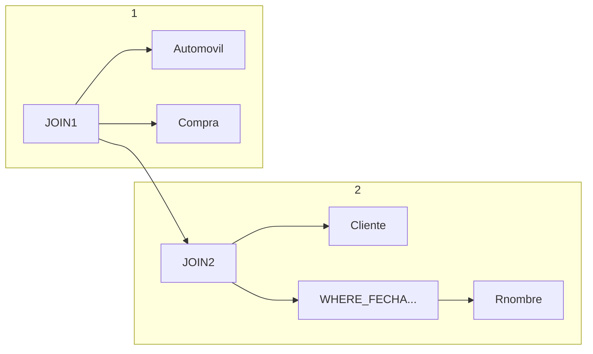

## 1.2 - Almacenamiento e Indexación

---

## Indexación:
Mejora el tiempo de búsqueda en la base de datos.
Existen dos tipos:
- Ordenados
- Asociativos (hash)

Coste de buscar datos $=$ Coste de buscar en índice + Coste de buscar en archivo de datos
$C=C_{índice}+C_{archivo\_ datos}$

$V(A) \rightarrow$ número de valores diferentes para el campo A en archivo / tabla
$n_R \rightarrow$ número de registros del archivo (tabla) R

Archivo de datos:
- Ordenado respecto al campo de búsqueda (Primario)
- No ordenado respecto al campo de búsqueda (Secundario)

$n_{Ri} \rightarrow$ Número de registros en el índice (nunca entradas/valores duplicados)
Registro índice $\rightarrow$ Valor campo + Puntero

$L_{Ri}=L_K + L_{PB}$ ó $L_{Ri} = L_K+L_{PR}$

### Clasificación de índices

- **Primario** + **Campo clave** $\rightarrow n_{Ri} = V(A) = n_R$
- **Primario** + **Campo no clave** $\rightarrow n_{Ri} = V(A)$
- **Secundario** + **Campo clave** $\rightarrow n_{Ri} = V(A) = n_R$
- **Secundario** + **Campo no clave** $\rightarrow$ *Cajones punteros* $\rightarrow n_{Ri} = V(A)$ (Se apunta a cada cajón)

Cajones de punteros contienen siempre *Punteros* a *Registro*

---

Se dispone de un archivo r de datos que contiene información sobre estudiantes donde se almacena: ...

1. Índice multinivel 3 niveles campo carnet
    Índice primario + Clave
        - **Denso** $\rightarrow n_{Ri} = V_{Carnet} = 100.000\space registros$
            $L_{Ri_1} = L_{carnet} + L_{registro} = 8+7 = 15\space bytes$
            $B_{util} = (512-12)*0,65 = 325\space bytes$
            $t_{Ri_1} = \frac{325}{15} = 21\space \frac{registros}{bloque}$
            $b_{Ri_1} = \frac{100.000}{21} = 4.762\space bloques$
            **2º nivel** $\rightarrow$ Disperso
            $L_{Ri_2}=L_{carnet}+L_{PB}=8+6=14\space bytes$
            $t_{Ri_2}=\frac{315}{14}=23\space \frac{registros}{bloque}$
            $b_{Ri_2} = \frac{4762}{23}=208\space bloques$
            **3º nivel** $\rightarrow n_{Ri_3}=208$
            $L_{Ri_3}=14\space bytes$
            $t_{Ri_3}=23\space \frac{registros}{bloque}$
            $b_{Ri_3}=\frac{208}{23}=10\space bloques$
            $4.762+208+10 = 4.980$
            **Índice = 4.980 bloques**
        - **Disperso** $\rightarrow n_{Ri_1}=b_R=20.000\space registros$
            $b_{Ri_1}=\frac{20.000}{21}=953\space bloques$
            $b_{Ri_2}=\frac{953}{23}=42\space bloques$
            $b_{Ri_3}=\frac{42}{23}=2\space bloques$
            **$953+42+2=997\space bloques$**
            **Índice = 997 bloques**

2. Índice multinivel secuencial ordenado
    Código_carrera $\rightarrow$ desordenado $V(código\_ carrera)=10$
    Secundario + No clave $\rightarrow$ Denso -> $M_{Ri}$ = $V(código\_ carrera)=10$ reg
    Cajones de punteros

    $L_{Ri} = L_{código\_carrera}+L_{P_B}=2+6=8\space bytes$
    $t_{Ri}=\frac{325}{8}=40\space \frac{reg}{bloque}$
    $b_{Ri}=\frac{10}{40}=1\space bloque$

    Número de cajones?
    $N_c=V(código\_ carrera)=10\rightarrow Preg/cajon? =\frac{100.000}{10}=10.000\space \frac{Preg}{Caj}\rightarrow L_{Rc}=L_{Preg}=7\space bytes$
    $t_{R_C}=\frac{325}{7}=46\frac{Preg}{Bloque}$
    $b_{R_C}=\frac{10.000}{46}=218\space bloques$

    **Índice$=1+10*218=2181\space bloques$**
    $\sigma_{código\_carrera=2}=?$
    $nec=\frac{100.000}{10}=10.000\space bloques$
    $Sec\rightarrow 20.000\space blq$
    **Índice $\rightarrow 1 + 218 + 10.000 = 10.219\space bloques$**

3. Índice $B^+$ Carnet, ordenado, $V(Carnet)=100.000$
    Primario + Clave $\rightarrow$ Denso $\rightarrow M_{Ri} = V(carnet) = 100.000\space reg$
    Nodo raíz $\rightarrow n * L_{P_B} + (n-1)*L_{carnet}\le B_{util} \rightarrow n*6+(n-1)*8\le 325 \rightarrow 14n \le 333 \rightarrow n \le 23 P_{Blq}$
    Nodo hoja $\rightarrow n_h * (L_{carnet}+L_{Pag})+L_{P_B} \le B_{util} \rightarrow n_h * 15 + 6 \le 325 \rightarrow n_h \le 21 \frac{Valores}{Campo}$

    Hojas? $\frac{100.000}{21} = 4762\space blq$
    Nivel tnt1 = $\frac{4762}{23} = 208 \space blq$
    Nivel tnt2 = $\frac{208}{23} = 9 \space blq$
    Raiz = $\frac{9}{23} = 1 \space blq$
    $4762+208+9+1=4980$
    $Carnet \gt 90.000$


    $\sigma_{carnet=2345} \rightarrow n_{rc} = \frac{100.000}{100.000} = 1\space reg$
    - Sec $\rightarrow 20.000 \space blq$
    - Binario $\rightarrow \log_{2}(20.000)+\frac{1}{5}-1=15\space blq$
    - $B^+ \rightarrow 4 + 1 = 5 \space blq$


5. Índice hash campo carnet
    Hash de 8 bits $\rightarrow N_C = 2^8 = 256\space cajones$
    Primario + clave $\rightarrow$ Denso $\rightarrow n_{Ri}=V(carnet)=100.000\space reg$
    $N_{reg}/Caj = \frac{100.000}{256} = 390,625 \rightarrow 391$
    $L_{R_C} = L_{carnet} + L_{reg} = 8 + 7 = 15$
    $t_{R_C} = \frac{325}{15}=21 \space reg/blq$
    $b_{R_C} = \frac{391}{21} = 19\space blq$

    $Índice = 256*19 = 4864 \space blq$

    $\sigma_{carnet=2345(r)}?$
    $n_{R_C}=1\space reg$
    $Índice \rightarrow 19+1=20\space blq$

---

## GUIA PARA HACER EJERCICIOS DE EXAMEN

# Pasos
1. Traducir SQL $\rightarrow$ Expresión inicial $\rightarrow$ **Álgebra Relacional**
2. Aplicar optimización heurística $\rightarrow$ 6 reglas $\rightarrow$ Estadísticas:
    - $M_R$
    - $L_R$
    - $b_R$
    - $V(Campo)$
3. Nº de registros/operación $\rightarrow$ Resultado final
4. Coste total $\rightarrow \sum_i{C_i}$ bloques leídos/escritos


# Ejercicio 19 (Tipo Examen)
### 1. Considerar la siguiente consulta y expresarla en álgebra relacional:
```sql
SELECT nombre
FROM automovil NATURAL JOIN compra
    NATURAL JOIN cliente
WHERE fecha='3er cuatri' AND (proveedor='R' OR proveedor='S');
```

Donde: 
- SELECT = $\Pi$
- NATURAL JOIN = $\Join$
- WHERE = $\sigma$


Árbol inicial:


⬆️ A este árbol hay que ir haciéndole los cambios

---

## Apuntes Tema 3


Coste total = $\sum{C_i}$ donde $C_i$ es el coste de cada operador del álgebra relacional **que utiliza el disco leyendo o escribiendo**.

***`Si no usa el disco la operación no tiene coste asociado`***.

El coste se mide en bloques.

Relacionado $M \rightarrow$ *Número de bloques de **memoria** disponibles para hacer una operación.*


### Algoritmos para leer una tabla:

1. **Lectura Secuencial** $\rightarrow C = b_r$ es decir, Coste = Número de bloques de la tabla.
2. Tabla ordenada por campo A, **Búsqueda binaria** $\rightarrow C = \log_2(b_r) + \frac{n_{rc}}{f_R} -1$ donde $n_{rc}$ es el número de registros a recuperar y $f_R$ es el factor de bloque.
3. Si disponemos de **índices** en el campo a buscar $\rightarrow C = C_{indice} + C_{datos}$
    - $C_{indice}$ depende del tipo de índice
    - $C_{datos}$ depende de si el archivo está ordenado o no
        - **Ordenado** (índice primario): $C_{datos} = \frac{n_{rc}}{f_R}$
        - **Desordenado** (índice secundario): $C_{datos} = n_{rc}$


### Coste operaciones básicas del álgebra relacional

- **Proyección** $\rightarrow \Pi_{proveedor}(r)$, **solo lectura secuencial**: $C=b_r$
- **Selección** $\rightarrow \sigma_{proveedor='Seat'}$, se pueden usar los 3 algoritmos siempre que apliquen:
    - Secuencial siempre se puede
    - Binaria si la tabla está ordenada por el campo (proveedor)
    - Índice si existe un índice sobre el campo (proveedor)
    *Nos quedamos con la que tenga menor coste.*
- **Ordenación**: `order by (r)`. Hay dos posibilidades:
    - Si estamos leyendo desde una tabla *r* que está en disco y tenemos $M \geq b_r$, el coste será $b_r$ porque estamos leyendo la tabla una sola vez **y cabe en memoria**.
    - Si $M \leq b_r$, no caben todos los bloques en memoria, y hay que ir usando disco por trozos. Aplicamos fórmula **ordenación mezcla externa**: $C = b_r (2 \lceil \log_{M-1}(\frac{b_r}{M})\rceil +1)$
- **Reunión *(Join)*** $\rightarrow \space r\Join s$, dos tablas r con $b_r$ bloques y s con $b_s$ bloques y que están en disco. Varias formas:
    - ***Bucle anidado por bloques***: Para cada bloque de r hay que hacer una búsqueda secuencial en memoria de toda la tabla s. Se hace con dos bucles *for* anidados, donde hay que recorrer cada tupla de r con todas las de s. Equivale a mezclar cada bloque de r con todos los de s. **Algoritmo más sencillo pero que puede dar más coste**. ***Aplicable siempre, pero requiere M=3 como mínimo*** (1 de entrada para r, 1 de entrada para s y 1 de salida del join).
    $C = \lceil \frac{b_r}{(M-2)} \rceil b_s + b_r$
    Puede haber dos costes distintos si r es externa y s es interna. Habrá que poner como relación externa la que menos bloques tenga para optimizar.
    Si M es más grande que $b_r$ el coste será $C = b_r + b_s$ porque al dividir tiende a 1. **Mejor coste posible**.
    - ***Bucle anidado indexado***: Se puede usar cuando uno de los campos de unión de una de las tablas tiene un índice (por el campo común del join). ***Requiere M=3 como mínimo para aplicar***
    $C = n_r * C_{indice} + b_r$
    - ***Reunión por mezcla***: Sólo se puede usar cuando las dos tablas están ordenadas por el campo común A
    $C = b_r + b_s$
    Si las tablas no están ordenadas, se pueden ordenar y luego aplicar reunión por mezcla:
    $C_{total} = C_{ordenar\space r} + C_{escribir\space r\space en\space disco} + C_{ordenar\space s} + C_{escribir\space s\space en\space disco} +b_r + b_s$, en este caso los costes de escribir serían equivalentes a $b_r$ y $b_s$ respectivamente, si no caben en memoria.
    - ***Reunión por asociación*** (*hash join*): Se basa en particionar las dos tablas por medio de la misma función de asociación, grabar las dos tablas particionadas en disco y realizar la mezcla de las particiones de ambas tablas. 
    $C = 3(b_r+b_s)$
    ***Se puede usar cuando la memoria $M \geq N+1$ siendo $N$ el número de particiones que devuelve la función.*** Si no nos dan una función de asociación o no nos lo pide el problema, no podemos hacer reunión por asociación.

### Otras operaciones -> Mismos algoritmos
- ***Agregación*** *(Group by)* $_AG_{count(B)}$: Es lo mismo que ordenar, por lo tanto el coste será igual que el de ordenar.
- ***Operaciones de reunión externa***: Mismo coste que reunión normal
- ***Operaciones de conjuntos***:
    - $r\cap s$
    - $r\cup s$
    - $r-s$
    Sus costes son como un join, es decir, los mismos 4 algoritmos. El número de tuplas de salida es distinto. La resta **no es conmutativa**, es decir, la rama de entrada de la izquierda siempre será r.


## Reglas de equivalencia
1. Las operaciones de selección conjuntiva se pueden dividir en varias selecciones individuales
    $\sigma_{\theta_1 \cap \theta_2}(E) = \sigma_{\theta_1}(\sigma_{\theta_2}(E))$
2. Las operaciones de selección son conmutativas
    $\sigma_{\theta_1}(\sigma_{\theta_2}(E)) = \sigma_{\theta_2}(\sigma_{\theta_1}(E))$$
3. Solo la última secuencia de operaciones de proyección se necesita, las otras se pueden omitir.
    
4. Las selecciones se pueden combinar con productos cartesianos y reuniones zeta.

5. 
asi hasta la 12, no se


## REGLAS HEURISTICAS
### 1. Descomponer las selecciones conjuntivas en una secuencia de operaciones de selección sencillas
### 2. Desplazar las operaciones de selección a la parte baja del árbol (ejecutarlas lo antes posible)
### 3. Ejecutar primero las selecciones y reuniones que produzcan relaciones más pequeñas
### 4. Reemplazar operaciones producto cartesiano seguidas de una selección por una operación reunión.
### 5. Dividir y desplazar hacia abajo del árbol las listas de atributos de proyección, creando nuevas proyecciones si se necesitan.
### 6. Identificar aquellos subárboles cuyas operaciones pueden ser encauzadas y ejecutarlos usando encauzamiento.


## Información estadística

- $n_r$: número de tuplas en la relación r
- $b_r$: número de bloques de r
- $s_r$: tamaño en bytes de una tupla de r
- $f_r$: factor de bloques de r (número de tuplas en un bloque)
- $V(A,r)$: número de valores únicos que aparecen en r para un atributo A, mismo tamaño que $\Pi_A(r)$
- Si las tuplas de r se almacenan juntas físicamente en un fichero entonces $b_r = \lceil \frac{n_r}{f_r}\rceil$
- $n_{rc}$: número de tuplas a recuperar (número de tuplas estimado que satisfacen la condición)


## Materialización y Encauzamiento

### Materialización
Materializar es ejecutar una operación completamente, y guardar su resultado en disco si no cabe en memoria.
La evaluación materializada **siempre se puede aplicar**, pero hay que tener en cuenta el coste de escribir los resultados de cada operación en disco, que no se incluyen en las fórmulas por defecto.

### Encauzamiento
Encauzar consiste en ejecutar varias operaciones a la vez, evitando tocar o grabar los resultados de las operaciones intermedias en disco.
**Solo podemos encauzar** proyección, selección y una de las entradas del join cuando se usan bucles anidados, o ambas entradas del join cuando se usa hash join.

Si se puede encauzar una rama de entrada, lo que hay que hacer es eliminar un $b_r$ de la fórmula que estemos aplicando en ese instante, que equivale a eliminar una lectura.
