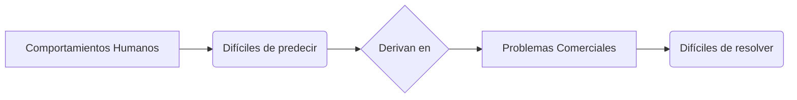
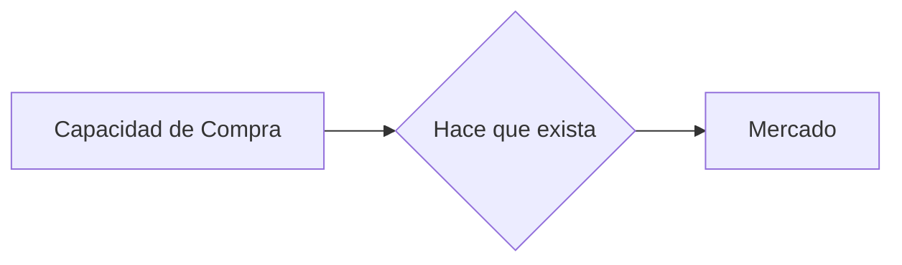
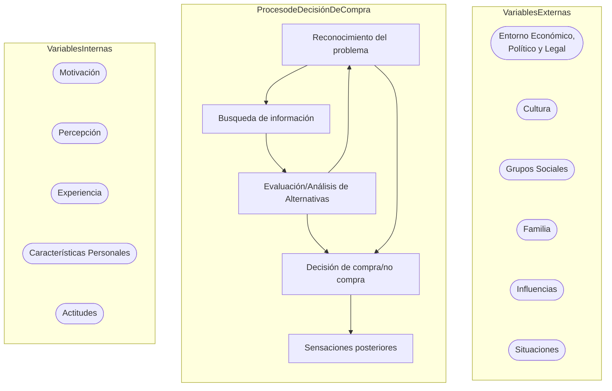
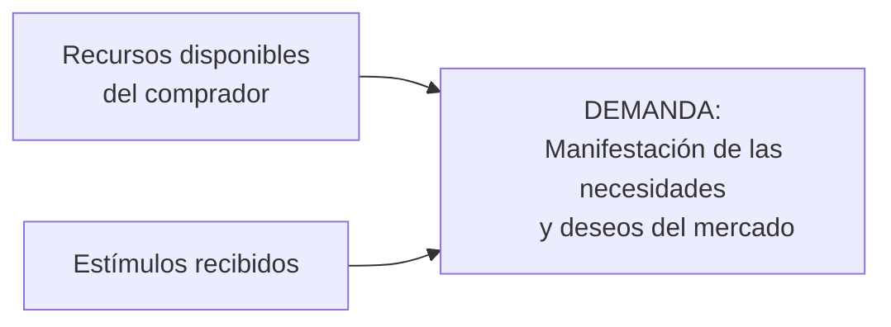
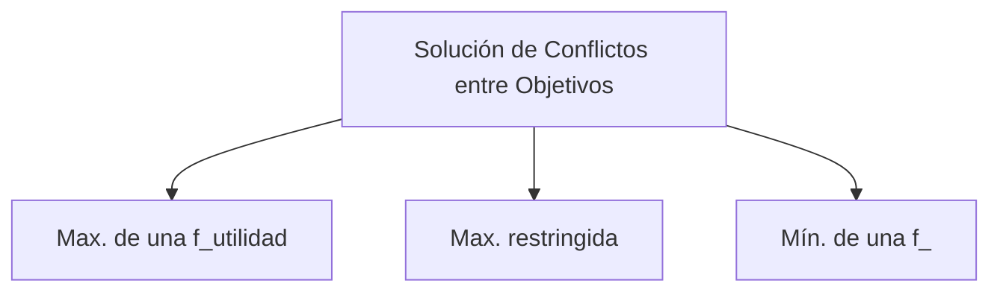
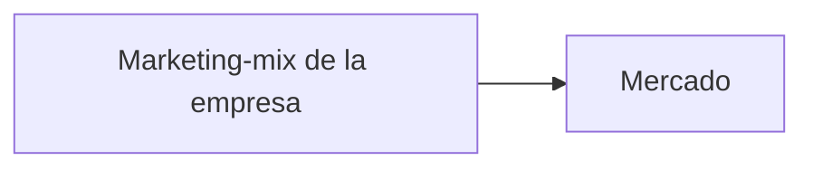
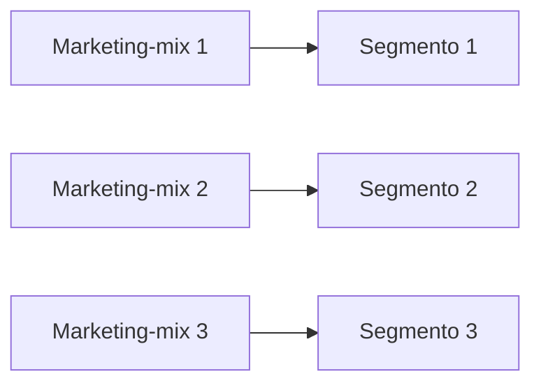
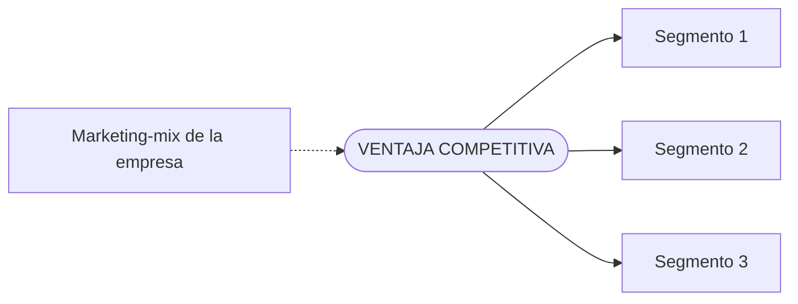
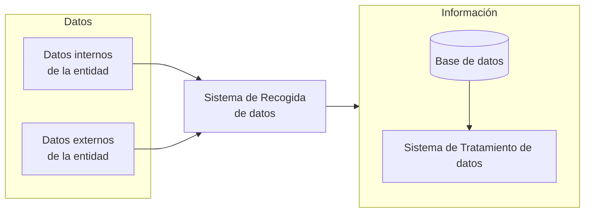
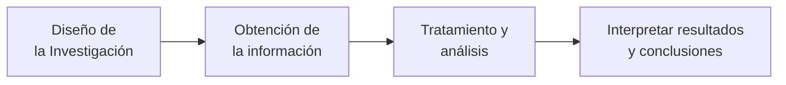

Colección de apuntes de Marketing TIC, no están muy bien organizados (lo que tiene dar clases de marketing a las 8)

## 6.1. - Función comercial de la empresa

 

FASES DE EJECUCIÓN:
- Análisis del sistema
    - Mercado
    - Competencia
    - Suministradores
    - Públicos interesados / Stakeholders
    - Entorno

- Diseño de estrategias de marketing (4 Ps)
    - Producto
    - Precio
    - Distribución (Place)
    - Promoción
- Dirección, organización y control de la actividad comercial

### 6.1.1 - Análisis de sistema
- Análisis de Situación:
    - Análisis Externo [Oportunidades y Amenazas]
        - Entorno
        - Mercado
        - Competencia
        - Suministradores
    - Análisis Interno [Fortalezas y Debilidades]
        - Misión
        - Cartera de Productos
        - Estrategia de Marketing
        - Calidad del Servicio
        - Clientes
        - Organización
        - Recursos Humanos
- Análisis de Mercado:
    - Segmentación
    - Targeting
- Propuesta de valor:
    - Posicionamiento: Escoger orientación de la empresa
- Marketing Mix (4 Ps)
- Revisión y Control:
    - Revisión de resultados

---

## 6.2 - El Sistema Comercial: Elementos y variables

 

Suministradores -> Empresas -> Intermediarios (o no) -> Mercado
RODEADO POR **ENTORNO** (etnia, religión, tecnología...)

Análisis Sistema Comercial = f(protagonistas, caracteristicas, clasificaciones, comportamientos) =
f(mercado/entorno, demanda-estimac, segmentos mercado, comportamiento consumidor, SI-Investig. Comercial)

- Mercado y Entorno:
    - Mercado: Conjunto de personas con una necesidad, capacidad de compra y d ispuestas a comprar
        - Conocer mercado, potencial de compra, distribución, clasificación, límites -> **`Mercados objetivo`**
    - Entorno: Competencia, Intermediarios, Suministradores, Instituciones (facilitar/controlar)
- Demanda:
    - Comprender/Entender: Influencia de las variables en la demanda (**`controlables y no controlables`**)
    - Predecir
- Segmentos de Mercado:
    - Heterogeneidad de necesidades, características y comportamiento de los actores
    - Determinación de mercados objetivo
- Comportamiento del Consumidor
    - Por qué, cómo, cuándo, dónde...
    - Variables Internas: Motivación, Percepción, Experiencia, C. Personales, Actitudes
    - Variables Externas: Entorno Económico, Social, Cultural, grupos sociales, familia, amigos
    - Fases del proceso de decisión de compra
- Sistema de Información / Investigación Comercial
    - Alternativas de decisión

### 6.2.2 - Variables del Sistema Comercial
- **Variables Controlables** ($V_c$) :
    - Producto
    - Precio
    - Place
    - Promoción

- **Variables No Controlables** ($V_n$) :
    - Mercado
    - Competencia
    - Entorno

- *Elementos/Actores*:
    - Empresas/Competencias
    - Intermediarios
    - Mercado
    - Entorno

$ V_c + V_n = Variables\space Meta $

## 6.3 - Instrumentos del Marketing

- **`PRODUCTO`** (*L/P*):
    - Satisface una **necesidad**
    - Cartera: nº, agrupación, homog./heterog. , comp. *vs* sust.
    - Diferenciación: $, Q, diseño, imagen, servicio...
    - Identificación: Marca, modelo, envase...
    - Ciclo de Vida del Producto
    - Modificar/Eliminar productos
    - Planificación de nuevos productos
- **`PRECIO`** (*C/P*):
    - Impacto en imagen/ingresos/beneficio
    - Costes, márgenes y descuentos
    - Métodos de fijación de precios:
        - Costes
        - Competencia
        - Mercado
    - Fijación precio a una línea de productos
- **`DISTRIBUCIÓN`** (*L/P*):
    - Relaciona producción y consumo
    - Canales de distribución: Intermediarios, canal, nº, loc...
    - Merchandising: Pres, disposición, diseño y contenido pub.
    - Distribución directa *vs* Marketing directo
        - Venta a domicilio, correo, catálogo, telemarketing, internet, vending
    - Logística/Distribución física:
        - Transporte, almacén, entrega, cobro, servicio
- **`PROMOCIÓN`** (*C/P*):
    - Actividades
        - Venta Personal
        - Publicidad (Persuadir, Informar, Recordar)
        - Propaganda
        - RRPP
        - Promoción de ventas
        - Marketing Directo
    - Políticas
        - Dirección de Ventas
        - Publicidad, Propaganda, RRPP
        - Promoción de Ventas
        - Marketing Directo

### 6.3.2 - Transformación de las 4 P's a las 4 C's

Cómo lo ve el **c**liente:
Producto -> Valor para el **C**liente
**P**recio -> **C**oste
**P**lace -> 
**P**romoción -> 

### 6.3.3 - Las 7 P's en los Servicios
- Producto
- Precio
- Place
- Promoción
- People (personas)
- Processes (procesos)
- Physical Evidences (evidencias físicas)

---

## 6.4 La Dirección Comercial

 

### 6.4.1 Actividades a desarrollar

- Análisis de las necesidades de los consumidores
- Planificación de las acciones (marketing-mix) a desarrollar
- Organización (+ Ejecución) de los medios humanos y materiales
- Control del desarrollo del programa comercial

Dirección Comercial = Dirección de Marketing

#### a. Análisis:
- Comportamiento de los consumidores
- Competencia
- Segmentos del mercado
- Identificar oportunidadess de mercado
- Identificar amenazas y riesgos del comportamiento del entorno y competencia (DAFO)
- Puntos fuertes y débiles de la empresa y de la competencia

#### b. Planificación:
- Selección de mercados y segmentos a los que dirigir la oferta
- Determinar objetivos (cuotas de mercado, # de clientes...)
- Diseño de Estrategias a Corto Plazo o tácticas (precio y comunicación)
- Diseño de Estrategias a Largo Plazo o estratégicas (producto y distribución/place)
- Elaborar plan/presupuestos de ingresos, gastos y

#### c. Organización:
- Estructura y recursos humanos y materiales
- Aplicación de las estrategias de Marketing

#### d. Control:
- Medir resultados y compararlos con los objetivos previstos
- Corregir las desviaciones negativas y explotar las positivas

## 6.5 La Orientación al Mercado de la Dirección Comercial

Elementos básicos:
- Orientación al cliente
- Integración y coordinación de funciones
- Orientación al beneficio

Elementos añadidos:
- Orientación a la competencia
- Perspectiva a largo plazo

Las empresas más orientadas al mercado anticipan mejor las oportunidades, responden antes que sus competidores y obtienen mejores resultados.

## 6.6 Dirección Comercial y los Estados de la Demanda

| **Estado de la Demanda** | **Tarea del Marketing** | **Tipo de Marketing a Aplicar** |
| ------------------------ | ----------------------- | ------------------------------- |
|                          |                         |                                 |

Recordar diferencia entre **maximarketing** y **megamarketing**

A. **Remarketing**: Revitalizar la demanda débil de un producto, bien modificando las características del mismo, dirigiéndolo a otros segmentos o practicando una comunicación más efectiva.

B. **Desmarketing**: Reducir la demanda de productos o recursos vitales que pueden agotarse por un consumo excesivo.

C. **Contramarketing**: Destruir o eliminar la demanda que se considera perjudicial, por ejemplo tabaco alcohol drogas etc

D. **Megamarketing**: Desarolar marketing en mercados bloqueados o protegidos. Mayor número de partes implicadas, uso más intenso de las relaciones públicas

E. **Maximarketing**: Mercados muy segmentados. Utilización intensa de bases de datos. Marketing de nichos.

---

## 6.7 Marketing Especial: Tipos de Marketing

 

### 6.7.1 Instituciones de naturaleza económica, con ánimo de lucro

- **Según tipo de productos**
    - Agrícola
    - Industrial
    - Productos de consumo
    - Servicios
    - Ideas
- **Mercados especiales**
    - Internacional

### 6.7.2 Instituciones de naturaleza benéfica, sin ánimo de lucro

- No lucrativas
- Publico
- Social
- Político y electoral

## 6.8 Características de los problemas comerciales

Comportamientos humanos -> Difíciles de predecir -> Derivan en problemas comerciales (Difíciles de resolver)

Los Problemas Comerciales son complejos y difíciles por...
- Gran número de variables contempladas
- La dificultad de determinar la respuesta de la demanda
- La interacción entre las variables
- La inestabilidad de los efectos y relaciones de las variables
- Los efectos competidores
- Las respuestas retardadas y anticipadas de la demanda
- Los múltiples mercados en los que actúa la empresa
- Los múltiples productos comercializados
- La interrelación de la función comercial
- Los múltiples objetivos y partes interesadas
- La incertidumbre en los resultados
- La no existencia de normas estándar

### 6.9 El Proceso de Toma de Decisiones Comerciales

 

Bases para tomar decisiones:
- Experiencia
- Normas estándar
- Acumulación de datos
- Elaboración de modelos

---

**$Mercado = Elementos$**
*Conjunto* de personas individuales u organizadas
*Necesitan* un producto determinado
*Desean* o pueden desear comprar
Tienen *capacidad* (económica y legal) para comprar

## 3.1 - Mercado

 

### 3.1.1 Concepto de Mercado

El Comportamiento del Mercado lo medimos mediante la **Demanda**

Mercado Actual vs Mercado Potencial

Mercado de un producto vs Mercado objetivo

### 3.1.2 Límites del Mercado

Conocer límites -> Estrategia de Marketing

Puedo organizar mercados según:
- **Físicos/Geográficos**: Local, Regional, Nacional, Internacional
- **Características de Consumidores**: Demográficas, Socioculturales, Étnico, Cultural
- **Uso del producto**: Más Relativos, Más Modificables

Demanda Primaria: Demanda de los particulares, del consumidor final
Demanda Derivada/Secundaria: Demanda de las empresas que van a satisfacer las necesidades de los consumidores

### 3.1.3 Clasificación del Mercado

Mercados según:
- **Comprador**
    - Particulares
    - Empresas
    - Organismos públicos
    - Otras instituciones
- **Oferta/Tipo de producto**
    - Materias Primas
    - Agropecuarios
    - De consumo
        - Duradero
        - No duradero
    - Servicios
    - Actividades financieras
    - Ideas
- **Número de competidores**
    - Monopolio
    - Oligopolio
    - Competencia monopolística
    - Competencia perfecta
- **Intensidad de la Demanda**
    - Vendedores (Demanda>Oferta)
    - Compradores (Demanda<Oferta)
- **Forma de la relación de Intercambio**
    - Subasta
    - Licitaciones (Subtipo de Subasta)
    - Relaciones
    - Contractuales
    - Franquicias
    - Obligacionales (trabajo)

**Según # de Competidores**:
- **Monopolio** Hay un solo oferente y muchos demandantes. Barreras de entrada MUY altas.
- **Oligopolio** Hay pocos oferentes y muchos demandantes. Barreras de entrada altas.
- **Competencia Monopolística** Hay muchos oferentes y muchos demandantes. Barreras de entrada bajas. Productos diferenciados.
- **Competencia Perfecta** Hay muchos oferentes y muchos demandantes. Barreras de entrada bajas. Productos homogéneos.

### 3.1.4 Estructura de la Demanda/Consumo

a. Nivel de Posesión, Distribución de Gastos/Productos y Predisposición de Compra
b. Distribución Geográfica del Poder Adquisitivo

#### a) Nivel de Posesión, Distribución de Gastos/Productos y Predisposición de Compra

**Indicadores Socieconómicos y Nivel de Vida**:
Ayudan a conocer el potencial de los mercados y el nivel de saturación de un determinado producto.
- Población, RPC, Paro
- Posesión/1000 habitantes
- % de hogares

**Distribución de Gasto Familiar**:
Proporciona información sobre el gasto de las familias.
- Encuesta de Presupuestos Familiares (ECPF)
    - Niveles de gasto en %
    - Determina el IPC (Tasa de inflación de un país)

**Predisposición de Compra**:
Son encuestas que miden la situación financiera y expectativas del consumidor.
- Índice del Sentimiento del Consumidor (ISC) *Situación financiera y expectativas*
- Índice de Confianza del Consumidor (ICC) *(De 0/200) Situación actual y perspectivas de Economía General*

---

## 3.2 - Entorno

 

### 3.2.1 Microentorno
!!!summary **Microentorno** 
    Conjunto de factores del entorno próximos a la relación de intercambio entre la Empresa y el Mercado

    Influencia más inmediata

#### a) Suministradores (IN)
Proporcionan recursos fuera de la empresa para el Output de la Empresa
- Materias Primas y Productos Intermedios
- Recursos Humanos
- Servicios (transporte, almacén, seguro, asesoramiento, ...)
- Otros (ideas, ...)
Relación Intercambio con la Empresa
- Compras, Cantidad, Calidad, Tiempo, Disponibilidad, Fiabilidad

#### b) Intermediarios (OUT)
Relación de Intercambio
- Funciones de Distribución/Place, Promoción y Ventas: Capilaridad
Tipos:
- Mayoristas (Vende a mayoristas o minoristas)
- Minoristas/Detallistas (Vende al consumidor final)
Independientes/Asociados -> Capacidad de Compra/Negociación
Formas de Comercio Minorista:
- Super, Hiper, Gran Almacén, Tiendas Especializadas, Franquicias
- Venta por:
    - Correspondencia
    - Catálogo
    - Teléfono
- Sociedades y Agencias de Valores

#### c) Instituciones
!!!summary **Instituciones** 
    Instituciones que promueven la actividad comercial, informan y protegen al consumidor, o intervienen y regulan la actividad comercial
    **Facilitadoras y Promotoras de la Actividad Comercial**
    **Informadoras y Protectoras del Consumidor**
    **Interventoras y Reguladoras de la Actividad Comercial**

    - **Facilitadoras y Promotoras de la Actividad Comercial**
        - Secretaría de Estado de ***Comercio***
            - Dirección General de Política Comercial
            - Secretaría de Comercio Exterior
                - Dirección General de Comercio e Inversiones
                - Dirección General de Financiación Internacional
        - Cámaras de Comercio: Industria y Navegación
        - Secretaría General de Turismo: Turespaña
    - **Informadoras y Protectoras del Consumidor**
        - Administración Central
            - DGC, INC, JANC, CCU, SRBancoE, Defensor del Pueblo
        - Administración Autonómica y Local: OMIC, JAC
        - Asociaciones de Consumidores y Usuarios: Privadas, registradas en el INC
        - Infracciones y Sanciones
    - **Interventoras y Reguladoras de la Actividad Comercial**
        - Control y regulación de SI y Comercio, Contratación, Distribución Comercial, e-business y Mercado de Valores
            - Comisión Nacional de la Competencia
            - Ley Competencia Desleal
            - SI y Com. : LOPD, Agencia de Protección de Datos, LGPublicidad & LGCom Audiovisual
            - Condiciones de Contratación
            - Distribución Comercial (LOCm)
            - Comercio Electrónico
            - CNMV

#### d) Competencia
!!!summary **Competencia**
    Empresas que ofrecen productos sustitutivos o similares a los de la empresa
    Se puede tener competencia en:
    - Volumen de ventas
    - Economías de Escala
    - Rentabilidad / Ventas
    - Crecimiento
    Hay 4 principios básicos de la competencia:
    1. Si un competidor persiste con el tiempo -> Ventaja Competitiva Única
    2. Si la competencia está equiparada -> Competencia más fuerte
    3. Si la competencia no está equiparada / Cada competidor se diferencia -> Cada uno tiene Ventajas Competitivas diferentes
    4. Los competidores que coexisten están en equilibrio

    ¿Quiénes son mis competidores?
    - Competidores surgidos por expansión del mercado
    - Surgidos por expansión del producto
    - Surgidos por integración hacia atrás [Consumidor - Minorista - Mayorista - Fabricante - Suministrador] (P.ej. Marcas Blancas)
    - Surgidos por integración hacia delante [Suministrador - Fabricante - Mayorista - Minorista - Consumidor]

 

### 3.2.2 MacroEntorno

 

---

## 3. Dirección del Entorno

Conjunto de actividades desarrolladas para anticipar los cambios del entorno y medir sus consecuencias, con el fin de poder llevar a cabo, en su caso, las acciones correctoras necesarias.

Tipos de acciones:

Proactivas: Anticiparse a los cambio,s no solo buscar la adaptación

- Independientes:
    - Anticipar la competencia
    - Relaciones Públicas
    - Mejora de Imagen
- Cooperativas:
    - Mejorar posición competitiva
    - Acuerdos de Colaboración
    - Alianzas
    - Intercambios
- Maniobras Estratégicas
    - Cambiar el entorno, no solo influir
    - Diversificación
    - Fusiones
    - Integraciones verticales y horizontales
    
---

## El Comportamiento del Consumidor

Estudio del Comportamiento del Consumidor
- Finalidad
- Características
- Aspectos/Dimensiones

El proceso de decisión de compra

### 1. Estudio del Comportamiento del Consumidor

Necesidad -> Deseo -> Demanda -> **Compra** -> **Uso**

#### 1.1 Finalidad del Estudio del Comportamiento del Consumidor
1. Identificar necesidades
2. Mejora comunicación
3. Confianza y Fidelidad
4. Planificar acción comercial

#### 1.2 Características del Comportamiento del Consumidor
1. Complejo -> n-variables, No lineal, Retardos, Umbrales, ...
2. $f(tipo\space producto)$ -> $f(riesgo)$=Alta/Baja implicación
3. $f(ciclo\space vida\space producto)$ -> Estrategias

#### 1.3 Aspectos/Dimensiones del Comportamiento del Consumidor

- ¿Quién? -> Iniciador, influyente, decisor, comprador, consumidor o usuario, pagador...
- ¿Por qué? -> Bºs, motivos excluyentes, preferencias internas y externas, ...
- ¿Cómo? -> Racional vs Emocional, Interés/Rutina, Solo/No solo, Nivel de Información, Respuesta Promocional
- ¿Cuándo? -> CVPersona, Frecuencia, time
- ¿Dónde? -> Puntos de venta, 7P's, Q percibida
- ¿Cuánto?
- ¿Qué? -> Demanda mayor o menor, jerarquía de productos

Es el punto de partida de la aplicación del concepto actual de marketing

Aspectos considerados:
- Comportamiento de compra o adquisición
- Comportamiento de uso o consumo
- Factores internos y externos que influyen

Es complejo y variable

### 2. El proceso de decisión de compra

f(tipo de producto)
    - Complejidad Baja
    - Complejidad Alta

f(roles)
    - Comprador=Consumidor=Pagador
    - Comprador!=Consumidor!=Pagador
    - Comprador=Pagador!=Consumidor
    - Comprador=Consumidor!=Pagador
    - Comprador!=Consumidor=Pagador

#### 2.1 Complejidad según producto

Baja (Rutina, hábito, inercia):
- Repetición
- Frecuente
- Por impulso
- De baja implicación
- De bajo precio

Alta (Proceso laborioso/largo) [Importancia-Experiencia-Conocimiento]:
- Primera compra
- Compra esporádica
- Compra razonada
- De alta implicación
- De alto precio

**EL PROCESO DE DECISIÓN DE COMPRA**

Motivación/Necesidad
- Predisposición general

Percepción (**selectiva**)
- Exposición a información
- Atención
- Comprensión
- Retención

Experiencia
- Aprendizaje (proceso)
- Hábito
- Lealtad marca
- Teorías Comportamiento

Características Personales
- Demográficas
- Socioeconómicas
- Psicográficas (**Subjetivas**):
    - Estilo de vida
    - Personalidad
    - Valores

Actitudes
- Creencias (cognos)
- Valoración (afectivo)
- Tendencia actuar (activo)
- Funciones

!!!summary Motivación = Necesidad = Deseo
    **Predisposición** general que dirige el comportamiento hacia la obtención de lo que se desea
    Afecta a los criterios de evaluación

    - Fisiológicos vs Psicológicos
    - Primario vs Selectivo
    - Racional vs Emocional
    - Consciente vs Inconsciente
    - Positivo vs Negativo

    Según orden de prioridad, la jerarquía de necesidades es:

    1. Fisiológicas
    2. Seguridad
    3. Aceptación Social
    4. Autoestima
    5. Autorrealización

!!!summary Percepción
    **Proceso** de selección, organización e integración de estímulos en una imagen coherente y significativa
    Se refiere al modo personal de interpretar y dar sentido a los estímulos a que se está expuesto = **CODIFICACIÓN**
    Es **SELECTIVA**, se escoge lo que interesa

    Fases:
    - Exposición selectiva: Busca estímulos por los que se siente interés -> *Medios Elegidos*
    - Atención selectiva según creencias u opiniones: Atributos/Características buscados. Se ignoran el resto.
    - Comprensión selectiva: Se interpreta según creencias u opiniones
    - Retención selectiva: Se recuerda lo que interesa

    [**UMBRAL DE WEBER**]

!!!summary Experiencia
    Experiencia = **Resultado** del aprendizaje
    Aprendizaje = **Proceso** de cambio en el comportamiento como resultado de la experiencia
    Aprendizaje puede provocar
    - Hábitos de compra
    - Lealtad a la marca
    - Reducción tiempos

    Refuerzo de lealtad: Programas de fidelización

    "Behaviorismo" -> Estímulo-Respuesta
    - Condicionamiento clásico: Respuesta a estímulos repetidos (Pavlov)
    - Condicionamiento instrumental: f(experiencias anteriores, satisfacciones obtenidas)

    Cognoscitivas -> Proceso de solución de problemas
    - Reflexión del consumidor

!!!summary Características Personales
    Influyen en todas las fases del Proceso de Decisión de Compra
    - Demográficas: Edad, sexo, estado civil, nivel de estudios, ocupación, ...
    - Socioeconómicas: Ingresos, clase social, ...
    - Psicográficas: **Subjetivas**
        - Personalidad: Afecta de modo consistente y duradero
        - Estilo de vida: Forma de vida, valores, intereses, opiniones, ...

!!!summary Actitudes
    Actitudes = **Predisposiciones aprendidas** para responder consistentemente +/- a objeto

    Multidimensional -> Componentes:
    - Cognoscitivo: Creencias
    - Afectivo: Valoración
    - Activo: Tendencia a actuar
    
    Influyentes:
    - Familia
    - Grupo Social
    - Información Recibida
    - Experiencia
    - Personalidad

    4 Formas Básicas de Expresar funciones:
    - **Utilidad**: Satisfacer necesidades
    - **Valor**: Autoconcepto y Sistema de Valores
    - **Ego-Defensiva**: Asociación actitudes aceptadas. Confianza
    - **Conocimiento**: Estándares internos

#### 2.2. Determinantes/Variables externas del comportamiento

- **Macroentorno**
    - Demográfico
    - Económico
    - Cultural/Social
    - Legal/Político
    - Tecnológico
    - Ecológico/Medio Ambiente
- **Microentorno**
    - Clase Social
        - Alta
        - Media
        - Baja
    - Grupos Sociales
        - Miembro vs Aspirante
        - Características:
            - Normas
            - Roles
            - Status
            - Socialización
            - Poder
        - Influencias:
            - Informativas
            - Corporativas
            - Normativas
    - Familia
        - Personalidad
        - Actitudes
        - Motivaciones
    - Influencias personales, líderes y estrategias
        - Identificar Líder
        - Crear Líder
        - Simulación
        - Estimulación
        - Strat. Defensa
    - Determinantes situacionales
        - Compra
        - Consumo

---

## 4.1. Análisis de la demanda

**Tareas**:
- Medir
- Explicar
- Pronosticar

**Métodos**:
- Subjetivos
- Investigación de mercado
- Series temporales
- Análisis causal

**Modelos**:
- Lineales
- No lineales
- No lineales con saturación
- En forma de S (Efectos "umbral" y "saturación")

### 4.1.1. Análisis de la demanda: Tareas
#### 1. Medir
- $Q$ uds
- $€ = Q * P.U$ (*Precio Unitario*)
- $C_M$ (Cuota de mercado) = $\frac{Q}{Q_{total}}$

#### 2. Explicar
- Variables controlables y no controlables
- Interacciones
- Análisis de sensibilidad

Imagen demanda:

#### 3. Pronosticar

[`FALTA`]

## 4.2. Enfoque Subjetivo: Métodos
- Estimación de los vendedores
- Jurados de opinión [Pedir estimación a distintos niveles jerárquicos de la empresa (p.e. director comercial, director financiero, ...)]
- Método Delphi
    - Respuestas anónimas
    - Interacción y retroacción controlada
    - Respuesta estadística de grupo
    (Método Delphi: [Wikipedia](https://es.wikipedia.org/wiki/M%C3%A9todo_Delphi))
    La mediana o la media (`?`) es el modelo representativo de la opinión del grupo (? La moda no)

### 4.2.1. Investigación de Mercado: Métodos
#### A. Intención de compra
- Intención de compra
- Marca/Producto
- Atributos/Factores POC

Estimación de la demanda futura
*Intenciones* $\ne$ *Realidad*
#### B. Test de Concepto y de Producto
- Intención de Compra
- Percepciones
- Preferencias
- 4 P's

Predice Prueba/1ª R.BB.Com.
No demanda Productos Innovadores
#### C. Test de Mercado
- Cond. de Mercado
- Cond. de Entorno
- Cond. de Estrategia

$\checkmark$ Predice Prueba/1ªs Rep.
$\$ No recompras futuras
No fidelidad marca

A $\rightarrow$ B $\rightarrow$ C

### 4.2.2. Series Temporales: Métodos
#### Métodos simples y medias móviles
- $y(t) = y(t-1)$
- $y(t) = y(t-1) + {comp.\space estacional}$
- $y(t) = \frac{y(t-1)+y(t+2)+...+y(t+n)}{n}$
Supongo que tampoco entra

#### Alisado Exponencial
- Similar medias móviles
Ni idea pero no entra

#### Descomposicion de series
Ni idea pero no entra
#### Box-Jenkins
Ni idea pero no entra

### 4.2.3. Análisis Causal: Métodos
$Q=f(x_1,x_2,...,x_n)$
En teoría tampoco lo pregunta

## 4.3. Modelos de demanda

### 4.3.1. Dimensiones Modelos Demanda: Formulación Matemática
#### a) Modelos lineales en variables y parámetros
Aproximación (p.e. línea recta)

#### b) Modelos no lineales en variables pero lineales en parámetros
Efectos **Aditivos**: Efectos de variación no proporcionales de la variable independiente
Ej. F-cuadrática y F-logarítmica

#### c) Modelos no lineales en los parámetros pero linealizables
Efectos **Multiplicativos**: Efectos de variación proporcional de la variable independiente
Ej. F-geométrica y F-exponencial

#### d) Modelos no lineales en variables y parámetros
Se adaptan a situaciones concretas de la demanda
Ej. F-exponencial modificada, F-logística y F-Gompertz ($Q=Pa{^b{^2}}$)
- Efecto Saturación: Respuesta de la demanda a un estímulo
- Efecto Umbral: 

### 4.3.2. Dimensiones Modelos Demanda: Efectos Dinámicos, Incertidumbre y Nivel de Agregación y Alcance
#### a) Efectos Dinámicos
${Demanda}(t) = f[{vbles.exp\space (t-n, t, t+n)}]$

Consideración de modo explícito del tiempo en función de la demanda
- **Efectos Retardados**: La variación perdura en el tiempo (p.e. publicidad)
- **Efectos Anticipados**: Anticipan variaciones esperadas (p.e. inflación)

#### b) Incertidumbre
Acontecimientos Posibles ($AP$) y Probabilidades de Ocurrencia ($P$)

Evolución de las VNC, nº de variables incluidas, Relaciones inestables (t)

- **Decisión en situación de incertidumbre**: $AP$ pero no $P$
- **Decisión en situación de riesgo**: $AP$ y $P$
- **Decisión en situación de ignorancia**: No $AP$

#### c) Nivel de Agregación y Alcance
- **Agregación**: Mercado, Segmento, Individuo
- **Alcance**: Producto/marca y Penetración de mercado: $\frac{d_M}{d_T} = \frac{Demanda\space marca\space i\space producto\space j}{Demanda\space total\space producto\space j}$

## 4.4. Elaboración de modelos

Esto no entra

---

# 4_2. Segmentación del Mercado

- Mercado sin segmentar: Estrategia de marketing indeferenciada
- Mercado segmentado: Estrategia de marketing diferenciada por segmento
(`No tengo ni idea de qué es esto`)

## 4_2.1. Concepto de Segmentación
Proceso de división del mercado en grupos homogéneos de consumidores con características y necesidades similares
Con el fin de llevar a cabo una estrategia de marketing diferenciada
Que permita satisfacer de forma más eficaz las necesidades de los consumidores

**Utilidad de la segmentación**
- Pone de relieve las oportunidades de negocio existentes
- Contribuye a establecer prioridades
- Facilita el análisis de la competencia
- Facilita el ajuste de la estrategia de marketing a las necesidades de los consumidores

## 4_2.2 Criterios de Segmentación

| MERCADOS DE CONSUMO | Generales                                       | Específicos                                                       |
| ------------------- | ----------------------------------------------- | ----------------------------------------------------------------- |
| Objetivos           | Demográfico  Socioeconómicos  Geográficos | Uso del producto  Fidelidad  Primera compra                 |
| Subjetivos          | Personalidad  Estilos de Vida                | Beneficio buscado  Actitudes  Percepciones  Preferencias |

## 4_2.3. Métodos y Técnicas de Segmentación

**Criterios previamente establecidos**:
- $X$ atributos consumidores
- $X$ comportamiento de compra
- $X$ necesidades manifestadas

#### A) A priori
$\checkmark$ Fácil aplicación
$\space! \space$ No garantiza segmentos relevantes

#### B) Segmentación por criterios

#### C) Segmentación óptima
$\checkmark$ Busca segmentos óptimos
$\space! \space$ Complejidad, Técnicas multivariable

## 4_2.4. Aplicación de la segmentación de la estrategia comercial
### 4_2.4.1. Tipos de Estrategias
#### A) Estrategia de marketing indiferenciada

#### B) Estrategia de marketing diferenciada

#### C) Estrategia de marketing concentrada

**Segmentación vs Diferenciación**
- Segmentación: Proceso de división del mercado en grupos homogéneos de consumidores con características y necesidades similares con el fin de llevar a cabo una estrategia de marketing diferenciada para cada uno que permita satisfacer de forma más eficaz las necesidades de los consumidores

- Diferenciación: Estrategia de marketing que trata de resaltar las características distintivas de un producto o servicio frente a los de la competencia

### 4_2.4.2. Utilización de las 4P's en segmentación
#### A) Producto
- Productos similares
- Productos distintos
- Marcas diferentes

#### B) Precio
- Productos similares o iguales
- Diferencia fundamental en preio

#### C) Distribución
- Exclusiva (solo en un punto de venta)
- Selectiva (en determinados puntos de venta)
- Intensiva (en todos los puntos de venta posibles)

#### D) Promoción
- Medios de comunicación
- Publicidad
- Venta personal
- Promoción de ventas
### 6.4.1 Actividades a desarrollar

- Análisis de las necesidades de los consumidores
- Planificación de las acciones (marketing-mix) a desarrollar
- Organización (+ Ejecución) de los medios humanos y materiales
- Control del desarrollo del programa comercial

Dirección Comercial = Dirección de Marketing

#### 1. Análisis:
- Comportamiento de los consumidores
- Competencia
- Segmentos del mercado
- Identificar oportunidadess de mercado
- Identificar amenazas y riesgos del comportamiento del entorno y competencia (DAFO)
- Puntos fuertes y débiles de la empresa y de la competencia

#### 2. Planificación:
- Selección de mercados y segmentos a los que dirigir la oferta
- Determinar objetivos (cuotas de mercado, # de clientes...)
- Diseño de Estrategias a Corto Plazo o tácticas (precio y comunicación)
- Diseño de Estrategias a Largo Plazo o estratégicas (producto y distribución/place)
- Elaborar plan/presupuestos de ingresos, gastos y

#### 3. Organización:
- Estructura y recursos humanos y materiales
- Aplicación de las estrategias de Marketing

#### 4. Control:
- Medir resultados y compararlos con los objetivos previstos
- Corregir las desviaciones negativas y explotar las positivas

## 6.5 La Orientación al Mercado de la Dirección Comercial

Elementos básicos:
- Orientación al cliente
- Integración y coordinación de funciones
- Orientación al beneficio

Elementos añadidos:
- Orientación a la competencia
- Perspectiva a largo plazo

Las empresas más orientadas al mercado anticipan mejor las oportunidades, responden antes que sus competidores y obtienen mejores resultados.

---

## 5.1. El Sistema de Información del Marketing

`Aquí faltan cosas a la derecha`

 

---

## 5.2. Concepto y contenido de la Investigación Comercial

### 5.2.1. Definición

> La investigación comercial es el proceso de recogida, tratamiento y análisis de información con el fin de tomar decisiones comerciales.

### 5.2.2. Aplicaciones

- Generales:
    - Mercado
        - Estructura y potencial
        - Segmentación
        - Test
    - Comp.
        - Consumers
        - Users
    - Análisis
        - Planes Estratégicos
        - Estrategias Competidores
- Producto:
    - Compra/uso
    - Imagen/posicionamiento
    - Tests
        - Concepto + prod.
    - Modelos Ventas Nuevos Productos
- Precio:
    - Estructura precios
        - Descuentos/Rebajas
    - Elasticidades
        - Dem/Precio
        - Cruzadas
    - Percepciones
- Distribución:
    - Canales
    - Puntos de Venta y almacenamiento
    - Diseño del Punto de Venta
- Publicidad y RRPP:
    - Test mensajes
    - Selección de medios
    - Efectividad
    - Imagen empresa
- Ventas:
    - Vendedores
    - Zonas + Cuota ventas

### 5.2.3. Fases

Diseño de la Investigación:
- Identificación del problema
- Definición objetivos
- Determinar tipo de diseño
- Especificar hipótesis
- Definir, clasificar y medir variables

Obtención de la información:
- Selección de fuentes
- Determinar formas de obtener información
- Diseño y selección muestral
- Recogida de datos

Tratamiento y análisis:
- Edición, codificación y grabación de datos
- Tabulación de resultados
- Aplicar técnicas de análisis estadístico

Interpretar resultados y conclusiones:
- Informe general
- Presentaciones

#### a. Diseño de la Investigación

|                                | Estudios exploratorios                                                                                     | Estudios descriptivos                          | Estudios causales                                                                                         |
| ------------------------------ | ---------------------------------------------------------------------------------------------------------- | ---------------------------------------------- | --------------------------------------------------------------------------------------------------------- |
| **Objetivo**                   | Explorar el fenómeno                                                                                       | Describir el fenómeno                          | Determinar relaciones de causa-efecto                                                                     |
| **Flexibilidad en el proceso** | Muy flexible                                                                                               | Flexible                                       | Rígido                                                                                                    |
| **Enunciado de hipótesis**     | No                                                                                                         | Sí                                             | Sí                                                                                                        |
| **Resultados**                 | Lograr mayor información, definición del problema, y enunciar una hipótesis que permita otra investigación | Respuestas al qué, cómo, cuándo, dónde y quién | Establecer las relaciones entre variables independientes y dependientes, identifcar la causa del fenómeno |

##### a1. Estudios exploratorios
Preliminar, flexible, informal, datos existentes, entrevistas, simulaciones

##### a2. Estudios descriptivos
Características grupos, frecuencia, relación variables, predicciones, hipótesis basadas en datos
- Longitudinal
- Transversal

##### a3. Estudios causales
[`Copiar de la imagen`]

#### b. Obtención de la información
**Fuentes**:
- Primarias
    - Observación
    - Comunicación
        - Encuestas
            Personales, telefónicas, por correo, online...
        - Cuestionarios: Preguntas abiertas/cerradas
            - Requisitos:
                Definir OK el problema, formular OK hipótesis, Variables y escalas
            - Puntos a tener en cuenta:
                Orden, tono, equilibrio, predisposición al sí
            - Errores en redacción:
                Cargadas, dobles, ambiguas, vocabulario, alternativas no contempladas...
            - Muestra válida:
                población objeto, estructura, unidad, método, tamaño, plan de muestreo
- Secundarias

#### c. Tratamiento y análisis
`No entran porque "son un coñazo"`

#### d. Interpretar resultados y conclusiones
**Informe general**:
- Planteamiento del problema
- Metodología
- Resultados
- Conclusiones

*Requisitos*:
- Entendible
- Riguroso
- Evitar exceso de tecnicismos
- SÍNTESIS de resultados y conclusiones
- GRÁFICOS
- Fuentes

