# 1. Introducción a las Redes de Ordenadores

## 1.1. Introducción
Red: Gran número de máquinas autónomas pero interconectadas que realizan todo el trabajo.
Permiten compartir recursos, ahorrar costes, alta confiabilidad, acceso remoto, comunicación...


## 1.2. Normalización en las redes
Surgen estándares para asegurar la cohesión y normalización:
- **Oficiales o *de jure***: Creados por organizaciones.
- **No oficiales o *de facto***: No los impuso ninguna organización, pero su uso extensivo ha hecho que se consideren estándares globalmente. Un ejemplo de esto es Internet y sus protocolos.

### 1.2.1 ISO (Organización Internacional de Normalización)
Formada por organizaciones de normalización de 89 países. Posee 200 **comités técnicos** (TC) que se subdividen en **subcomités** (SC) y a su vez estos en **grupos de trabajo** (WG).
Tienen tres tipos de miembros:
- Corporativos (con derecho a voto en los TC)
- Corresponsales
- Abonados

Establecieron el **modelo OSI** de siete niveles para interconexión de sistemas abiertos.
Suelen adaptar estándares de otras organizaciones.

### 1.2.2 ITU (Unión Internacional de Telecomunicaciones)
Agencia de la ONU que coordina la compatibilidad de servicios de telecomunicaciones.
Tiene tres órganos principales:
- ITU-R
- ITU-D
- ITU-T

ISO e ITU-T cooperan en normas de telecomunicaciones con el fin de asegurar la compatibilidad.

### 2.3 IEEE (Instituto de Ingenieros Eléctricos y Electrónicos)
Establecieron la norma 802 para LANs, la más importante. Adoptada por la ISO como ISO 8802.

### 2.4 Organizaciones de Internet
#### ISOC
Internet Society. Organización no gubernamental y sin ánimo de lucro. Da soporte y  gestiona las relaciones internas de sus suborganizaciones.

#### IANA
Internet Assigned Numbers Authority. Se encarga de la asignación de los parámetros que permiten funcionar a Internet. Se dedica ahora a numerar protocolos e identificadores.

#### ICANN
Internet Corporation for Assigned Names and Numbers. Asigna el espacio de direcciones IP, identificadores de protocolo y administración de DNS.

gTLD (*general Top Level Domain*) y ccTLD (*country code Top Level Domain*) son la base del DNS y permiten usar las URLs que conocemos en vez de IPs y puertos.

Hay cinco RIR (Regional Internet Registry) encargados de distribuir las direcciones IP:
- APNIC (Asia-Pacífico)
- ARIN (Norte América)
- LACNIC (América Latina)
- RIPE NCC (Europa)
- AFRINIC (África)

#### IAB
Internet Architecture Bureau. Aprueba los nuevos estándares para Internet, llevados a cabo por la **IRTF** (*Internet Research Task Force*) en sus documentos RFC y evaluados por la **IETF** (*Internet Engineering Task Force*).


## 1.3. Modelos de referencia
### 1.3.1 El Modelo OSI
Open Systems Interconnection, definido por la ISO.
Tiene siete niveles:
1. Aplicación
1. Presentación
1. Sesión
1. Transporte
1. Red
1. Enlace
7. Físico

Los datos bajan del nivel superior al inferior en una máquina, y en la máquina receptora suben del inferior al superior. Los niveles van añadiendo cabeceras para sus homólogos. Las cabeceras aseguran el control de la información. Los datos que no pertenecen a la cabecera deben ser ignorados por los niveles, pasados al siguiente nivel.

#### Servicios
Un **servicio** es una capacidad que el nivel (N) y los niveles inferiores a él ofrecen a las entidades del nivel superior (N+1).
El nivel N en una máquina conversa con el nivel N de la otra máquina. A esto se le conoce como **protocolo de nivel**.
Una **entidad** es un elemento de un nivel, puede ser software o hardware.
Un **SAP** es un Service Access Point, es donde interactúan dos capas contiguas de una misma máquina.

N+1 le pasa a N un **IDU** (*Interface Data Unit*) que contiene datos e información de control, compuesta de:
- **ICI** (*Interface Control Information*): Datos de control, se usa por la capa proveedora y no se transmite.
- **SDU** (*Service Data Unit*). Datos que se envían al nivel homólogo. Se añade una cabecera de control.

El **SDU** más la cabecera forman la **PDU** (*Protocol Data Unit*).

#### Tipos de servicios
**Orientados a conexión**. El usuario establece una conexión, la usa, y posteriormente la libera.

**No orientados a conexión**. Se envían los paquetes de datos con su dirección por separado. Cada uno puede ir por un camino distinto y por lo tanto pueden llegar desordenados. La red es más robusta dado que si falla una ruta se pueden usar otras, pero es necesario reordenar más tarde.

#### Niveles OSI
- Nivel físico: Trata los aspectos físicos de la transmisión
- Nivel de enlace: Ofrece servicio de control de errores. Regula el flujo de datos. Agrupa información en **tramas**.
- Nivel de red: Controla congestión de paquetes, encamina paquetes del origen al destino.
- Nivel de transporte: Acepta los datos, los divide y los pasa a la capa de red. Solicita y libera la conexión de red.
- Nivel de sesión: Controla diálogo, permite tráfico en ambos sentidos (*full duplex*) o alternativamente (*half duplex*).
- Nivel de presentación: Usa una sintáxis abstracta para facilitar la compatibilidad entre formatos. Cifrado de datos.
- Nivel de aplicación: Aplicaciones como servicios de terminal virtual, de transferencia, de correo...

### 1.3.2 Modelo TCP/IP
Estándar de facto. Desarrollado en 1973 por ARPANET, con la idea de una red descentralizada que pudiese funcionar tras un ataque nuclear. Gracias a este modelo existe la World Wide Web.
TCP/IP se acomoda al nivel de enlace y físico, permitiendo la convivencia entre máquinas de distintos fabricantes.
TCP: Transmission Control Protocol
IP: Internet Protocol

En vez de siete niveles, consta de cuatro capas:
1. Aplicación: Contiene protocolos de alto nivel como TELNET, FTP, SMTP, DNS...
2. Transporte: Permite el diálogo entre entidades homólogas de extremo a extremo. Contiene dos protocolos: TCP (fiable y orientado a conexión) y UDP (no fiable y N.O.C)
3. Internet: Con protocolo IP. Los *host* insertan paquetes en la subred, que viajan de forma independiente a su destino. Pueden llegar desordenados.
4. Interfaz de red: Interfaz con la red real. No especifica un protocolo y por ello es flexible.

### 1.3.3 Modelo IEEE
Establece estándares de comunicación de dispositivos en LAN.
1. Nivel físico
2. Nivel de enlace
    - LLC: Control de enlace lógico. Maneja distintos tipos de servicios de comunicación.
    - MAC: Control de acceso al medio. Ofrece dirección física del equipo a la red.


## 1.4. Otros modelos de redes
NetWare de NOVELL
SNA de IBM
AppleTalk de Apple
DNA de DIGITAL

## 1.5. Tipos de redes
### 1.5.1 Por extensión
#### Redes de Área Local (LAN)
De ámbito privado, limitadas en espacio. Interconectan distintas máquinas de empresas, organizaciones, hogares, etc para compartir recursos e intercambiar datos.

Velocidades de hasta 10 Gbps con baja tasa de errores. Tres tipologías:
- BUS (Conectados a un bus)
- ESTRELLA (Conectados a un hub, switch, router...)
- ANILLO (Conectados a otros equipos)

Por ejemplo, Ethernet (IEEE 802.3) es una red LAN.

#### Redes de Área Metropolitana (MAN)
Mayor dimensión que una LAN. Se diferencia dado que IEEE estableció un estándar específico para MANs, el DQDB (Bus Dual de Cola Distribuida) para conectar LANs y WANs a través de MANs.

#### Redes de Área Extendida (WAN)
Abarcan grandes distancias.
Baja velocidad de transmisión y mayor tasa de errores.
Por ejemplo, Internet.

### 1.5.2 Por tecnología
#### Broadcast
Medio de transmisión compartido. Los paquetes se envían a toda la red y no a un único destinatario. Posibles problemas de seguridad. Suelen ser redes locales.

#### Punto a punto
Formadas por un conjunto de enlaces entre nodos dos a dos. La información se envía de un nodo a otro, que es el destinatario. La comunicación entre ordenadores se suele realizar a través de nodos intermedios, que conmutan los paquetes (conmutador o router). El conjunto de conmutadores o routers y los enlaces que los unen forman la *subred*. La *subred* delimita la responsabilidad del proveedor del servicio.

Pueden ser:
- Simplex: Un solo sentido
- Semi-dúplex: Ambos sentidos, no simultáneamente.
- Dúplex: Ambos sentidos simultáneamente.

En función del número de destinatarios de un envío se puede enviar información:
- Unicast: Un solo destinatario
- Broadcast: A todos los destinatarios posibles
- Multicast: Determinado grupo de destinatarios
- Anycast: A un conjunto de destinatarios posibles.


## 1.6. Historia de las redes
1969: Nace ARPANET, la primera red de la historia, con cuatro nodos: UCLA, SRI, UCSB y la U. de Utah, con líneas de 50 Kbps, ofreciendo servicios de FTP y TELNET.
1971: ARPANET dispone de 15 nodos y 23 máquinas.
1972: Se elige el signo de puntuación “@”, como separación entre nombre de usuario y máquina, aparece el primer e-mail. Un año mas tarde se realiza la primera conexión con Europa.
1974: IBM lanza su aportación a las redes: la arquitectura SNA, incluyendo el concepto de capas.
1975: DEC lanza DNA, padre del actual DECnet.
1979: XEROX crea ETHERNET, el cual es desarrollado conjuntamente con INTEL y DEC (DIX -> 3COM).
En este año también se inicia USENET (En Europa llamado EUNET), brindando el servicio de conferencia distribuida, news.
1980: Nace CSNET, red de los departamentos de ciencias de la computación en USA.
1981: Nace BITNET (Because It´s Time Network) como una red particular que proporciona correo electrónico.
1982: Un nuevo host cada 20 días y nace el estándar TCP/IP del DoD.
1984: Se introduce el Sistema de Nombres de Dominio (DNS) para la conversión entre nombre y máquina. Suman 1000 nodos.
1985: Nace el primer registro de nombre de dominio: symbolics.com.
1986: Nace Internet como un conjunto de redes que engloba a ARPANET, MILNET, CSNET, BITNET... etc. Usando protocolos TCP/IP.
1988: Se intenta cambiar los protocolos TCP/IP por OSI.
1989: Nace “Web” (Berners-Lee CERN), 100.000 máquinas en red.
1990: ARPANET se va haciendo mas pequeña hasta desaparecer.
1992: Se funda ISOC.
1993: Existen 19.000 redes. Nace Mosaic, el primer navegador Web.
1994: Se decide no cambiar a OSI.
1995: Ya son 50.000 las redes , el crecimiento es imparable


## 1.7. Interconexión de redes
Los elementos que permiten la interconexión son los repetidores, puentes, encaminadores y pasarelas. Su diferencia yace en el nivel del modelo OSI en el que actúan.
- Repetidor: Físico
- Puente (Bridge): Físico + Enlace
- Encaminador (Router): Físico + Enlace + Red
- Pasarela (Gateway): Los 7 niveles

### Repetidor
Conectan dos redes idénticas. Extienden la distancia máxima de las LANs y las pueden unir entre sí. Elementos pasivos, no almacenan, solo amplifican la señal de entrada y la envían por la salida.

### Puente (bridge)
Conecta dos redes que actúan en el nivel de enlace.
Recoge los paquetes que circulan por una LAN. Cuando un paquete circula con destino a otra, lo retransmite. Genera una tabla con direcciones MAC de las tramas y *aprende la ubicación de las máquinas*.
Por ejemplo, conecta una 802.3 con una 802.4. O dos 802.3.

### Encaminador (Router)
Conecta redes en el nivel de red.
En función de las tablas de routeo, selecciona la mejor ruta. Pueden segmentarse los datos.
Suelen usarse para interconectar LANs con WANs, pero también en conexiones LAN-LAN y WAN-WAN.
Su desventaja es que el procesado aumenta los tiempos de espera.

### Pasarela (gateway)
Convertidor de protocolo. Traduce entre LANs o aplicaciones incompatibles en niveles superiores.

### Concentrador (Hub)
Trabaja en capa física. Repite la señal que recibe por una entrada a todas las demás.

### Conmutador (Switch)
Trabaja en nivel de enlace. Examina cada paquete y lo envía a su destino, en lugar de retransmitir a todos como el hub.

### Proxy
Software que hace de pasarela entre redes

### Firewall
Sistema que mantiene seguros a los miembros de una LAN. Deniega los accesos no permitidos desde el exterior.

### Túneles
Intercambian paquetes entre dos redes con un mismo protocolo, que estén unidas por una con un protocolo distinto. Se usan para VPNs.

### VPNs
Redes privadas virtuales. Interconexión de un conjunto de ordenadores mediante una infraestructura pública compartida.

---

# 2. Nivel Físico

## 2.1. Canal de Transmisión
Un canal de transmisión es el conjunto de medios que unen a dos equipos.
### 2.1.1 Ancho de Banda
El ancho de banda es el margen de frecuencias en las cuales la amplitud es mayor de un determinado valor. Por ejemplo: Señal de audio 20Hz-20.000Hz (B=20KHz)
Nos interesa que un sistema de transmisión tenga un gran ancho de banda para llevar muchas señales.
### 2.1.2 Atenuación y Ganancia
Una señal puede ser atenuada o amplificada en función de la relación entre la potencia de entrada y la de salida. Los valores de ganancias se suelen expresar en decibelios.

$$N_{dB}=10\log_{10}{\frac{P_o}{P_i}}$$ 
donde $P_o$ es la potencia de salida y $P_i$ la de entrada. $N_{dB}$ es el número de decibelios.

**Ganancia**: Aumento adimensional de la señal de salida en función de la señal de entrada. $G=\frac{P_o}{P_i}$.
**Atenuación**: Inversa de la ganancia. $A=\frac{P_i}{P_o}$

### 2.1.3 Perturbaciones en la transmisión
Las perturbaciones producen diferencias entre la señal transmitida y la señal recibida.
- **Distorsión**: Los sistemas pueden producir una deformación en la señal de entrada, como amplificar o atenuar unas componentes más que otras según su posición en el ancho de banda.
- **Diafonía**: Acoplamiento electromagnético no deseado entre las líneas muy cercanas que transportan las señales.
- **Ruido térmico**: Debido a la agitación térmica de los electrones, aumenta con la temperatura.
- **Ruido impulsivo**: Ruido aleatorio, picos irregulares de corta duración y gran amplitud.
- **Error de cuantificación**: Al cuantificar muestras de una señal analógica para convertirla en digital.
- **Error de sobrecarga de pendiente**: Cuando la señal analógica a digitalizar experimenta variaciones temporales mayores de las permitidas.

### 2.1.4 Multiplexación de un canal
Dos técnicas para compartir una única línea de transmisión:
- **MDF** (*Multiplex por división en frecuencia*). Consiste en compartir el ancho de banda de un canal, enviando varias señales simultáneamente, cada una desplazada a una frecuencia.
- **MDT** (*Multiplex por división en el tiempo*). Consiste en compartir el tiempo durante el cual se está transmitiendo. Necesario señal digital. Un multiplexor hace que varias señales de entrada puedan salir por una única línea, el demultiplexor hace lo opuesto.

### 2.1.5 Modulación de señales
Modular consiste en modificar una señal portadora para que pueda llevar información. Demodular es el proceso que recupera la señal original.
**Con portadora digital**: Los datos se codifican en una señal digital con una forma de onda dependiente de un esquema adoptado. Para convertir una señal analógica en digital se requiere una técnica de muestreo, y después una cuantificación. En el receptor se hará a la inversa.

**Con portadora analógica**: Se usan señales de alta frecuencia por su menor sensibilidad al ruido. Existen tres tipos:
- Modulación de amplitud (*AM*). La portadora es modulada en base a dos estados posibles (0 y 1) con dos amplitudes diferentes.
- Modulación de frecuencia (*FM*). La portadora es modulada a dos frecuencias distintas.
- Modulación en fase (*PM*). La portadora experimenta un cambio de fase de 180º que representa el cambio de información del bit 1 al 0.


## 2.2. Medios de Transmisión
Camino físico entre emisor y receptor, con el objetivo de transportar el flujo de bits de una máquina a otra.

### 2.2.1 Par trenzado
Hilos de cobre entrelazados en forma helicoidal y a veces apantallado.
En un solo cable pueden ir varios pares, sirven tanto para analógica como digital. Es el más usado por su buen comportamiento al ruido y bajo coste. Existen dos variantes:
- **UTP**: Unshielded Twisted Pair sin apantallar de $100 \Omega$.
- **STP**: Shielded Twisted Pair apantallado de $150 \Omega$.

El conector más utilizado es el RJ45. El RJ45 tiene 8 pines, para 4 pares.

### 2.2.2 Cable coaxial
Excelente combinación de ancho de banda y excelente inmunidad al ruido.
- **Cable grueso** (*Thicknet*)
- **Cable fino** (*Thinnet*)

Ambos con una impedancia de $50 \Omega$
El conector más usado es el RG59.

### 2.2.3 Fibra óptica
Transportan señales de datos en forma de pulsos modulados de luz, con grandes capacidades y ausencia de atenuación. Se transporta según el principio de reflexión total, que se da en cualquier medio transparente con un índice de refracción mayor que el medio que lo contenga.
- **Fibra multimodo**: Varios rayos diferentes rebotando a distintos ángulos.
- **Fibra monomodo**: Solo pasa el rayo axial, en línea recta y sin rebotar.
...

### 2.2.4 Medios de transmisión no guiados
Transportan ondas electromagnéticas sin usar físicamente un conductor. Las señales se difunden por el aire.
- **Microondas**: De 2 a 40 GHz. Las ondas viajan sobre un haz estrecho y en línea recta. Debe haber una alineación entre emisor y receptor. No pueden atravesar edificios y son sensibles a condiciones atmosféricas.
- **Satélites**: Enormes repetidores de microondas. Compuestos por dispositivos receptor-transmisor denominados transpondedores. Cada uno escucha parte del espectro, amplificando la señal y retransmitiendo a otra frecuencia, evitando interferencias con la señal de entrada.

Ambos medios anteriores son sistemas **fijos**. Existen sistemas **móviles** como el GSM, GPRS, 3G, 4G, 5G, WiFi, Bluetooth...


## 2.3. Comunicaciones serie
Cuando la distancia entre transmisor y receptor es grande la alternativa más usada es la comunicación serie.
### 2.3.1 Transmisión asíncrona
Se envía la información carácter a carácter, cada uno de los cuales se identifica con un bit al principio y otro al final.
### 2.3.2 Transmisión síncrona
Envío contínuo de información sin separación entre caracteres.
Transmisor y receptor están sincronizados con una señal externa de reloj.
Es mucho más eficiente para bloques de datos de gran tamaño a grandes distancias.
### 2.3.3 El estándar RS-232-C
Conector de 25 pines...
### 2.3.4 USB (Bus Serie Universal)
Sistema de conexión serie de alta velocidad. Longitud de cable máxima de 5 metros.
Con USB los periféricos dejan de necesitar drivers y se configuran automáticamente.
Existen **Hubs USB** que amplían la cantidad de puertos. Tienen una parte *Repetidora* y una *Controladora*.

El bus está basado en el paso de un testigo que el controlador USB distribuye. El dispositivo cuya dirección coincide con la que porta el testigo responde aceptando o enviando datos.
Consta de:
- Capa física
- Capa de protocolo
- Capa de transferencia de datos


## 2.4. Hardware del nivel físico

### 2.4.1 Modem
Modulador/Demodulador. Utilizado para comunicar terminales a través de la red telefónica (RTC).
Descuelga el teléfono, marca un número, emite una portadora y espera una portadora del otro lado de la línea. A partir de esto la conexión está establecida. Para cerrar la conexión o bien desaparece la portadora del otro extremo, o se envía la secuencia "+++"

La línea digital abonada asimétrica (ADSL) convierte las líneas de par tenzado en comunicaciones de datos de alta velocidad.

### 2.4.2 Hub
Un hub repite la señal de una de sus entradas a todas las demás. Esto genera más probabilidades de colisión.
Existen tres tipos de hub:
- **Pasivos** No regeneran la señal
- **Activos** Regeneran la señal
- **Inteligentes** Regeneran y además proveen de detección de errores

---

# 3. Nivel de Enlace

## 3.1. Introducción

El **nivel de enlace** (subnivel 6 de modelo OSI) de datos es el encargado de proporcionar una comunicación fiable y eficiente entre máquinas físicamente conectadas por un canal de comunicación.
Realiza el *control de flujo* de datos para que un emisor rápido no desborde la memoria temporal del receptor.
Mediante códigos añadidos a la información es capaz de detectar errores.

La función principal del nivel de enlace es **enviar tramas limpias de errores de transmisión al nivel de Red**

La unidad de información en el nivel de red se llama **paquete** o **trama**.


---

## 3.2. Control de Flujo

El problema de control de flujo surge cuando el dispositivo receptor no es capaz de tratar los datos con la misma velocidad que los recibe.
El receptor dispone de una memoria intermedia para amortiguar la llegada de datos, que se pueden almacenar para su uso posterior.
Existen dos procedimientos para controlar el flujo de datos:
- Parada y espera
- Ventana deslizante

### Parada y espera
Una máquina (emisor) transmite una trama, esta llega a la máquina destino (receptor), la cual envía una trama de confirmación `ACK` (*de **ACK**nowledge*). La máquina emisora debe esperar esta confirmación antes de poder enviar otra trama.

¿Qué problema tiene? $\rightarrow$ Cuando existen **varias tramas a enviar**, este método es inadecuado ya que solo permite una trama en tránsito. Esto lleva a un uso ineficiente del canal.

### Ventana deslizante
Para dos estaciones ($A$ y $B$) con memoria suficiente para almacenar $W$ tramas sin esperar confirmación.
- Un número de secuencia identifica a **cada trama**
- $B$ confirma una trama enviando una confirmación que incluye **el número de secuencia de la siguiente trama esperada**.
- $B$ está preparado para recibir las W tramas siguientes.

*Si B ha recibido las tramas 2, 3 y 4, y no confirma hasta la llegada de la 4, lo hará con la petición de la trama 5. Al confirmar la llegada de la 4, se entiende que también han llegado correctamente la 2 y la 3.*

$A$ mantiene una lista de números de secuencia que se le permite transmitir, y $B$ otra lista con los números de secuencia que espera recibir.


---

## 3.3. Detección de Errores

Los **transmisores** introducen **bits adicionales** para formar un código con capacidad de detectar errores.
$m$ bits de información de la palabra sin codificar.
$r$ bits de redundancia.

**Palabra codificada** $\rightarrow n = m + r$ bits
A cambio de redundancia podemos detectar y corregir errores comparando el resultado recibido.

### Bit de paridad
Consiste en añadir un bit adicional a cada carácter, que hará que la palabra codificada tenga una paridad determinada.

$00110101 \rightarrow 001101011$ Se añade un 1 al final, dado que la suma de unos (incluido el 1 añadido) es impar.
$11000001 \rightarrow 110000010$ Se añade un 0, dado que la suma ya es impar.

### Comprobación de Redundancia Cíclica (CRC)
Se basa en el residuo de una división de polinomios.
Para una determina trama de datos $T$ el emisor seleccionará $r$ bits adicionales $R$, y se los añadirá a $T$, de modo que el patrón de $T + r$ bits resultante sea exactamente divisible por $G -$ polinomio (que no tenga resto) utilizando aritmética módulo 2.

Ejemplo: `110001` es el polinomio $X^5 + X^4 + 1$ (grado 5)

`TODO Revisar`

**Algoritmo** (Pasos):
1. Agregar $r$ (grado de $G(x)$ ) bits a 0 a la trama $M(x)$ (en el extremo inferior), obtenememos  $\rightarrow XrM(x)$
2. Calcular el resto $R(x)$ de la división $\rightarrow \frac{XrM(x)}{G(x)}$
3. Restar en módulo 2 $\rightarrow T(x) = XrM(x)-R(x)$
4. Transmitimos $T(x)$

Un resto distinto de 0 en el receptor implica un error.

Existen tres polinomios normalizados:
- CRC-12: $X^{12}+X^{11}+X^3+X^2+X^1+1$
- CRC-16: $X^{16}+X^{15}+X^2+1$
- CRC-ITU-T: $X^{16}+X^{12}+X^5+1$


---

## 3.4. Control de Errores

En el envío de datos se contemplan dos tipos de errores: **Trama perdida** y **Trama dañada**.

Los mecanismos de control de errores se conocen como **solicitud de repetición automática** (*ARQ - Automatic Repeat-reQuest*)

Hay tres variaciones de ARQ normalizadas:
- ARQ Simple o *De parada continua*
- ARQ Continua de Rechazo Simple
- ARQ Continua de Rechazo Selectivo

### ARQ Simple
El procedimiento es enviar una trama de datos y esperar a recibir la confirmación: ACK o NACK.

Si se pierde una trama de respuesta (ACK/NACK) el sistema se esperará un tiempo $T$ (timeout) y retransmitirá la trama al alcanzarlo. El problema es que, si se pierde el ACK, **se duplicará la trama en el receptor**. Una solución para este problema es enviar las tramas y las respuestas **numeradas**, que permite reconocer duplicados al receptor.

- El transmisor requiere poca memoria
- El receptor no requiere memoria
- Si el tiempo de ACK es elevado, se pierde eficiencia.
- Si el canal es ruidoso se pierde eficiencia.

### ARQ contínua de rechazo simple
Las tramas se envían numeradas y de forma contínua. Si el receptor detecta un error en una trama, envía un NACK de dicha trama, y no aceptará tramas posteriores a esta.

Las confirmaciones llegan numeradas:
- ACK $n$: *Llegó bien hasta $n-1$, espero trama $n$*.
- NACK $n$: *La trama $n$ ha llegado errónea o no ha llegado (esto último se detecta si ha llegado la trama $n+1$ sin haber llegado la $n$)*.

El tamaño máximo de la ventana será del módulo - 1 (si dicen ARQ contínua de rechazo simple módulo 8, el tamaño máximo de ventana es 7) para evitar duplicados.

No es necesario enviar un ACK por cada trama, al confirmarse una quedan confirmadas todas las anteriores.

- Necesidad de memoria en transmisor.
- Disminuye el caudal eficaz.

#### Superposición (Piggybacking)
Mejora eficiencia. Se puede usar en transmision bidireccional.
Aprovecha las tramas de datos que el receptor envía al emisor para introducir los ACKs.
Se puede producir bloqueo si el receptor no tiene nada que transmitir y espera mucho tiempo sin enviar ACKs.

Para evitarlo, se pone un *timeout* en el receptor, que se activa al recibir una trama. Si este finaliza y no hay tramas de datos para enviar, se envía una de control con el ACK correspondiente.
En el emisor se arranca otro *timeout*, si termina sin recibir un ACK, se reenvía la trama correspondiente.

### ARQ contínua de rechazo selectivo

La mejora respecto a la anterior consiste en que se pide la retransmisión de la trama errónea únicamente.
Las tramas pueden llegar desordenadas, por lo tanto el receptor tendrá que reordenarlas.

- Necesidad de memoria en transmisor (para retransmitir) y en receptor (para reordenar)
- El caudal eficaz es independiente del tiempo de confirmación.

El tamaño máximo de la ventana será de módulo / 2.

### Otras técnicas (no entran)

- FEC (Forward Error Correction) $\rightarrow$ Corrige el error de trama errónea, en este caso usando un código corrector de error. La eficiencia de esta técnica depende de la eficiencia del código para corregir errores.
- Técnicas de concatenación de códigos $\rightarrow$ Variante de FEC en la cual se concatenan dos codificaciones sobre los datos que se adaptan a diferentes tipos de ruidos. Se codifica con un tipo de código, y esta codificación se codifica de nuevo con otro tipo.

---

## 3.5. Códigos Correctores

### Paridad múltiple
Consiste en agrupar en una matriz varias palabras código, codificadas con paridad par o impar, transmitiendo columna a columna.

### Hamming simple
Se añaden $k$ bits de paridad a un carácter de $n$ bits, formando un carácter de $n + k$ bits.
Los bits se numeran empezando por $1$, no por $0$. Y todos aquellos cuyo número de posición de bit sea potencia de 2 serán bits de paridad, el resto serán bits de datos.


---

## 3.6. Protocolos de la capa de Enlace

### HDLC (High-Level Data Link Control)
Control de enlace de datos de alto nivel (ISO 3309). Es el más importante y más usado en el nivel de enlace, y es la base para otros protocolos de esta capa como LAP-B.

Tres tipos de estaciones:
- Primaria: Controla el funcionamiento del enlace mediante tramas llamadas órdenes.
- Secundaria: Es esclava de la primaria. Las tramas son respuestas.
- Balanceada: Mezcla de las dos anteriores.

Dos configuraciones de enlace:
- No balanceada: una est. primaria y una o más secundarias. Transmisión "full-dúplex" o "semi-dúplex".
- Balanceada: Dos estaciones balanceadas permitiendo de igual manera transmisión "full-dúplex" o "semi-dúplex".

Tres modos de transferencia de datos:
- Modo de Respuesta Normal (NRM)
    P puede inciiar la transferencia de datos, las secundarias solo pueden usando respuestas a las órdenes de P
    ```mermaid
    graph LR
        P
        P --> S1
        P --> S2
        P --> S3
    ```
- Modo Balanceado Asíncrono (ABM)
    Cualquier estación combinada podrá iniciar la transmisión
    ```mermaid
    graph LR
        B1 --> B2
    ```
- Modo de Respuesta Asíncrono (ARM)
    Se puede configurar para que S pueda empezar la transmisión sin tener permiso explícito de P.
    ```mermaid
    graph LR
        P --> S
    ```

Estructura de la trama:

| **GUIÓN** | **CONTROL** | **DIRECCIÓN** | **INFORMACIÓN** | **SVT / CRC** | **GUIÓN** |
| :-------: | :---------: | :-----------: | :-------------: | :-----------: | :-------: |
|  8 bits   | 8 o 16 bits |    8 bits     |    variable     | 16 o 32 bits  |  8 bits   |

CONTROL $\rightarrow$ INFORMACIÓN, SUPERVISIÓN Y NO NUMERADAS `TODO ver esto en el ppt`

#### Funcionamiento de HDLC

**HDLC** consiste en el intercambio de tramas-I, tramas-S y tramas-N entre dos estaciones. El funcionamiento consta de 3 fases:
1. Iniciación:
    1. Se avisa al otro extremo de que se ha solicitado la iniciación.
    2. Se especifica el modo (NRM,ABM,ARM)
    3. Se especifica si se usarán números de secuencia de 3 o 7 bits.
2. Transferencia de datos:
    Una vez iniciada, ambos lados pueden intercambiar tramas-I, comenzando por el número de secuencia 0. Los campos N(S) y N(R) de una trama-I son números de secuencia para el control de flujo y errores.
3. Desconexión:
    Cualquiera de las dos entidades puede iniciar la desconexión. HDLC transmite una trama (DISC). El otro extremo acepta respondiendo una trama UA.


### Protocolo Punto a Punto (PPP)

Parecido al HDLC.

Autentificación con PPP (*RTC PSTN* / *RDSI*):

#### PAP (Password Authentication Protocol)
Consta de un envío de login/password para establecer la conexión.

#### CHAP (Challenge Handshake Authentication Protocol)
En primer lugar, el usuario se identifica con su código de usuarioe, posteriormente, el servidor envía al usuario una secuencia de caracteres arbitrariamente generada (reto) que el usuario debe transformar mediante un algoritmo de encriptado, usando como clave de encriptado su password.
Mientras, el servidor hace el mismo proceso, es decir encripta la secuencia de caracteres seleccionada utilizando como clave de encriptado la password del usuario que se intenta identificar.
El usuario envía al servidor la secuencia encriptada y éste la compara con la suya; si ambas coinciden el servidor concluye que el usuario se ha identificado satisfactoriamente


---

# 4. Redes de Área Local (LAN)

## 4.1. Introducción

Una red de área local (LAN) es un medio de transmisión compartido y un conjunto de software y hardware, que sirve de interfaz entre dispositivos y el medio, regulando el orden de acceso al mismo.

Tienen un alcance reducido, pertenecen a una organización que usa un medio privado de comunicación, y alcanzan grandes velocidades de transmisión, desde 10Mbps a más de 10Gbps.

Los medios de transmisión más utilizados son: par trenzado, fibra óptica y medios inalámbricos (Wifi).

IEEE 802 es el estándar más aceptado.

Los aspectos técnicos principales que determinan la naturaleza de una red LAN son:
- Topología
- Medio de transmisión
- Técnica de control de acceso al medio

## 4.2. Arquitectura LAN
Para OSI, los niveles superiores (3-7) son independientes de la arquitectura de red, por lo que el estudio de protocolos LAN está relacionado con los niveles inferiores (1-2).

La arquitectura LAN fue desarrollada por el comité IEEE 802 y ha sido adoptada por todas las organizaciones que trabajan en estándares LAN.

### 2.1 Topologías
La topología de una red es la distribución física de los elementos que la integran. Las principales en LAN son bus, anillo y estrella.

#### En estrella
Todo el tráfico pasa a través de un nodo central.
`TODO imagenes`
#### En anillo
Cada estación está unida a una anterior y una posterior. La información circula siempre en el mismo sentido.

#### En bus
Todas las estaciones se conectan a un mismo tramo de cable, y todas escuchan los paquetes difundidos por este.

### 2.2 Control de Acceso al Medio (MAC)
Su función principal es asignar un único canal de comunicación entre varios usuarios que compiten por obtenerlo, y resolver los conflictos en colisiones.
Recuerda que una colisión es la transmisión simultánea de dos tramas por dos estaciones.

Al enviar las tramas se pueden distinguir dos aproximaciones:
- Tiempo continuo: Se puede iniciar la transmisión de las tramas cuando se desee.
- Tiempo ranurado: Se determina algún mecanismo para establecer unos instantes que son los únicos válidos para iniciar el envío de una trama.

Los dispositivos con detección de portadora están capacitados para detectar si el canal está en uso en un momento dado.

#### Técnicas de acceso al medio:
- Reserva: Asignación estática del canal donde se distribuye el medio entre distintos terminales utilizando técnicas MDF o MDT. No son óptimas para redes LAN, pero sí son bastante utilizadas en redes WAN.
- Contienda: Asignación dinámica del canal. Permite que varias estaciones conectadas a un mismo medio puedan utilizarlo cuando quieran y recuperarse de los conflictos que aparecen cuando dos o más estaciones quieren ocupar el canal al mismo tiempo. Existen varias técnicas:
    - ALOHA (la menos efectiva)
        Cada ordenador transmite lo que desea sin preocuparse si el canal está libre o no. Si dos estaciones coinciden hay una colisión y se pierde la información. Se calculó una eficiencia del 18%.
    - ALOHA RANURADO
        Se divide el tiempo en intervalos discretos, denominados ranuras, y la transmisión de la trama se realiza siempre al instante de una ranura. Esta sincronización la consigue una estación especial que emite una señal al inicio de cada ranura. Se calculó una eficiencia del 37%.
    - CSMA
        *Carrier Sense Multiple Access*. Además de ser de contienda, escucha el canal (detector de portadora). Las estaciones pueden conocer el estado del canal.
        Sistema sensible al retardo de propagación.
        El rendimiento depende del tiempo de propagación $t_p$. Ante un aumento de la carga aumenta la probabilidad de colisión.
        Hay tres algoritmos para determinar cuando se debe reintentar la transmisión tras encontrar el canal ocupado:
        - CSMA persistente:
            Se tiene una trama lista para enviar. Primero se escucha el canal y si el medio no está ocupado envía la trama, si lo está escucha constantemente hasta que detecte el canal libre. Escuchar antes de enviar aumenta la eficiencia un 55%. Problema: Habrá muchas estaciones esperando a que termine la trama actual. Si todas emiten a la vez al detectar el canal libre, se producen colisiones.
        - CSMA no persistente:
            Como el anterior pero menos egoísta. En vez de escuchar constantemente se espera un tiempo aleatorio y vuelve a intentarlo. Mejor rendimiento, pero si hay poco tráfico es poco eficiente.
        - CSMA p-persistente:
            Si el canal está libre, transmite con probabilidad $p$ y retarda la transmisión hasta la siguiente ranura, con una probabilidad $q=1-p$. Si la siguiente ranura está libre también, el canal transmite o retarda la transmisión de nuevo con una probabilidad $p$ y $q$.
    - CSMA/CD (la más efectiva)
        *Carrier Sense Multiple Access with Collision Detection*, detecta la colisión en el momento en que se produce, y se aborta la transmisión. Esto ahorra tiempo y mejora el rendimiento. Consiste en oír antes de hablar, hablar cuando los demás callan únicamente, y si mientras hablamos oímos a alguien más hablar, nos callamos.

## 4.3. IEEE 802
Se crea el proyecto 802 en 1979 para aprobar el estándar de LANs. Recibieron 3 propuestas:
- CSMA/CD
- Token Bus
- Token Ring

Con el tiempo, 802.3 (*Ethernet* resultó ganadora)

Ethernet es un estándar de facto, basado en la especificación para LAN sobre una topología en bus con mecanismo CSMA/CD para acceso al medio. Fue desarrollada por DIX y es la base del estándar 802.3.

IEEE ha desarrollado una notación precisa para distinguir las diferentes implementaciones:
- 10BASE5
- 10BASE-T
- 100BASE-TX
- 1000BASE-SX
- 10GBASE-LR

Cada máquina de una red ethernet dispone de su propia tarjeta de red (NIC *Network Interface Card*). Esta tarjeta de red proporciona a la máquina una dirección MAC única.
A cada tarjeta de red que se fabrica se le asigna una dirección de 6 bytes (48bits), que va grabada en su memoria ROM. Es única, inalterable y presenta el siguiente formato en hexadecimal:
`05:01:CB:45:2C:B7`
Donde `05:01:CB:` identifica al fabricante y `45:2C:B7` es el número de serie.

---

## 4.4. PUENTES
Un puente permite la interconexión de LANs **con idénticos protocolos en la capa física y MAC**, permitiendo aislar el tráfico entre ellas.

El puente captura las tramas MAC cuyo destino no se encuentra en la LAN de origen, las almacena temporalmente y las transmite sobre la otra LAN.
Existen dos estrategias para redirigir los mensajes:
### Encaminamiento estático
Se debe conocer la topología de la red (nº de máquinas e interconexiones)
De esta manera, ya se sabe el camino entre dos máquinas cualesquiera, y se selecciona en basa al menor número de saltos, guardándose estas tablas en cada puente.
Esta estrategia es útil para un número pequeño de LANs y para interconexiones estables.
`TODO añadir imagen pag 27`

### Encaminamiento dinámico
Se desarrolla automáticamente una tabla de encaminamiento en base al conocimiento adquirido, y la actualizan en respuesta a cambios en la topología.
Existen dos tipos de puentes, veremos el primero:
#### Puentes transparentes
Desarrollados por DEC y utilizados para redes 802.3.
Un puente transparente va "aprendiendo" por observación de los mensajes que se transmiten.
Cuando se conecta, inicialmente no tiene información, pero si recibe un mensaje de la LAN A proveninete de la estación 1, ya sabe que la estación 1 está en la LAN A, y añade esta entrada en una tabla.
Cuando el puente recibe una trama para un determinado destino, comprobará si existe ya una entrada en la tabla y lo enviará directamente a la LAN correspondiente. Si no encuentra la entrada retransmitirá la trama por todos los puertos de salida, excepto por el que se recibió.

#### Tramas broadcast o multicast
Se reenvían a todas las estaciones. Para mantener la tabla actualizada, las entradas se borran pasado un cierto tiempo.

#### Spanning tree
Puede ocurrir al interconectar puentes, que haya más de un camino posible entre dos redes (un bucle). Estos pueden hacerse por error o por querer disponer de varios caminos para mejorar la fiabilidad y tolerancia a fallos.
Debido a la forma en la que funcionan los puentes transparentes, cuando se produce un bucle la red se bloquea.
Spanning tree, o árbol de expansión, es un grafo en el que hay un solo camino posible entre cualquier par de nodos (un árbol sin bucles)

## 4.5. SWITCH (o CONMUTADOR) LAN
Hoy en día no se usan los puentes, han sido reemplazados por el switch.
Un switch es equivalente a un puente transparente a nivel funcional, e implementa el algoritmo de conmutación de tramas en hardware, mientras que el puente lo hace en software.
Para ello utiliza chips diseñados para ello (ASICs)

El switch es mucho más rápido que el puente y suelen tener muchas más interfaces que estos. Permiten unir varias redes y dedican todo su ancho de banda a cualquier comunicación, debido a que no actúan como repetidores multipuerto sino que únicamente envían paquetes de datos a la puerta destino.

### Tabla CAM de direcciones
La tabla de direcciones MAC en conmutadores LAN se denomina **tabla CAM** (*Content Addressable Memory*). Al cabo de un rato de normal funcionamiento de red, la tabla incluye las direcciones de la mayoría de estaciones activas de todas las LANs conectadas directa o indirectamente al puente.
Las entradas de la tabla CAM tienen un TTL limitado, las inactivas se borran pasado un tiempo (típicamente 5 min.).
La tabla CAM se mantiene en memoria dinámica, y tiene un tamaño limitado.
#### Ataque de desbordamiento de MACs
Cuando un host envía una trama en una LAN nada le impide poner una dirección MAC de origen distinta, e incluso una diferente en cada trama. Esto abre la posibilidad de que un host envíe miles de tramas por segundo, con direcciones falsas que lleven al desbordamiento de la tabla CAM, lo que hará que el conmutador difunda todo el tráfico, como un hub.
### Tipos de conmutadores
- Almacenamiento y reenvío
- Cut-through
- Híbrido


---

# 5. Redes Inalámbricas

## 5.1. Introducción

El estándar ***802.11*** es sobre el que se basa **Wi-Fi**, una tecnología de envío de datos y conexión entre dispositivos **en un rango local** (WLAN).

Tecnologías inalámbricas (Cada una encapsula a la anterior):
- Redes de área personal inalámbricas (WPAN)
    Por ejemplo: Bluetooth, HomeRF, ...
- Redes de área local inalámbricas (WLAN)
    Por ejemplo: WiFi, HiperLAN, ...
- Redes de área metropolitana inalámbricas (WMAN)
    Por ejemplo: Wimax, ...
- Redes de área extendida inalámbricas (WWAN)
    Por ejemplo: GSM, GPRS, UMTS, 4G, 5G, ...

`TODO meter imágenes diapo 6 y 7`

La Wi-Fi Alliance es un consorcio de fabricantes cuyo objetivo es promover el uso de la tecnología 802.11 y velar por su interoperatibilidad.
Existe un proceso de certificación basado en la norma 802.11, pero los requisitos no son equivalentes.
Se encargan de la creación de nuevos estándares 802.11 y la implementación de nuevos avances sobre este.

## 5.2. Arquitectura
### Tipos de redes 802.11
- **Redes ad-hoc**: Sin puntos de acceso. Los ordenadores se comunican directamente. Se pueden comunicar entre sí o también acceder a internet si uno de los equipos tiene acceso. En desuso.
- **Redes de infraestructura**: Al menos un AP (Access Point) a través del cual se comunican los dispositivos. Pueden ser:
    - **BSS *Basic Service Set***: La zona de cobertura que abarca un AP, que puede estar o no conectado a una red.
    - **ESS *Extended Service Set***: Conjunto de dos o más BSS, es decir, dos o más APs interconectados a nivel 2. La red que conecta los APs se denomina DS (Distribution System). Piensa en ello como un bus que conecta dos BSSs o más. También puede ser sin cables, mediante un repetidor inalámbrico por ejemplo.

Los APs actúan como puentes transparentes entre 802.11 y 802.x (normalmente Ethernet, 802.3)

`TODO imagenes 13-15`


## 5.3. Nivel MAC
Nivel situado en la capa de enlace.

MAC = Media Access Control (Control de Acceso al Medio)

En 802.11 se encarga de direccionar tramas al equipo físico correspondiente, buscando evitar colisiones. Se complementa con la capa LLC (Logic Link Control), situada encima de MAC, y que proporciona servicio a la capa superior (capa de red).

### Tipos de tramas 802.11
- Tramas de gestión
    - Tramas baliza (beacon)
    - Tramas de sonda petición/respuesta
    - Tramas de autenticación/deautenticación
    - Tramas de asociación/reasociación/desasociación
- Tramas de control
    - Tramas RTS (Request To Send) y CTS (Clear To Send)
    - Tramas ACK (Acknowledgement)
- Tramas de datos (paquetes IP, ARP, ST, etc...)

### Protocolo MAC
Se utiliza una variante de Ethernet, CSMA/CA (Carrier Sense Multiple Access/Collision Avoidance)
No puede usarse CSMA/CD porque el emisor de radio, una vez empieza a transmitir, no puede detectar si hay otras emisiones en marcha en el mismo canal, dado que no puede distinguir otras emisiones de la suya propia.

### Envío de una trama de datos en 802.11
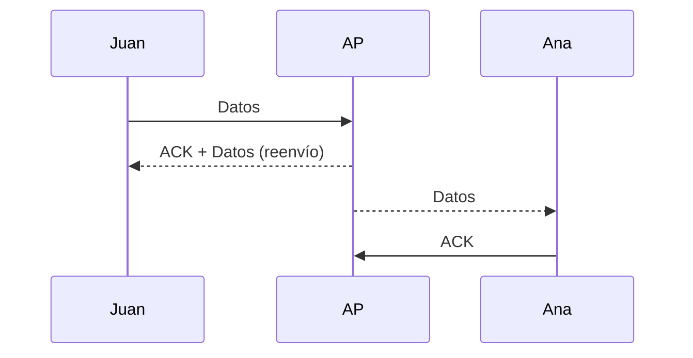
`TODO revisar si el orden está bien`

#### MAC: CSMA/CA
En una red ethernet (CSMA/CD Ethernet 802.3) todos detectan la colisión en tiempo real.
En una red WiFi (CSMA/CA Wi-FI 802.11) los dispositivos suponen que ha habido colisión si después de enviar una trama no reciben un `ACK`.

Tanto CSMA/CD como CSMA/CA son half-duplex.

#### Campo duración
Indica durante cuantos microsegundos estará ocupado el canal para transmitir esta trama.
Lo calcula el emisor a partir de la velocidad de transmisión y la longitud de la trama, incluye también el tiempo estimado que tardará en recibir el `ACK`.
Todas las estaciones de la celda reciben esta información (la emisión es tipo broadcast).

#### NAV (Network Allocation Vector)
Cada estación mantiene un contador de tiempo retrospectivo llamado NAV, que indica el tiempo que queda para que el canal quede libre.
El NAV se actualiza con el valor que aparece en cada trama emitida en la celda, excepto si el nuevo NAV es más pequeño que el que ya había, en cuyo caso se ignora.
Una estación no intentará transmitir mientras NAV > 0.

#### Proceso de transmisión de una trama:
Cuando una estación quiere enviar una trama:
1. Espera a que el canal esté libre.
2. Espera a que NAV = 0.
3. Elige un número aleatorio entre 0 y $n$ ($n\leq 255$, el valor de $n$ depende del hardware) y espera ese número de intervalos de tiempo.
4. Una vez agotados los intervalos, comprueba si el canal sigue todavía libre, si es así transmite la trama.
5. Al terminar espera a que el receptor le envíe una confirmación `ACK`. Si no se produce dentro del tiempo previsto considera que ha habido una colisión y repite el proceso desde el principio, doblando $n$ en el paso 3.

#### Colisiones
Pueden producirse porque dos estaciones a la espera elijan por casualidad el mismo número de intervalos de espera. En ese caso reintentarán duplicando cada vez el rango de intervalos, entre los que eligen al azar un número nuevo. Similar a Ethernet.
Si la trama va de una estación a otra en el mismo AP el proceso se ha de efectuar dos veces (para nivel MAC son dos envíos independientes).

#### Problema de la estación oculta
Tenemos un equipo $A$, un AP $B$ y otro equipo $C$. $A$ y $C$ no están dentro del alcance del otro, solo $B$.
1. $A$ quiere retransmitir una trama de 100ms a $B$. Medio libre así que transmite.
2. $B$ está callado durante los 100ms de transmisión. NAV = 100ms.
3. Mientras $A$ retransmite, $C$ quiere enviar una trama de 200ms a $B$. Detecta el medio libre (no capta la emisión de $A$) y transmite.
4. Se produce una colisión y $B$ no recibe ninguna de las dos tramas.

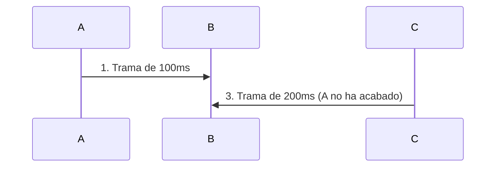
^ Se produce colisión.

**Solución**:
1. Antes de transmitir la trama, $A$ envía un mensaje **RTS** (Request To Send).
2. $B$ responde al RTS con un **CTS** (Clear To Send).
3. $C$ no capta el RTS, pero sí el CTS. Sabe que no debe transmitir durante los próximos 100ms.
4. $A$ envía su trama con seguridad de no haber colisiones.

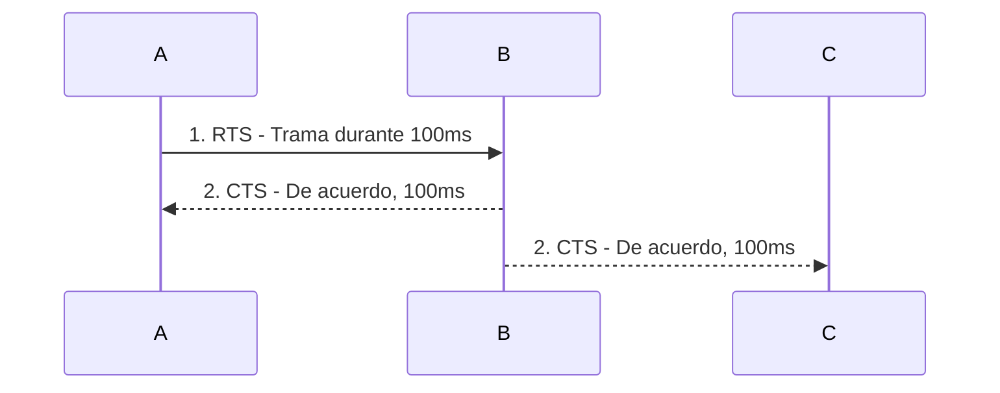
$C$ no retransmitirá dado que capta el CTS (B envía el CTS a todos)

El uso de RTS/CTS se denomina a veces *Virtual Carrier Sense*, ya que permite reservar el medio durante una trama. Una vez emitidos ambos mensajes, todos saben que el canal está reservado. Su uso se activa por configuración, pero no todas las interfaces lo soportan.
En algunos casos al configurar se puede especificar a partir de qué tamaño de trama se quiere utilizar. $>2312$ bytes no se utilizará nunca, $1$ se utilizará siempre. Esto es porque el beneficio de usar RTS/CTS es mayor cuanto mayores son las tramas transmitidas.

### Fragmentación
Las redes WLAN tienen mayor tasa de error que las LAN
Se prevé la posibilidad de que el emisor fragmente una trama para enviarla en trozos más pequeños.
Por cada fragmento se devuelve un `ACK`, en caso necesario cada fragmento se transmite por separado.
La fragmentación permite enviar datos en entornos con mucho ruido, a coste de aumentar el overhead. No se puede hacer fragmentación a nivel de red porque los APs no son routers.
Todas las estaciones están obligadas a soportar la fragmentación en recepción, pero no en transmisión.
Los paquetes multicast o broadcast no se fragmentan nunca.

### Direcciones MAC de los AP
Un AP suele tener dos direcciones MAC:
- La de su interfaz en la red cableada (DS) normalmente Ethernet.
- La de su interfaz inalámbrica.

La dirección MAC de la interfaz inalámbrica se utiliza como identificador del BSS que corresponde a ese AP, y se denomina el **BSSID**. Este dato es fundamental para el funcionamiento de una red 802.11.

La dirección de la interfaz ethernet no tiene interés para la red inalámbrica, pero es la que normalmente se asocia con la dirección IP del AP, y por tanto es la que aparecerá en las tablas ARP.
Si el AP tiene más de una interfaz inalámbrica, cada una tendrá una dirección MAC diferente. En ese caso cada emisor de radio configura un BSS diferente y tendrá un BSSID diferente, aunque sus áreas de cobertura se solapen.

`TODO imagen router 37`

### Envío de tramas en redes 802.11 ad-hoc

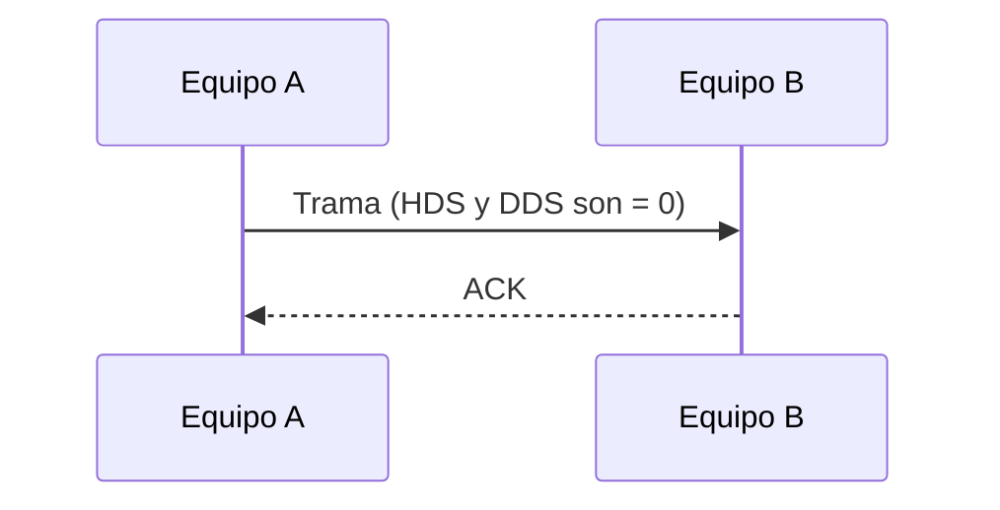

### Envío de tramas en redes 802.11 infraestructura
`TODO imagen 40`
El DS está formado por una red Ethernet, por lo que los puntos de acceso deberán hacer de puentes transparentes y traductores entre 802.3 y 802.11.
Por simplificar supongamos que las direcciones MAC de los hosts y de la interfaz inalámbrica de los APs son los nombres indicados en la imagen.
#### De A hacia B (A-AP1-B)
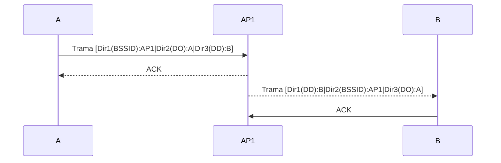
#### De A hacia X (A-AP1-X)
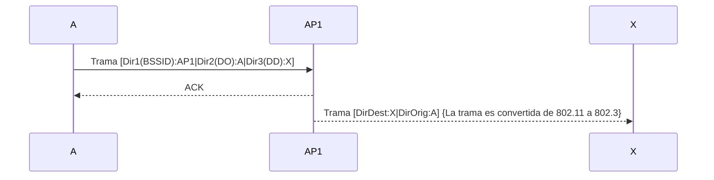
#### De X hacia A (X-AP1-A)
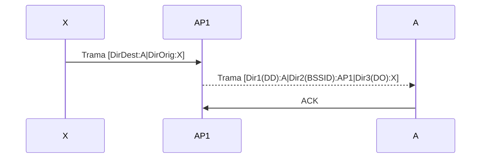
La trama Ethernet no contiene la dirección de AP1, pero como AP1 habrá enviado a la red tramas con dirección de origen A el conmutador tendrá la dirección MAC de A en el puerto donde esté conectado AP1.
#### De A hacia C (A-AP1-AP2-C)
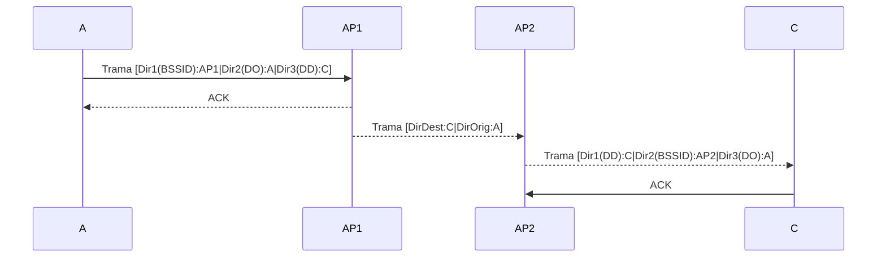
#### De C hacia D (C-AP2-AP3-D)
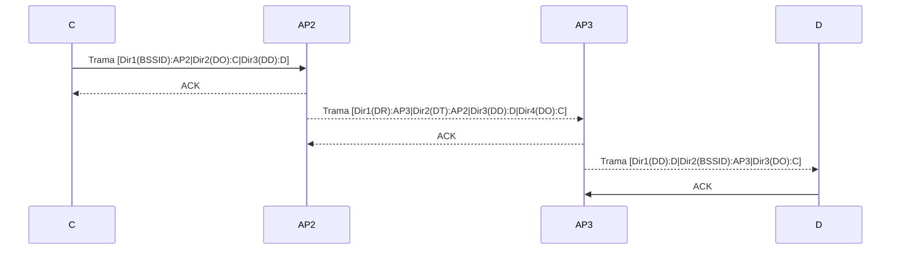

`TODO aquí vendría bien añadir las imágenes, 45 para arriba`

## 5.4. Conectividad y Seguridad

Cada red inalámbrica se identifica por un SSID (Service Set Identifier) que es una cadena de hasta 32 caracteres alfanuméricos.
Cuando el SSID corresponde a un ESS a veces se denomina ESSID.
**Importante**: No confundir el SSID con el BSSID (la dirección MAC de la interfaz inalámbrica de un AP). Un ESS tiene un SSID, pero puede tener muchos BSSID.
Cualquier estación que pretenda participar en una red debe configurarse con el SSID correcto.


¿Cómo sabe la estación qué SSIDs están disponibles en un momento dado?

### Conectividad en redes 802.11
Los APs difunden periódicamente unos mensajes broadcast llamados beacon, en los que indican el SSID de la red a la que pertenecen.
Se suelen enviar 10 veces por segundo.
Un AP puede configurarse para que no envíe beacons, o los envíe ocultando el SSID. No obstante los SSID no viajan encriptados por lo que se pueden averiguar captando un mensaje de otra estación.
Las estaciones pueden enviar 'probe requests' buscando APs. Un AP está obligado a responder con un 'probe response' si:
- El probe request indicaba el SSID del AP
- El probe request indicaba un SSID de 0 bytes (SSID broadcast)

### Escaneo activo con NetStumbler
NetStumbler envía un probe request con el SSID broadcast por cada canal de radio, después analiza los probe response recibidos.
Así se descubren todos los APs que no estén configurados para ocultar su SSID.

### Asociación
Si una red inalámbrica, o sea un SSID, no tiene configurada ninguna protección, cualquier estación puede conectarse a ella asociándose a uno de sus APs.
En redes inalámbricas la asociación a un AP equivale a conectarse por cable a un switch en una red Ethernet.
Cuando un AP recibe una trama del DS mira si el destino está en su lista de MACs asociadas. Si no lo está lo descarta.

### Itinerancia
Una estación no puede estar asociada a más de un AP a la vez.
Si se aleja de un AP y se acerca a otro deberá reasociarse (esto en un mismo ESS).
Si el proceso se realiza con suficiente rapidez es posible que no se pierdan paquetes.

### Autentificación
Una red inalámbrica está expuesta a ataques. Para evitarlos se debe utilizar un protocolo de protección (como WPA2...)
Esto obliga a las estaciones a autentificarse, se hace antes de asociarse. No hace falta al reasociarse.

### Organización de una red 802.11
Los APs se conectan a conmutadores ethernet con el RJ45. Todos los APs de un mismo SSID se conectan a la misma VLAN.
Un servidor DHCP suministra direcciones IP a las estaciones cuando se conectan al SSID.
Si se van a ofrecer distintos servicios algunos AP pueden configurar más de un SSID simultáneamente.
Debido a esto último, la conexión de un AP al DS debe hacerse mediante un puerto trunk.

### Ahorro de energía
Dado que muchos dispositivos funcionan con baterías, muchos usan un modo "standby" en el que no reciben tramas.
Antes de echarse a dormir, las estaciones deben avisar al AP para que retenga las tramas destinadas a ellos en el buffer.
Periódicamente estas estaciones se despiertan y capturan el siguiente beacon. Si la estación ve que tiene una trama pendiente se la pedirá al AP.
En 802.11e se incorporó el Unscheduled Automatic Power Save Delivery, que permite al AP despertar al dispositivo.

### Seguridad
Las redes inalámbricas están mucho más expuestas que las LANs. Existen mecanismos que permiten mejorar la seguridad, como desactivar el anuncio de SSID en modo broadcast, o filtrar por dirección MAC. Pero esto no es suficiente. La verdadera seguridad solo es posible con protocolos basados en técnicas criptográficas.

Originalmente se usó el protocolo WEP, muy vulnerable e inseguro.
Para cubrir esto se desarrollaron el WPA y WPA2 (WiFi Protected Access) basados en 802.1x.
WPA2 fue vulnerada en 2017, llegando así **WPA3**, la última versión, con un cifrado de hasta 192 bits en vez de 128 bits.
WPA3 usa Simultaneous Authentication of Equals que lo hace inmune a ataques pasivos o con diccionarios. Con WPA3 si un atacante obtiene la clave no podrá desencriptar todos los paquetes, y no podrá forzar la desconexión de los dispositivos. En resumen, con WPA3 no importa que la contraseña sea débil, porque la clave de cifrado de tramas no se basa en la contraseña.

### Seguridad en redes inalámbricas
Dos formas:
- Clave secreta compartida: Redes wifi personales
- Validación por usuario/password frente a un servidor RADIUS (Remote Authentication Dial In User Server): Redes wifi enterprise

Para controlar el acceso a la red mediante RADIUS se pueden usar túneles VPN u 802.1x.
Las claves no se envían por la red, sino que se emplean mecanismos basados en técnicas criptográficas como CHAP.

### Hacking de redes inalámbricas
Existen muchas formas de atacar redes wifi. Algunas consisten en [atacar al protocolo de seguridad](https://youtu.be/0Pgf5TMK6x8), como el ataque a WPA2. Otros intentan [evitar la seguridad](https://youtu.be/0Pgf5TMK6x8), como el del WPS, o clonar la red wifi y hacer que la víctima te de la contraseña.

### Software para análisis/ataque
Análisis:
- Netstumbler
- Acrylic Wifi Home
- Kismet

Ataque:
- Aircrack-ng
- Hashcat
- Kali Linux

## 5.5. Nivel físico
### Espectro radioeléctrico: regulación
La zona del espectro electromagnético para emisiones de radio es el espectro radioeléctrico, que abarca desde 9 KHz hasta 300 GHz.
Este espectro está regulado por la ITU-R. Para emitir en la mayoría de bandas se require una licencia. Se divide en tres regiones:
- Región 1: EMEA (Europa, Medio Oriente y África)
- Región 2: América
- Región 3: Asia y Oceanía

### Bandas ISM
Bandas Industrial-Scientific-Medical, en las que se puede emitir sin necesidad de una licencia. Las usan teléfonos inalámbricos, mandos a distancia, hornos de microondas...
Las redes inalámbricas siempre usan bandas ISM, sería inviable pedir licencia para cada red.

### Banda de 2,4 GHz (802.11 b/g/n)
La más utilizada, aunque los dispositivos nuevos incorporan ya 5GHz.
El estándar 802.11n soporta tanto 2,4 GHz como 5 GHz.

### Espectro disperso (SS)
Técnicas utilizadas para superar los inconvenientes de las bandas ISM, como el ruido o las interferencias. Tenemos dos:
- Salto de Frecuencia (FHSS): Hoy en día en desuso, todavía empleada en 802.15 (Bluetooth)
Creada por Hedy Lamarr en 1941. El emisor y receptor van cambiando constantemente de frecuencia, siguiendo una secuencia previamente acordada. Se emplea un canal estrecho. En 802.11 se usan 79 canales de un MHz y se cambia de canal cada 0,4 segundos. En Bluetooth se cambia más a menudo.
- Secuencia Directa (DSSS): Se emplea en todas las redes 802.11 actuales.
Se usa un canal muy ancho y se envía la información codificada con mucha redundancia. Se confía en que el receptor sea capaz de descifrar la información incluso si se produce interferencia. En 802.11 se usan canales de 22 MHz.

### Interferencia por multitrayectoria
Debido a la diferencia de tiempo entre la señal que llega directamente y la que llega reflejada por diversos obstáculos.
La señal puede llegar a anularse si el retraso de la onda coincide con media longitud de onda.

### Antenas diversidad
- El equipo recibe la señal por dos antenas, compara y escoge la que de mejor calidad de señal. Esto se hace para cada trama recibida.
- Para emitir a una estación se usa la antena que haya dado mejor señal la última vez que recibió desde dicha estación
- Si la emisión falla se cambia a la otra antena y se reintenta.

### Banda de 5 GHz (802.11 a/h/ac/ax)
Permite canales de mayor ancho de banda.
Se utilizan técnicas MIMO y OFDMA, que mejoran la eficiencia.

Las redes wifi 5 GHz hacen uso de 23 canales no superpuestos.

`Falta compatibilidad 802.11b/g`

### Rendimiento de WLANs
El rendimiento suele ser el 50-60% de la velocidad nominal. Con 11 Mb/s se pueden obtener 6 Mb/s en el mejor de los casos.


## 5.6. Diseño de redes inalámbricas
### Antenas
La ganancia de una antena es una medida relativa de la intensidad de señal emitida en comparación con la que emitiría una antena isotrópica a la misma distancia y con la misma potencia.
Se expresa en dBi (decibelio isotrópico)
En 802.11 se usan las siguientes antenas:
- Omnidireccionales
- De "parche"
- Yagi
- Parabólicas

Cuanto mayor la ganancia menor la potencia máxima.

### Diseño
Para ubicar los APs se ha de tomar en cuenta la forma del área a cubrir, por ejemplo el edificio. Si es posible conviene hacer pruebas preliminares. Se deben ajustar los canales AP y su potencia para minimizar interferencias entre ellos.
Normalmente en interior se usan antenas omnidireccionales, y en exterior de parche.

En algunos casos la señal puede atravesar 2-3 paredes, en otros puede cubrir plantas contiguas.


## 5.7. Puentes inalámbricos
### Puentes entre LANs
Se pueden aprovechar los sistemas de transmisión via radio para unir LANs entre sí. Los dispositivos que se usan son puentes inalámbricos, parecidos a un punto de acceso. Se pueden usar antenas direccionales, pero se require visión directa (elipse libre de obstáculos entre ambas antenas).

---

# 6. Nivel de Red

## 6.1. Introducción
### 6.1.1. Servicios y Funciones del nivel de Red
El nivel de Red puede ofrecer tanto un servicio O.C. como uno N.O.C.

Las principales funciones del nivel de red son:
- **Encaminar paquetes** desde la máquina origen a la destino.
- **Control de congestión** regulando el tráfico introducido y el transmitido.
- Proporcionar formatos de **direccionamiento universal**.
- **Interconexión de redes distintas**, nodos especiales (*routers*).
- **Tarificación**.

El nivel red es el único que **ve y conoce la topología de la red**, formada por dos tipos de nodos:
- **Nodos *terminales***: Generan o reciben paquetes de otros nodos
- **Nodos *intermedios o de encaminamiento***: Útiles para encaminar paquetes entre nodos terminales.


## 6.2. Organización Interna de Subred
En primer lugar hemos de distinguir entre **redes de conmutación de circuitos** y **redes de conmutación de paquetes**.
1. Redes de **conmutación de circuitos**: los canales físicos que unen ambos extremos están reservados para uso exclusivo.
2. Redes de **conmutación de paquetes**: cada nodo intermedio recibe mensajes (paquetes) y los almacena hasta que los reenvía hacia su destino final (o a otro nodo intermedio).

### 6.2.1. Técnica Datagrama
> Cada paquete se trata de forma **independiente**, sin referencia a los paquetes anteriores.

El emisor numera cada paquete, añade información de control y lo envía a su destino.

Por haber tomado caminos diferentes, los paquetes pueden llegar desordenados. El recepor ordenará los paquetes y sabrá si se han perdido.

### 6.2.2. Técnica Circuitos Virtuales
> Antes de enviar los paquetes, el emisor envía un paquete de control llamado **petición de llamada**, solicitando una conexión lógica al receptor. El nodo ha de enviar un paquete de **llamada aceptada**. Así queda establecido un camino virtual para todo el grupo de paquetes, los cuales contienen un número de circuito virtual, en lugar de una dirección de destino.

El encaminamiento sólo se hará una vez. Para finalizar la conexión uno de los nodos enviará un paquete de **petición de liberación**.


## 6.3. Encaminamiento
La verdadera función de la capa de red es el **encaminamiento de paquetes**. Las decisiones de encaminamiento se toman en el momento de establecimiento en caso de circuito virtual, o cuando se recibe un paquete en el caso de datagrama.

Un algoritmo de encaminamiento se encarga de decidir sobre qué línea de salida ha de transmitirse un paquete.

La selección de la ruta se basa en criterios de funcionamiento, como escoger el camino más corto, o escoger e camino con menor coste.


### 6.3.1. Algoritmos de encaminamiento no adaptativos
Se plantean *a priori*, siempre funcionan igual. También se les llama **deterministas**.
#### Avalancha o inundación
Cuando un nodo recibe un paquete, lo envía por todas las líneas menos la de origen. Utilizado en puentes transparentes (tramas broadcast, multicast)

#### Camino múltiple
Cada nodo encaminará sus datos sólo a su nodo adyacente. Cada nodo mantiene una tabla con los posibles destinatarios, ordenados en función de la mejor línea de salida y una ponderación relativa.

Antes de reexpedir un paquete, el nodo genera un número aleatorio.

**IMPORTANTE ENTENDER** -> Para examen

$J$ recibe un paquete con destino $G$. Utiliza la tabla.

$J$ generará un número aleatorio entre 0.00 y 0.99. Si el número es $<0.46$ se usará la $H$, si está entre $0.46$ y $0.76$ se usará la $A$, si es superior a $0.76$ se usará $K$

#### Camino más corto
Existen varios algoritmos para encontrar el camino más corto entre dos nodos de un grafo. Uno de estos es el **Algoritmo de Dijkstra**.

Se debe definir la distancia calculándola a partir de los siguientes parámetros:
- Capacidad del enlace
- Tráfico medio
- Retardo
- Fiabilidad

#### Basado en flujo
Optimiza las rutas para utilizar los enlaces de mayor capacidad y menor tráfico.

Se debe conocer la matriz de tráfico entre nodos y es conveniente que el tráfico sea regular.


### 6.3.2. Algoritmos de encaminamiento adaptativos
Permiten cambiar decisiones en función de variaciones en la topología o tráfico de la red.

#### Centralizado
Existe un **controlador central de encaminamiento *(CCR)***, al que periódicamente cada nodo envía su estado. El controlador construye las tablas y las manda a los nodos.

Simplifica los nodos, por lo que se acelera el encaminamiento.

**Problema si el CCR deja de funcionar**.

#### Aislado
Las decisiones de encaminamiento las toma **cada nodo de forma local**.

Un ejemplo es el **algoritmo de la patata caliente**. Los paquetes se encaminan por la línea de la cola menor, sin tener en cuenta el destino.

#### Distribuido
La información que usa el nodo está basada en información local y la de otros nodos cercanos. Conociendo la distancia a cada vecino el nodo es capaz de determinar la ruta más conveniente para el paquete.

#### Jerárquico
Basado en el sistema telefónico. Los routers se agrupan en regiones, y entre los routers de cada región conocen las rutas a seguir por los paquetes, pero nada de la estructura interna de otras regiones.

De esta forma hay ahorros muy significativos.

## 6.4. Congestión
La congestión es la degradación que se produce cuando hay demasiados paquetes circulando por la subred. En este caso, el router no puede procesar todos los paquetes que llegan.

Puede producirse por varias causas, destacando la **insuficiente capacidad de proceso** y la **velocidad insuficiente** en líneas de salida.

La congestión tiene efectos de avalancha: si un encaminador está saturado, rechazará todos los paquetes que lleguen, afectando a los encaminadores conectados a este, que intrentarán la retransmisión al vencer los temporizadores, no pudiendo liberar memoria.

### 6.4.1. Dos planteamientos
#### Técnica preventiva
Diseñar la red desde el principio para evitar la congestión

Esta técnica es más segura, pero puede ser ineficaz si las limitaciones son demasiado restrictivas.

#### Técnica curativa
Definir medidas que detecten la congestión y adoptar medidas correctoras.

Permite aprovechar mejor la red, pero en caso de congestión se puede dificultar la situación.

### 6.4.2. Mecanismos para evitar congestión
#### Rechazo de paquetes
Cuando un encaminador no puede procesar paquetes, los rechaza e informa al emisor de que reduzca la tasa de transmisión.

#### Restricción del número de paquetes en la subred
No permitir acceso a nuevos paquetes cuando haya demasiados en la subred.

#### Paquetes de choque
Cada encaminador monitora sus líneas de salida y hace una estimación de su uso. Si se sobrepasa un umbral, avisa a las estaciones que usan esa línea mediante un paquete de restricción. El encaminador origen disminuye el tráfico al encaminador destino, y los aumentos posteriores se harán en incrementos menores para evitar una nueva congestión.

### 6.4.3. Algoritmos de Control de Congestión
#### Cubeta de Goteo
Se envían paquetes desde el host.

La interfaz de red contiene una 'cubeta' que mantiene los paquetes.

Esta 'cubeta' actúa como un embudo, regulando el flujo.

#### Cubeta de Goteo con Fichas
Similar, pero el cubo tiene 'fichas', el cubo recibe fichas cada $\Delta T$.

El cubo puede ir gastando estos 'tokens' para ir más rápido.

#### Control de admisión
Aplicable a redes O.C., consisten en **evitar el establecimiento de nuevos circuitos virtuales** por una zona de red que se considera congestionada.

#### Descarte de paquetes
Puede dar lugar a situaciones oscilantes, si el router descarta paquetes de muchos hosts, estos lo detectarán y bajarán el ritmo de emisión.

Al ver que los paquetes ya no se pierden, los hosts irán recuperando la confianza hasta que se repita la situación.


---


# LABORATORIO

## 1.3.- FTP

**File Transfer Protocol** (*FTP*) es un protocolo que posibilita el intercambio de ficheros entre *máquinas remotas* mediante **TCP**.
- Acceso interactivo: Permite a los usuarios interactuar con el servidor remoto mediane comandos.
- Especificación de formato: FTP permite al cliente especificar el tipo y formato de los datos almacenados.
- Control de autentificación: Controla mediante nombre y password el acceso, rechaza a usuarios no autorizados, aunque en conexiones públicas de archivos esto se permite mediante conexiones `anonymous`. (Dice el profe que si tienes algo de honor o respeto lo que haces es poner tu correo como password, ni idea de cómo).

### El modelo FTP


Se entabla la *conversación* con el servidor FTP mediante una **conexión de control**. Este proceso es un "esclavo", para poder aceptar por el puerto `21` otras posibles conexiones, asegurando la concurrencia.

Si el usuario pide una transferencia de archivos, se abrirá una **conexión de datos** independiente en el puerto `20`, por la que se copiará el archivo.

> Resumiendo, se utilizan **dos** conexiones, una **de control** [`21`] y una **de datos** [`20`]. Ambas usan TCP pero la primera se usa para enviar comandos y la segunda para enviar datos.

Un cliente establece la conexión mediante un puerto de protocolo aleatorio asignado localmente (en el ejemplo el 5122), pero la comunicación con el servidor se realiza en el puerto 21 (en el caso de FTP). El cliente establece contacto con el proceso de transferencia de datos en la máquina del servidor, que utiliza el puerto 20 (reservado también para FTP).

Para asegurar que un proceso de transferencia del servidor se ha conectado al proceso de transferencia correcto en el cliente, la conexión de control indicará el puerto que se utilizará en la máquina cliente (en el ejemplo el 5137).

La sesión termina cuando la conexión de control desaparece.

---

### Comandos de FTP

Comandos que se pueden enviar a través de una conexión de control:
- Comandos de **autentificación**:
    - `user <parametro>`
    - `pass <parametro>`
- Comandos de **transferencia de archivo**:
    - `get <parametro 1> [<parametro 2>]` - Solicita el envío de un fichero. El primer parámetro indica el nombre del fichero que queremos. Mediante un segundo podemos indicar el nombre con el que almacenarlo en el disco local.
    - `mget <parametros>` - Solicita el envío de múltiples ficheros. Admite comodines si la opción global está activada.
    - `put <parametro>` - Informa al servidor de que se le va a enviar un fichero.
    - `mput <parametros>` - Informa de que se va a enviar multiples ficheros. Permite usar comodines igual que mget.
- Comandos de **gestión de archivo**:
    - `lcd` - Informa del directorio local actual.
    - `dir` - Solicita el listado de un directorio.
    - `pwd` - Pide al servidor información del path de acceso al directorio actual.
    - `mkdir` - Solicita al servidor crear un directorio especificado.
    - `rmdir` - Solicita al servidor borrar un directorio especificado.
    - `del <parametro>` - Solicita al servidor que borre el archivo especificado.
- Comandos de **control**:
    - `ascii` - El protocolo adapta los datos recibidos al formato local.
    - `binary` - Los ficheros se consideran binarios. FTP fija por defecto ASCII.
    - `quit` - Solicita al servidor que cierre el enlace.
- Otros comandos interesantes:
    - `quote` - Si el cliente no dispone de todo el juego de comandos, pero el host remoto sí.
    - `pasv` - Pide al servidor que identifique una IP y un puerto para que el cliente inicie una conexión de datos.
    - `stat` - El servidor envía respuesta con estado a través de la conexión de control.
    - `Noop` - No operación, provoca una respuesta O.K. por parte del servidor.
    - `syst` - Indica el sistema operativo del servidor.
    - `help` - El servidor envía información por la conexión de control.
    - `acct <parametro>` - Donde parametro es una cadena Telnet identificando la cuenta de usuario.
    - `cwd <parametro>` - Donde parametro es la ruta de un directorio para almacenar o recuperar información.
    - `cdup` - Cambia al directorio padre.
    - `snmt` - El usuario puede montar un sistema de fichero distinto.
    - `type` - Tipo de representación.
    - `mode \<argumento>` - Donde argumento dicta el modo de transferencia (**F**lujo, **B**loque o **C**omprimido).
    - `stor` - Guarda en un fichero del servidor los datos leídos.
    - `debug` - Obtiene información de la forma de trabajo del protocolo.

---

### Modo Activo

El cliente se conecta al servidor usando un puerto que esté libre mayor de 1024, al puerto 21 del servidor. En este momento indica al servidor en qué puerto está esperando los datos.
Si el cliente tiene un *firewall* el acceso del servidor al puerto comunicado será rechazado. Para solventar esto se puede usar el modo pasivo.

### Modo Pasivo

El cliente se conecta al servidor usando un puerto superior al 1024, al puerto 21 del servidor. El cliente especificará que quiere acceder en modo pasivo (`pasv` o `pass`). El servidor ofrecerá una IP y un puerto, y será el cliente el que se conecte desde su puerto de datos a la IP y puerto especificados por el servidor.

---

### Los códigos de transferencia

Compuestos por 3 dígitos decimales.
- 1xx - Indican que se ha comenzado a realizar una acción.
- 2xx - Indican que el comando se realizó con éxito.
- 3xx - Indican que se ha alcanzado con éxito un punto intermedio.
- 4xx - Indican errores pasajeros.
- 5xx - Indican errores permanentes.
<br>

- x0x - Errores de sintáxis.
- x1x - Errores de información.
- x2x - Relacionados con el estado de las conexiones.
- x3x - Relacionados con login.
- x4x - Sin especificar.
- x5x - Sobre el estado del sistema de ficheros.

Por ejemplo:
```
200 Command OK
331 Username OK, password required
504 Unknown command
```

---

## 1.4.- Correo electrónico y SMTP

El correo electrónico es una aplicación distribuida que permite el envío de mensajes y archivos. En el origen usaba FTP como protocolo.

Una dirección de correo es una forma de especificar la persona a la que se quiere enviar un mensaje (`usuario@dominio`).

### SMTP
El protocolo de transferencia de correo SMTP (Simple Mail Transfer Protocol) es el estándar de Internet para el intercambio de correo usando métodos de almacenamiento y reenvío. Necesita un canal fiable y con entrega ordenada, como por ejemplo el protocolo TCP (puerto `25`).

SMTP gestiona la transferencia de un host a otro. No es responsable del correo de usuarios locales ni de la distribución de correo recibido a sus destinatarios.

Al crear un mensaje, el sistema de correo local determina a partir del nombre del receptor si debe ser depositado en un buzón local o en la cola de salida. Para enviar el correo, el cliente SMTP obtiene la dirección IP del host de destino mediante el DNS y lo utiliza para inicializar una conexión de transporte en dicho host. Una vez se ha establecido la conexión, el cliente inicia la transferencia del correo en espera hacia el servidor.

### Mensaje SMTP
Los mensajes SMTP contienen cabecera y contenido. La cabecera especifica:
- TO:
- FROM:
- SUBJECT:
- CC:
- BCC:
- REPLAY_TO:
- REFERENCE:

Cada línea de la cabecera comprende una de estas palabras seguidas por un texto, y separados por el ":"
```
TO:<direccion_receptor>
FROM:<direccion_emisor>
DATE:<fecha>
```

El contenido es el mensaje a transmitir. Por defecto son los primeros 128 caracteres ASCII, y aunque se envíen 8 bits por carácter el primero se ignora (como si fuera 0) dado que se basa en ASCII de 7 bits.

Para indicar que el mensaje ha terminado, se transmite una línea con la secuencia `<CR><LF>.<CR><LF>` (5 caracteres)
> `<CR><LF>` o `<CRLF>` es *Carriage Return & Line Feed*, en ASCII los caracteres `#13` y `#10`. CRLF indica el fin de una línea, lo que entenderíamos por ejemplo por '*Enter*'.

### Funcionamiento de SMTP

El remitente actúa como cliente y establece una conexión TCP (25) con el destinatario, que actúa como servidor.

El usuario compone un mensaje y el agente de usuario (aplicación de correo) entrega este mensaje al emisor SMTP activo en la máquina cliente. Si existen varios destinos se mantiene en cola hasta haberlo entregado en todos ellos.

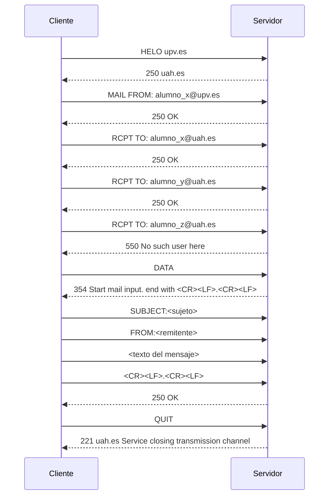
En el ejemplo anterior, `upv.es` es el remitente y toma el rol de cliente, mientras que `uah.es` es el destinatario y toma el rol de servidor. 

### Comandos SMTP

Los comandos de SMTP son nemónicos de 4 caracteres, con terminación de línea con `<CRLF>` (también dicho `#13#10`).

| Formato                                       | Descripción                                                        |
| --------------------------------------------- | ------------------------------------------------------------------ |
| `HELO <nombre_cliente>`                       | Envía la identificación (Recuerda que en SMTP cliente = remitente) |
| `MAIL FROM <remitente@host_remitente>`        | Identifica al remitente                                            |
| `RCPT <destino@host_destino>[<mas_destinos>]` | Identifica al destinatario                                         |
| `DATA`                                        | Transfiere un texto de mensaje                                     |
| `RSET`                                        | Aborta la transacción del correo actual                            |
| `NOOP`                                        | No operación                                                       |
| `QUIT`                                        | Cierra la conexión TCP                                             |
| `SEND FROM <remitente@host_remitente>`        | Envía el correo al terminal                                        |
| `SOML FROM <remitente@host_remitente>`        | Envía el correo al terminal si es posible                          |
| `SAML FROM <remitente@host_remitente>`        | Envía el correo al terminal y al buzón                             |
| `VRFY <nombre_usuario>`                       | Confirma el nombre de usuario                                      |
| `EXPN <nombre_lista_de_correo`                | Devuelve nº de miembros de lista de correo                         |
| `HELP [cadena_comandos]`                      | Envía documentación del sistema                                    |
| `TURN`                                        | Intercambia el rol de emisor y receptor                            |

Los códigos de respuesta son prácticamente idénticos a los anteriores de FTP
- 1yz - Respuesta positiva preliminar
- 2yz - Respuesta de finalización positiva
- 3yz - Respuesta positiva intermedia
- 4yz - Respuesta de finalización negativa *temporal*
- 5yz - Respuesta negativa al comando


### Extensiones de Correo y MIME

Debido a la simpleza de SMTP, surgió la necesidad de crear nuevos clientes que permitan más que transferir mensajes de texto. Así es como surgen los nuevos Agentes de transferencia de mensajes de **SMTP extendido** (*ESMTP*).


De esta manera, se implementó en 1992 la extensión para transmisión de datos no ASCII, denominada **MIME** (*Multipurpose Internet Mail Extension*).
MIME permite que los datos sigan codificándose en ASCII, enviándose así por e-mail estándar. Cada mensaje MIME contiene datos informando al receptor del tipo de datos que está recibiendo, y qué codificación se ha usado. Esto permite el envío de mensajes en idiomas previamente no soportados, como el castellano o el ruso, además del envío de audio, vídeo, ..., etc.

#### Funcionamiento de MIME
Un agente de transferencia de mensajes extendido envía un saludo **`EHLO`** (*no **`HELO`***). Si la respuesta es positiva sabrá que el receptor es un MTA extendido. Si es un error, podrá volver a SMTP normal y enviar un **`HELO`**.

#### Formato de MIME
Los mensajes pueden contener datos ASCII y no ASCII. A estos últimos se les incluyen unas cabeceras:
| Cabecera                    | Significado                                     |
| --------------------------- | ----------------------------------------------- |
| `MIME-Version`              | Identifica la versión de MIME                   |
| `Content-Description`       | Cadena de texto que describe el contenido       |
| `Content-Id`                | Identificador único                             |
| `Content-Transfer-Encoding` | Cómo se codifica el mensaje para su transmisión |
| `Content-Type`              | Naturaleza del mensaje                          |

```
FROM: alumno_x@uah.es
TO: alumno_y@uah.es
MIME-Version: 1.0
Content-Type: image/gif
Content-Transfer-Encoding: base64
<datos de la imagen>
...
```

Para el encoding existen varios valores definidos, como 7bit, 8bit, binary, ..., sin embargo el más extendido es base64.

#### Encoding y base64
Se convierten los datos en un conjunto de caracteres con un tamaño de un tercio mayor. Los datos se dividen desde la izquierda en grupos de 3 bytes de 8 bits cada uno. Para la conversión se divide en 4 grupos de 6 bits cada uno de los anteriores, y se interpreta cada grupo como un número. Por último se sustituyen los números por sus caracteres correspondientes, según la tabla:
<br>


Esto significa que si queremos aplicarlo a la cadena `10100001 10001111 11000001` (grupo de 3 bytes) tendríamos que dividir dicha cadena en 4 grupos de 6 bits `101000 011000 111111 000001` (40 24 63 1) y esta división la transformaríamos según la tabla a **`oY/B`**.

#### Content-Type
Tiene el formato `Content-Type: type/subtype`.
Existen tipos estandarizados (definidos en la RFC/521):
- `text` - Para texto normal
    - `text/plain` - Texto sin formato (con `charset` podemos especificar el juego de caracteres i.e. `charset=us-ascii` o `charset=iso-8859-3`)
    - `text/html` - Texto en lenguaje HTML
- `message` - Encapsular un mensaje dentro de otro (un reenvío)
    - `message/rfc822` - Clásico
    - `message/partial` - Encapsulado en trozos
    - `message/external body` - Puntero a documento remoto, no el documento en sí
- `image` - Transmitir datos de imágenes
    - `image/jpeg` - *Joint Photographic Experts Groups*, esquema de compresión de imágenes
    - `image/gif` - *Graphics Interchange Format*
    - `image/tiff` - Formato de archivos de imagen con marcas
- `audio` - Transmitir audio
    - `audio/wav`
    - `audio/mp3`
- `video` - Transmitir video (audio y video se transmiten por separado)
    - `video/mpeg`
    - `video/quicktime`
- `application` - Datos formateados para una aplicación determinada
    - `application/pdf` - Postscript de Adobe Acrobat
    - `application/zip` - Formato de documento comprimido
- `multipart` - Cuerpo del mensaje, con objetos independientes separados por un separador de encapsulado que está definido en `Content-Type`
    <br>

    ```
    Content-type: multipart/mixed; boundary = "200806131830"
    ```
    El separador tiene de 1 a 70 caracteres, se inicia con dos guiones excepto el último que se inicia **y finaliza** con dos guiones.
    - `multipart/mixed` - Permite distintos submensajes independientes
    - `multipart/parallel` - Indica que las partes deben mostrarse juntas
    - `multipart/alternative` - Permite que la codificación sea usando distintos métodos
    - `multipart/digest`- Permite que un mensaje contenga un conjunto de otros mensajes (una colección de emails de una discusión por ejemplo)
    <br>

    ```
    MIME-Version: 1.0
    From: alumnox <alumnox@cibeles.uah.es>
    To: alumnoy <alumnoy@perseo.upv.es>
    Subject: Message multipart
    Content-type: multipart/mixed; boundary = “Etiqueta _0123456789”
    - - Etiqueta _0123456789
    Content-type:TEXT/PLAIN;charset = ISO-8859-1
    Hola, te mando la foto de mi nuevo coche...
    - - Etiqueta _0123456789
    Content-type:image/jpeg
    Content-Transfer-Encoding: base64
    QkABBcdtyTRgfTRfKiujhhggGGlI....
    - - Etiqueta _0123456789 - -
    ```

### Entrega: POP e IMAP
Actualmente el usuario se conecta al servidor de correo por un periodo de tiempo breve, el servidor almacena los mensajes y los envía. En esta conexión se necesitan protocolos de entrega:
#### POP
POP3 (Protocolo de oficina de correo versión 3, *RFC 1225*) es un protocolo sencillo que trae correo del servidor y almacena los mensajes en local.
Se conecta con el servidor a través del puerto TCP `110` y es necesaria una cuenta de identificación en esa máquina.

El modelo se basa en tres estados: **autorización**, **transacción** y **actualización**.
- **Autorización** - Después de establecer la conexión, espera a que el cliente envíe nombre y clave
- **Transacción** - POP3 bloquea el buzón para impedir modificación y borrado de correos, y atiende a las peticiones del cliente hasta el comando `QUIT`.
- **Actualización** - El servidor borra los mensajes que tenían marca de borrado y finaliza la conexión.

| Comando       | Descripción                                                                                                                |
| ------------- | -------------------------------------------------------------------------------------------------------------------------- |
| `USER - PASS` | Indica nombre y clave                                                                                                      |
| `QUIT`        | Finaliza la sesión y, o bien interrumpe la conexión o se pasa al estado de actualización si ya estaba en el de transacción |
| `DELE`        | Marca como eliminado un mensaje para la fase de actualización                                                              |
| `LIST`        | Recupera información sobre el tamaño de un mensaje                                                                         |
| `NOOP`        | No operación, mantiene activa la sesión                                                                                    |
| `RETR`        | Recuperar. Solicita que el servidor envíe un mensaje determinado                                                           |
| `RSET`        | Reiniciar. Anula las marcas de borrado pendientes                                                                          |
| `STAT`        | Obtiene un resumen del contenido del buzón                                                                                 |

Códigos de respuesta:
- **`+ OK`** - Comando funcionó correctamente
- **`+ ERR`** - Fallo del comando

#### IMAP
El servidor de correo mantiene un depósito central accesible desde cualquier máquina.
IMAP4 (*Interactive Mail Access Protocol* versión 4, *RFC2060*) escucha en el puerto `143` y obtiene el correo no por número de llegada, sino por atributos (i.e. el primer mensaje de una persona específica).

IMAP permite:
- Almacenar datos en el servidor
- Acceso compartido a mensajes para grupos
- Servicios de búsqueda de mensajes
- Registro de actividad de mensajes
- Enlace a recursos externos

El acceso a mensajes mediante IMAP4 se hace a través de números (identificadores únicos)

El cliente manda comandos consecutivamente, sin esperar respuestas del servidor. El cliente añade a cada comando una etiqueta identificadora, que el servidor incluirá en su respuesta cuando la envíe.

Las respuestas del servidor incluyen la etiqueta del cliente y suelen ser `OK`, `NO` y `BAD`.
El cliente IMAP4 lleva a cabo una acción en función del primer token que reciba, que puede ser `*` o `+`.

#### POP3 vs IMAP4
**POP3** tiene la ventaja de que los mensajes se almacenan en nuestro ordenador, liberando espacio en el buzón del host. Es el idóneo para conectarse desde un mismo equipo siempre.

**IMAP4** es útil si vamos a conectarnos desde distintos ordenadores. Hace falta borrar los mensajes con regularidad para no sobrepasar el límite de capacidad de nuestro buzón.

---

## El servidor DNS

Originalmente las IPs y su relación con nombres se almacenaban en un fichero `hosts.txt` (C:/Windows/System32/drivers/etc). Esto hoy en día está anticuado, pero aún se puede usar como un 'mini DNS'.

DNS surgió como alternativa al `hosts.txt` basada en una BBDD distribuida y un esquema de nombres basado en una estructura jerárquica.

DNS es un sistema de dominio basado en la **delegación de autoridad**, y se usa en servicios TCP/IP (*http* (`80`), *telnet* (`23`),...) o de correo tanto a nivel FTP como UDP. El servicio DNS está en el puerto `53`, y tiene tanto TCP como UDP.

Directamente debajo de la raíz del sistema tenemos el conjunto de **dominios genéricos** de primer nivel (Top Level Domain).
Existen ahora mismo 13 servidores raíz (10 en USA, 2 en Europa [Londres y Estocolmo] y 1 en Japón) nombrados de la A a la M.

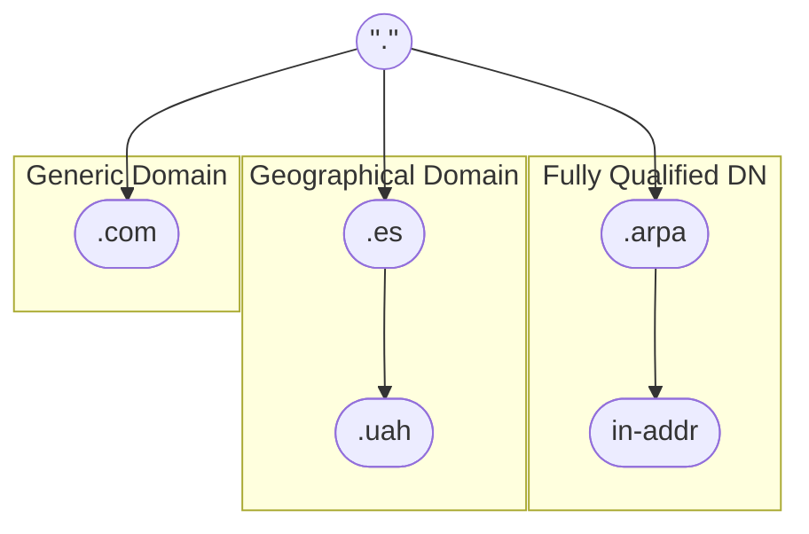
*Estructura jerárquica del sistema. Los nodos conectados a root (".") son TLD.*

- .com
- .edu
- .mil
- .net
- .org

Dirección de dominio inverso de 193.146.58.130 $\rightarrow$ **130.58.146.193.in-addr.arpa**

---

## Correo Electrónico

`miguel.martinez@uah.es` $\rightarrow$ ahora
`miguel.martinez@uah.es:25/index.html` $\rightarrow$ antes

En el ejemplo anterior, `miguel.martinez` es el **usuario**, `@` indica **en** (inicio del dominio) y `uah.es` es el **dominio**.

En el origen se utiliza FTP (`21`) como protocolo para el correo
Se crea un protocolo para el correo electrónico

### SMTP
El protocolo SMTP (*Simple Mail Transfer Protocol*) se ubica en el `puerto 25`

SMTP contiene una cabecera y contenido. La cabecera especifica:
- TO
- SUBJECT
- BCC
- REFERENCE
- FROM
- CC
- REPLAY_TO

El contenido engloba el mensaje, se envía alguno de los 128 primeros carácteres ASCII, y aunque se envían 8 bits por carácter el primero se ignora (como un 0), porque el formato de Terminal Virtual de Red se basa en ASCII de 7 bits.

La secuencia de final de mensaje es `<CR><LF>.<CR><LF>` (Enter . Enter)

#### Funcionamiento de SMTP
1. Cliente envía comando `HELO <destinatario>`
2. Servidor responde con un código OK `250 <cliente>`
3. Cliente 


### Creación de ESMTP y MIME
**MIME** (Multipurpose Internet Mail Extension)

#### Formato de mensajes MIME

### Base64
Los datos se dividen en grupos de 3 bytes (24 bits) que luego se subdividirán en 4 secciones de 6 bits cada una, que corresponderán a otros caracteres.

---

