Los apuntes están algo incompletos, pero incluyo lo más útil que he encontrado.

These notes are somewhat incomplete, only the useful parts are included. Bit of a mess but these notes are old and I don't have the time nor the will to fix them up properly.

# 4. Trees

---

## 4.1. Basic Terminology

A tree imposes a hierarchical structure on a collection of items
They arise in different areas:
- Database systems
- Compilers
- File systems
- Hierarchy of classes in object-oriented programming
- Menus in applications

A tree is a collection of *nodes* (one of which is **root**), along with a relation that places a hierarchical structure on them

General tree
    in each node arbitrary # of children

Binary tree *full implementation*
    each node has at most 2 children

Binary search tree [BST] *full implementation*
    each node has at most 2 children with internal order

Self-balancing tree [SBT] 
    AVL-tree (binary)

*Parent*, *child*, *siblings*
*Path*
*Length* of a path
*Ancestor* of a node
*Descendant* of a node
A node with no descendants is called a *leaf*
*Height* of a node -> longest distance to a leaf
*Depth* of a node -> distance to the root

Terminology - Traversing

Three main types: preorder, inorder, postorder
If a tree T is null, the empty list is the preorder, inorder, and postorder traversal of T
If a tree T is of a single node,

**Preorder** traversal
It's the root $n$ of $T$ followed by the nodes of $T_1$ in preorder, then the nodes of $T_2$ in preorder, and so on up to the nodes of $T_k$ in preorder

**Inorder** traversal
It's the nodes of $T_1$ in inorder, followed by the root $n$ of $T$, followed by the nodes of $T_2$ in inorder, and so on up to the nodes of $T_k$ in inorder

**Postorder** traversal
It's the nodes of $T_1$ in postorder, followed by the nodes of $T_2$ in postorder, and so on up to the nodes of $T_k$ in postorder, followed by the root $n$ of $T$

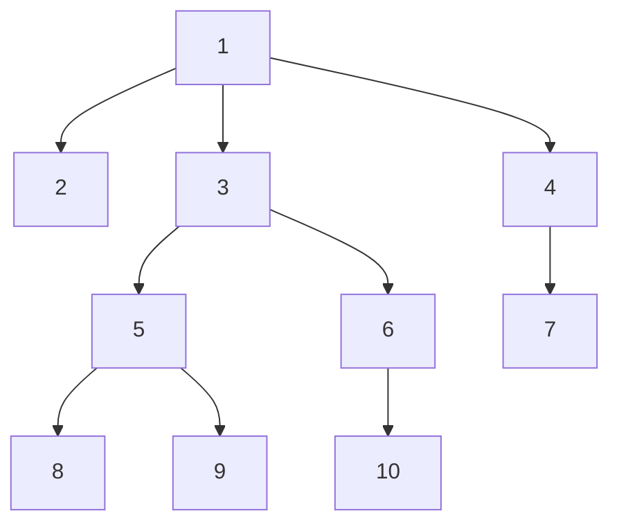
For the above tree
*Preorder*: 1, 2, 3, 5, 8, 9, 6, 10, 4, 7
(We start with root $n$ and then go to the left subtree and finish it, then to the right subtree and finish it...)
*Inorder*: 2, 1, 8, 5, 9, 3, 10, 6, 4, 7
(We go down and left from $n$, starting when we arrive at the most botton-left element)
*Postorder*: 2, 8, 9, 5, 10, 6, 3, 7, 4, 1
(We go down and left from $n$, starting when we arrive at the most botton-left element, and then we go up and right until meeting a branch)

```
void tree::PREORDER(n: node)
    list n;     {1}
    for each child c of n, if any, in order from the left do PREORDER(c)    {2}
endmethod { PREORDER }
```
^ To make it a POSTORDER we reverse the order of steps 1 and 2

```
void tree::POSTORDER(n:node)
    for each child c of n, if any, in order from the left do POSTORDER(c)
    list n
```

```
void tree::INORDER (n:node)
    if n is a leaf then
        list n
    else begin
        INORDER(leftmost child of n)
        list n
        for each child c of n, except for the leftmost, in order from the left do
            INORDER(c)
    endelse
endmethod { INORDER }
```

So, for example in **C++** the code would be:
```c++
void tree::PREORDER(node n){
    if (n == null){
        return;
    }
    std::cout << n.element << std::endl; // We print the node as soon as we reach it
    PREORDER(n.leftchild);
    PREORDER(n.rightchild);
}

void tree::POSTORDER(node n){
    if (n == null){
        return;
    }
    POSTORDER(n.leftchild);
    POSTORDER(n.rightchild);
    std::cout << n.element << std::endl; // We print the node after we have visited all its children
}

void tree::INORDER(node n){
    if (n == null){
        return;
    }
    INORDER(n.leftchild);
    std::cout << n.element << std::endl; // We print the node after we have visited all its LEFT children
    INORDER(n.rightchild);
}
```

<br>

Terminology - Labels
It's often useful to associate a label to a node. The label is NOT a name, but a value of the node


## 4.2. The ADT Tree

```
spec TREE[NODE]
    genres tree, node, label
    operations
        parent: node tree -> node
        leftmost_child: node tree -> node
        right_sibling: node tree -> node
        label: node tree -> label
        create: label tree tree -> tree
        root: tree -> node
        makenull: tree -> tree
endspec
```

```
public void tree:create(t1,t2:tree, l:label)
    allocate(root)
    root^.element:=l
    root^.leftmost_child:=t1.root
    root^.leftmostchild^.rightsibling:=t2.root
endmethod
```

## 4.3. Binary Search Trees

A BST is a binary tree in which: 
- the nodes are labeled with elements of a set
- all elements stored in the left subtree of a node $n$ are less than the element stored in $n$, and all elements stored in the right subtree of $n$ are greater than the element stored at $n$
This condition, called the binary-search-tree property, applies to all nodes, including root.

If we list the nodes of a bst in inorder, the elements stored at those nodes are listed in sorted order.
Operations on a BST require comparison between nodes.

### The ADT BST
```
spec BINARY_SEARCH_TREE[NODE]
    genres bst, node, label
    operations
        search: label BST -> boolean
        insert: label BST -> BST
        delete: label BST -> BST
endspec
```

### Class of BST
```
class bst
    private root: ^node
    public boolean search(x:label, n:^node)
    public void insert(x:label, n:^node)
    public void delete(x:label, n:^node)
endclass
```

### BST Search
```
public boolean bst::search(x:label, n:^node)
    if n = null then return false
    else if n^.element = x then return true
    else if x < n^.element then return search(x, n^.leftchild)
    else return search(x, n^.rightchild)
endmethod
```
^ RT of $O(\log(n))$ [average] or $O(n)$ [worst case]

### BST Insert
```
public void bst::insert(x:label, n:^node)
    if n= null
        allocate(n)
        n^.element:=x
        n^.leftchild:=null
        n^.rightchild:=null
    else if x<n^.element then insert(x, n^.leftchild)
    else if x>n^.element then insert(x, n^.rightchild)
    {if x=n^.element do nothing}
    endif
endmethod
```
^ RT of $O(\log(n))$ [average] or $O(n)$ [worst case]

### BST Delete
```
private label bst::deletemin(n: ^node)
    {returns & removes the smallest  element from a bst}
    var aux:label
    if n^.leftchild = null {n points to smallest}
        aux:=n^.element
        n:=n^.rightchild
        return aux
    else
        return deletemin(n^.leftchild)
    endif
endmethod
```

```
public void bst::delete(x:label, n: ^node)
    if n != null then
        if x < n^.element then delete(x, n^.leftchild)
        else if x > n^.element then delete(x, n^.rightchild)
        else if n^.leftchild = null then n:=n^.rightchild {isnt this wrong}
        {if we reach here, x = n^.element}
        else if n^.leftchild = null and n^.rightchild = null then dispose(n)
        else if n^.leftchild = null then n:= n^.rightchild
        else if n^.rightchild = null then n:= n^.leftchild
        else n^.element:=deletemin(n^.rightchild) {both children}
    endif
endmethod
```
^ RT of $O(\log(n))$ [average] or $O(n)$ [worst case]

### Balanced Trees

A (height) **balanced tree** is a tree where the height of the left and right subtrees of every node differ by at most 1

**Complete tree**: a tree where all levels are completely filled except possibly the last level, which is filled from left to right
**Complete tree**: A tree in which every level, except possibly the deepest, is entirely filled. At depth $n$, the height of the tree, all nodes are as far left as possible.
A complete tree is balanced, but a balanced tree is not necessarily complete.

- AVL Trees
- 2-3 Trees
- Red-Black Trees
- B Trees (B+ Trees)
- T Trees

### AVL Trees

An AVL tree is a self-balancing binary search tree.
The balance factor of a node is the height of its left subtree minus the height of its right subtree (sometimes opposite)
A node with balance factor of -1, 0, or 1 is considered balanced. A node with any other balance factor is considered unbalanced and requires rebalancing the tree. The balance factor is usually stored directly at each node.

A binary tree is defined to be an AVL tree if the balance factor of every node is -1, 0, or 1.

- **SEARCH**: Same as BST

- **INSERT**: After inserting a node, it is necessary to check each of the node's ancestors for consistency with the rules of AVL. If for each node the balance factor remains -1, 0 or 1 then no rotations are needed. Otherwise, one or more rotations are necessary to rebalance the tree.
We consider four different cases:
    - Right-right case
    - Right-left case
    - Left-left case
    - Left-right case

    If the balance factor of a node **(P)** is -2 then the right subtree outweighs the left subtree, and the balance factor of the **right child (R)** of **P** must be checked.
    If the balance factor of **R** is -1 or 0 then a single left rotation of **P** is needed. (***Right-right case***).
    If the balance factor of **R** is 1 then a right rotation of **R** followed by a left rotation of **P** is needed. (***Right-left case***).

    ```mermaid
    flowchart LR
        subgraph RightLeftCase
            direction TB
            rl3[3] ~~~ rlnull1:::hidden
            rlnull1 ~~~ rlnull3:::hidden
            rl3 --> rl4[4]
            rl4 --> rl5[5]
            rl4 ~~~ rlnull2:::hidden
        end
        subgraph RightRightCase
            direction TB
            rr3[3] ~~~ rrnull1[null1]:::hidden
            rrnull1 ~~~ rrnull3[a]:::hidden
            rr3 --> rr4[4]
            rr4 ~~~ rrnull2:::hidden
            rr4 --> rr5[5]
        end
        subgraph Balanced
            direction TB
            b4[4]
            b3[3]
            b5[5]
            b4 --> b3
            b4 --> b5
            b3 ~~~ bnull1:::hidden
            b5 ~~~ bnull2:::hidden
        end
        RightLeftCase --> RightRightCase --> Balanced
    ```

    If the balance factor of a node **(P)** is 2 then the left subtree outweighs the right subtree, and the balance factor of the **left child (L)** of **P** must be checked.
    If the balance factor of **L** is 1 or 0 then a single right rotation of **P** is needed. (***Left-left case***).
    If the balance factor of **L** is -1 then a left rotation of **L** followed by a right rotation of **P** is needed. (***Left-right case***).

    ```mermaid
    flowchart LR
        subgraph LeftRightCase
            direction TB
            lr5[5] --> lr3[3]
            lr3 ~~~ lrnull2:::hidden
            lr3 --> lr4[4]
            lr5 ~~~ lrnull1:::hidden
            lrnull1 ~~~ lrnull3:::hidden
        end
        subgraph LeftLeftCase
            direction TB
            ll5[5] --> ll4[4]
            ll4 --> ll3[3]
            ll5[5] ~~~ llnull1:::hidden
            llnull1 ~~~ llnull3:::hidden
            ll4 ~~~ llnull2:::hidden
            
        end
        subgraph Balanced
            direction TB
            b4[4]
            b3[3]
            b5[5]
            b4 --> b3
            b4 --> b5
            b3 ~~~ bnull1:::hidden
            b5 ~~~ bnull2:::hidden
        end
        LeftRightCase --> LeftLeftCase --> Balanced
    ```

- **DELETE**:
    - If the node to be deleted is a leaf or has only one child, simply remove it from the tree.
    - Otherwise, replace it with either the largest in its left subtree (inorder predecessor) or the smallest in its right subtree (inorder successor), then delete that node.
    Check the balance factor of each node on the path from the parent of the removed node to the root. If the balance factor of any node is not -1, 0, or 1, the subtree rooted at that node is unbalanced and a rotation is needed to restore balance.
    Rebalance as in insertion if necessary.


<br>

---

<br>

# 5. Other Non-Linear Data Structures

---

Remember:

| Data  Structure | Average Case | Worst Case   |
| :-------------- | :----------- | :----------- |
| **List**        | $O(\log{n})$ | $O(\log{n})$ |
| **BST**         | $O(\log{n})$ | $O(n)$       |
| **AVL**         | $O(\log{n})$ | $O(\log{n})$ |
| **Hash table**  | $O(1)$       | $O(n)$       |

As can be seen, the Hash Table is much faster on the Average Case, however it's worse in the Worst Case. This, however, is not a problem, as the Worst Case can be avoided with careful implementation.

---

## 5.1. Dictionaries

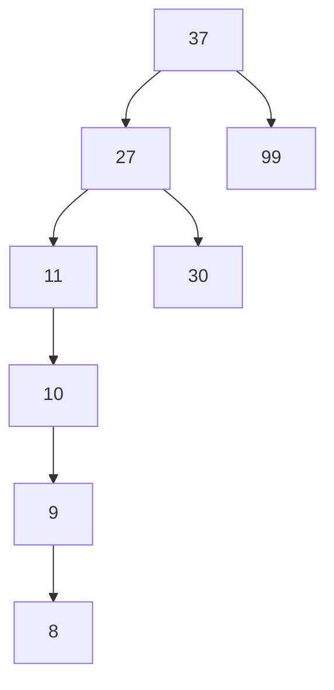

- MEMBER(x, A) takes set A and object x, whose type is the type of elements of A, and returns a boolean value: true if it exists in the set, false if it doesn't
- INSERT(x, A) takes set A and object x, whose type is the type of elements of A, and returns the set A with the object x added to it. Note that if x is already in A, then A is returned unchanged
- DELETE(x, A) takes set A and object x, whose type is the type of elements of A, and returns the set A with the object x removed from it. Note that if x is not in A, then A is returned unchanged
- UNION(A, B) takes sets A and B, whose types are the same, and returns the set A ∪ B

### ADT Dictionary

```
spec DICTIONARY[ITEM]
    genres dictionary, item
    operations
        member: dictionary, item -> boolean
        insert: dictionary, item -> dictionary
        delete: dictionary, item -> dictionary
        union: dictionary, dictionary -> dictionary
```

### ADT Dictionary - Simple Implementation

Simple implementation via a **sorted or unsorted linked list**

Via a **bit vector** (Provided the elements are restricted to the integers 1, ..,  N for some N, or are restricted in a way that can be put in correspondence with such a set)

Via a **fixed-length array** with a pointer to the last entry of the array in use (Only feasible if we can assume our sets never get larger than the length of the array)

We are not going to consider these options, we will instead use **Hash Tables**.

---

## 5.2. Hash Tables

Hashing is a widely useful technique for implementing dictionaries.
- It requires constant time per operation on average
- In the worst case, it requires time proportional to the size of the set, just like array and list implementations do
- We can, by careful design, reduce the probability of the worst case happening

The essential idea is that the set of potential set members is partitioned into a finite number of classes. To do this we use a **hash function**.

### Hash Function
What is a hash function? $h(x)$
A hash function is a function that takes an object of some type and returns an integer in some range.
It has to be:
- **Non-bijective**: Given $x \rightarrow h(x)$, we can't find $x$ from $h(x)$
    $h(x) = h(y)$ does not imply $x = y$
- (Reasonably) **Fast**

### Open Hashing
If we wish to have $B$ classes, numbered $0, 1, ..., B-1$, then we can use the hash function $h$ such that for each object $x$ of the data type, $h(x)$ is an integer in the range $0, 1, ..., B-1$.

The value of $h(x)$ is the class to which $x$ belongs. We often call $x$ the **key** and $h(x)$ the **hash value** of **x**. The "classes" we shall refer to as **buckets**, and we say that $x$ belongs to the *bucket* $h(x)$.

[image 13 -> open hashing]

In an array called the *bucket table*, indexed by the bucket numbers $0, 1, ..., B-1$, we have headers for $B$ lists.

The elements on the $i$th list are the members of the set being represented that belong to class $i$, that is, the elements $x$ in the set such that $h(x) = i$.

[`FALTA LA 15`]

### The open hash table ADT

```
const B:= {Suitable constant for number of buckets}

celltype = record
    element: elementtype
    next: ^celltype	
endrecord

class dictionary{// hashtable}
    private A: array [0..B-1] of ^celltype {must be in the class}
    public boolean member(x: elementtype)
    public void insert(x:elementtype)
    public void delete(x:elementtype)
    public void makenull()
endclass

item: elementtype
```

### Open Hashing example

Hash function: $h(x) = x$ mod $5$

1. Create the bucket table (an array of buckets)
2. Show the hash table after inserting the following elements: 12, 8, 137, 20, 38, 14, 27, 42
3. Delete the following elements: 137, 42, 38, 20

```
public boolean dictionary::member(x:elementtype)
    current: ^celltype
    current:= A[h(x)]
    while current != null
        if current^.element = x then return true
        else current := current^.next
    endwhile
    return false
endmethod
```

```
public void dictionary::insert(x:elementtype)
    bucket: integer
    oldheader: ^celltype
    if not member(x)
        bucket:= h(x)
        oldheader:= A[bucket]
        allocate(A[bucket])
        A[bucket]^.element:= x
        A[bucket]^.next:= oldheader
    endif
endmethod
```
^ RT of $O(n)$ in the worst case (due to `member()`)

```
public void dictionary::delete(x:elementtype)
    current, disposable
    bucket: integer
    bucket:= h(x)
    if A[bucket] != null
        if A[bucket]^.element=x
            {first element}
            disposable:= A[bucket]
            A[bucket]:= A[bucket]^.next
            dispose(disposable)
        else
            current:= A[bucket]
            while current^.next != null
                if current^.next^.element = x
                    disposable:= current^.next
                    current^.next:= current^.next^.next
                    dispose(disposable)
                else
                    current:= current^.next
                endif
            endwhile
        endif
    endif
endmethod
```
We have to consider the case in which the element to delete is the first, because then we'd have to update the bucket header. Otherwise it's the same as an insert.
^ Running time of $O(n)$ in the worst case


1. *Create the bucket table (an array of buckets)*

|      | Bucket |
| :--- | -----: |
| 0    |        |
| 1    |        |
| 2    |        |
| 3    |        |
| 4    |        |


2. *Show the hash table after inserting the following elements: 12, 8, 137, 20, 38, 14, 27, 42*

Remember: $h(x) = x$ mod $5$

$h(12) = 2$, so we insert 12 in bucket 2

|      | Bucket |
| :--- | -----: |
| 0    |        |
| 1    |        |
| 2    |   [12] |
| 3    |        |
| 4    |        |

$h(8) = 3$, so we insert 8 in bucket 3

|      | Bucket |
| :--- | -----: |
| 0    |        |
| 1    |        |
| 2    |   [12] |
| 3    |    [8] |
| 4    |        |

$h(137) = 2$, so we insert 137 in bucket 2

|      |        Bucket |
| :--- | ------------: |
| 0    |               |
| 1    |               |
| 2    | [137] -> [12] |
| 3    |           [8] |
| 4    |               |

$h(20) = 0$, so we insert 20 in bucket 0
$h(38) = 3$, so we insert 38 in bucket 3
$h(14) = 4$, so we insert 14 in bucket 4
$h(27) = 2$, so we insert 27 in bucket 2
$h(42) = 2$, so we insert 42 in bucket 2

|      |                        Bucket |
| :--- | ----------------------------: |
| 0    |                          [20] |
| 1    |                               |
| 2    | [42] -> [27] -> [137] -> [12] |
| 3    |                   [38] -> [8] |
| 4    |                          [14] |

3. *Delete the following elements: 137, 42, 38, 20*

$h(137) = 2$, so we delete 137 from bucket 2

|      |               Bucket |
| :--- | -------------------: |
| 0    |                 [20] |
| 1    |                      |
| 2    | [42] -> [27] -> [12] |
| 3    |          [38] -> [8] |
| 4    |                 [14] |

$h(42) = 2$, so we delete 42 from bucket 2
$h(38) = 3$, so we delete 38 from bucket 3
$h(20) = 0$, so we delete 20 from bucket 0

|      |       Bucket |
| :--- | -----------: |
| 0    |              |
| 1    |              |
| 2    | [27] -> [12] |
| 3    |          [8] |
| 4    |         [14] |


### Closed Hashing

In closed hashing, we use a hash function $h$ that maps the set of potential set members into the range $0, 1, ..., B-1$, where $B$ is the number of buckets. We use a bucket table, just as in open hashing, but we do not use a linked list for each bucket. Instead, we use a single array, called the **element table**, of length $B$.

A closed hash table keeps the members of the dictionary in the bucket table itself, rather than using that table to store list headers.
Associated with closed hashing is a *rehash strategy*. If we try to place $x$ in bucket $h(x)$ and find it already holds an element, a situation called a *collision* occurs, and the rehash strategy chooses a sequence of alternative locations $h_1(x)$,$h_2(x)$, . . . , within the bucket table in which we could place $x$. We try each of these locations, in order, until we find an empty one. If none is empty, then the table is full, and we cannot insert $x$.

### Closed Hashing example 1

– Suppose $B = 8$ and keys $a$, $b$, $c$, and $d$ have hash values $h(a) = 3$, $h(b) = 0$, $h(c) = 4$, $h(d) = 3$.
– We shall use the simplest rehashing strategy, called linear rehashing, where $h_i(x)$ $=$ $(h(x) + i)$ mod $B$.
– Thus, for example, if we wished to insert a and found bucket 3 already filled, we would try buckets 4, 5, 6, 7, 0, 1, and 2, in that order.

For **deletions** the most effective approach is placing a constant called `deleted` into a bucket that holds an element we wish to delete.

The *membership test* for an element $x$ requires that we examine $h(x)$ and the buckets $h_1(x)$, $h_2(x)$, . . . , in order until we find $x$ or an empty bucket.

### Closed Hashing ADT

```
const
    B:= {Suitable constant for number of buckets}
    empty:= '          ' {10 blanks}
    deleted:= '**********' {10 asterisks}

A: array [0..B-1] of elementtype {in a class}

item: elementtype
```


In a closed hashing scheme the speed of insertion and other operations depends not only on how randomly the hash function distributes the elements, but also on how well the rehashing strategy avoids additional collisions.

If we use an open hash table, the average time for operations increases as $N/B$, a quantity that grows rapidly as the number of elements exceeds the number of buckets. Similarly, for a closed hash table, and it is not possible that $N$ exceeds $B$.

If $N$ gets too large, we can **rehash** the table, that is, we can create a new table with a larger number of buckets and insert all the elements into it. The hash function has to be redefined too.

### Closed Hashing example 2

Hash function: $h(x) = $ mod $5$

1. Create the bucket table
2. Show the hash table after inserting the following elements: 12, 8, 137, 20, 38, 14, 27, 42 (Restructure the table if needed)
3. Delete the following elements: 137, 42, 38, 20

|      | Bucket |
| :--- | -----: |
| 0    |     20 |
| 1    |     38 |
| 2    |     12 |
| 3    |      8 |
| 4    |    137 |

$N \geq 9B$
$5 \geq 9B$

At this point the table is full, we have to restructure it. We can do this by doubling the number of buckets, so we'll have 10 buckets.
We also have to redefine the hash function:
$h(x) = x$ mod $10$

|      | Bucket |
| :--- | -----: |
| 0    |     20 |
| 1    |     27 |
| 2    |     12 |
| 3    |     42 |
| 4    |     14 |
| 5    |        |
| 6    |        |
| 7    |    137 |
| 8    |     38 |
| 9    |      8 |

$N = 8B$

member(7) -> 9 comparisons
$N \geq 5B$ -> Optimal

<br>

---

<br>

# 6. Heaps

---

## 6.1. Heaps

A heap is a complete tree that satisfies the heap property: 
*if B is a child node of A, then $key(a) \ge key(b)$*

This implies that the element with the greatest key is always gonna be the **root** node.

There is no restriction as to how many children each node has in a heap, although in practice each node has at most 2 (*binary heap*)
The heap is one maximally-efficient implementation of an ADT called a priority queue.
Heaps are crucial in efficient graph algorithms such as *Dijkstra's algorithm*, and in the sorting algorithm *heapsort*.

### The ADT heap
```
spec HEAP[node]
    genres heap, node
    operations
        find_max: heap -> node
        find_min: heap -> node
        delete_max: heap -> heap
        delete_min: heap -> heap
        insert: node heap -> heap
        makenull: heap -> heap
        create: node[] -> heap
        empty: heap -> bool
endspec
```

To clear this up:
* A max-heap has: `find_max`, `delete_max`,...
* A min-heap has: `find_min`, `delete_min`,...

### Heap operations

* **`insert`**: inserts a node into the heap
    To add an element to the heap we must perform an up-heap operation in order to restore the heap property.
    We can do this in $O(log(n))$ time, in a binary heap, by following this algorithm:
    1. Add the element to the bottom level of the heap
    2. Compare the added element with its parent; if they are in the correct order, stop.
    3. If not, swap the element with its parent and return to the previous step.
    We do this at maximum once per each level of the tree, so the complexity is $O(log(n))$. However, since approximately 50% of the nodes are leaves, and 75% of them are on the bottom level, the average complexity is $O(1)$.
* **`delete`**: Deletes a node from the tree
    To delete the root from the heap (effectively extracting the maximum element in a max-heap or the minimum element in a min-heap), and restore the properties of the heap, we must carry out a down-heap:
    1. Replace the root of the heap with the last element on the last level.
    2. Compare the new root with its children; if they are in the correct order, stop.
    3. If not, swap the element with one of its children and return to the previous step. (Swap with its smaller child in a min-heap and its larger child in a max-heap.)
* **`create`**: Creates a heap from an array of nodes
    A heap could be built quickly by successive insertions. This approach requires $O(nlog(n))$ time in the worst case, because each insertion takes $O(log(n))$ time and there are $n$ insertions. However, by using the following method, a heap can be built in $O(n)$ time:
    * The optimal method starts by arbitrarily putting the elements of the array into a binary tree, respecting the BT shape property. Then, starting from the lowest level and moving upwards, shift the root of each subtree downward as in deletion operation.
    * More specifically if all the subtrees starting at some
    height h (measured from the bottom) have already been "heapified", the trees at height h + 1 can be heapified by sending their root down along the path of maximum valued children when building a max-heap, or minimum valued children when building a minheap.

### Heap implementation (from Victor)
**Max-heap**:
```
const maxsize:= {suitable constant}

class maxheap
    private content: array [1..maxsize] of node
    private last:integer
    public node find_max() {O(1)}
    public node delete_max() {O(1)--O(log n)}
    public void insert(node n) {O(1)--O(log n)}
    public void makenull()
    public void create (ns: node[]) {O(n)}
    public bool empty()
    private void max_heapify_up(i:integer) {recursive}
    private void max_heapify_down(i:integer) {recursive}
endclass

node: elementtype
```

```
public node maxheap::find_max()
    if last > 0 then
        return content[1]
    endif
endmethod
```

```
public node maxheap::delete_max()
    if last > 0 then
        swap(content[1], content[last])
        last := last - 1
        max_heapify_down(1)
        return content[last+1]
    end if
endmethod
```

```
public void maxheap::insert(node n)
    last := last + 1
    content[last] := n
    max_heapify_up(last)
endmethod
```

```
public void maxheap::create(A:node[])
    content:=A
    for i = floor(length(A)/2) downto 1 {all nodes that are not leaves}
        max_heapify_down(i)
    last:=length(A)
endmethod
```

```
private void maxheap::max_heapify_up(i:integer)
    if i > 1 then
        if content[i].key > content[i/2].key then
            swap(content[i], content[i/2])
            max_heapify_up(i/2)
        end if
    end if
endmethod
```

```
private void maxheap::max_heapify_down(i:integer)
    if 2*i <= last then
        if 2*i+1 <= last then
            if content[2*i].key > content[2*i+1].key then
                if content[2*i].key > content[i].key then
                    swap(content[i], content[2*i])
                    max_heapify_down(2*i)
                end if
            else
                if content[2*i+1].key > content[i].key then
                    swap(content[i], content[2*i+1])
                    max_heapify_down(2*i+1)
                end if
            end if
        else
            if content[2*i].key > content[i].key then
                swap(content[i], content[2*i])
                max_heapify_down(2*i)
            end if
        end if
    end if
endmethod
```


`NOT FINISHED` ask victor

---

## 6.2. Heapsort
Heapsort is a comparison-based sorting algorithm.
Heapsort begins by building a heap from a data set.
The largest value (in a max-heap) or the smallest value (in a min-heap) is extracted repeatedly from the heap and stored in an array until the heap is empty. This way the array ends up sorted. Heapsort can be performed in place. The running time of heapsort is $O(nlog(n))$.

Heapsort uses three heap operations: *create*, *find_max* and *delete_max*. (or *find_min* and *delete_min* for min-heap)

1. Build the heap from the data set. (create)
2. The root node contains the largest (or smallest) value. Swap it with the last node of the heap followed by reducing the size of the heap by 1. (delete_max or delete_min)
3. Repeat step 2 while the size of the heap is greater than 1.
4. The values stored in the array are now sorted in order.

### Heapsort implementation
```
func elementtype[] heapsort (a: elementtype[])
    //assuming that a binary min-heap is used
    sorted: elementtype[]
    h: heap
    index: integer

    h := create(a)
    index := 1
    while not empty(h)
        sorted[i]:= find-min(h)
        delete-min(h)
        index := index+1
    endwhile
    return sorted
endfunc
```


---

## 6.3. Priority queues

A priority queue is an ADT similar to a regular queue or stack, but in which each element additionally has a "priority" associated with it. Common operations on a priority queue are: *insert*, *delete_min* (or *delete_max*) and *makenull*.

The usual implementation to get better performance is via a heap as the backbone, giving $O(log(n))$ time for inserts and removals, and $O(n)$ to build the heap initially.

### The datatype priority queue
```
const maxsize := {some suitable constant}

node = record
    element: elementtype
    priority: integer
endrecord

class priorityQueue
    content: array[1..maxsize] of node
    last: integer
    public void insert(node n) 
    public node delete_min()
    public void makenull()
endclass
```

<br>

---

<br>

# 7. All exercises
## 7.1. Tree Exercises
### 7. Write programs to traverse a binary tree in: preorder, postorder, inorder
#### a) preorder
```
public void btree::preorder(n: ^node)
    if n = null then return
    write(n^.element)
    preorder(n^.leftchild)
    preorder(n^.rightchild)
endmethod
```
#### b) postorder
```
public void btree::postorder(n: ^node)
    if n = null then return
    postorder(n^.leftchild)
    postorder(n^.rightchild)
    write(n^.element)
endmethod
```

#### c) inorder
```
public void btree::inorder(n: ^node)
    if n = null then return
    inorder(n^.leftchild)
    write(n^.element)
    inorder(n^.rightchild)
endmethod
```

### 9. Write programs to compute the height of:
#### a) a given node on a binary tree (`nodeheight: node b tree -> integer`)
```
public int btree::height(n: ^node)
    if null then return 0
    return 1+max(height(n^.leftchild), height(n^.rightchild))
endmethod
```

#### b) a binary tree (`b treeheight: tree -> integer`)
```
public int btree::height()
    return height(this.root)
endmethod
```


### 10. The *level-order* listing of the nodes of a tree first lists the root, then all nodes of depth 1, then all nodes of depth 2, and so on. Nodes at the same depth are listed in left-to-right order. Write a program to list the nodes of a tree in level-order.

```
public void btree::levelorder(n: ^node)
    var q: queue
    temp: ^node
    q.makenull()
    q.enqueue(n)
    while not q empty()
        temp:= q.dequeue()
        write(temp^.element)
        if temp^.leftchild != null then q.enqueue(temp^.leftchild)
        if temp^.rightchild != null then q.enqueue(temp^.rightchild)
    endwhile
endmethod
```

!!!note Designing recursive algorithms for trees. Three options:
    1) Follow just one path
        1.1) Make a decision on each node
        1.2) Go ONLY left or right
        1.3) RT: $O(\log(n))$ [average] / $O(n)$ [worst case] 
    2) Browse all the elements in the tree
        2.1) Choose the method (preorder, inorder, postorder, [levelorder in special cases])
        2.2) Do the right processing
        2.3) RT: $O(n)$
    3) Special Cases [Exceptions]


### 12. noseque de borrar el 7
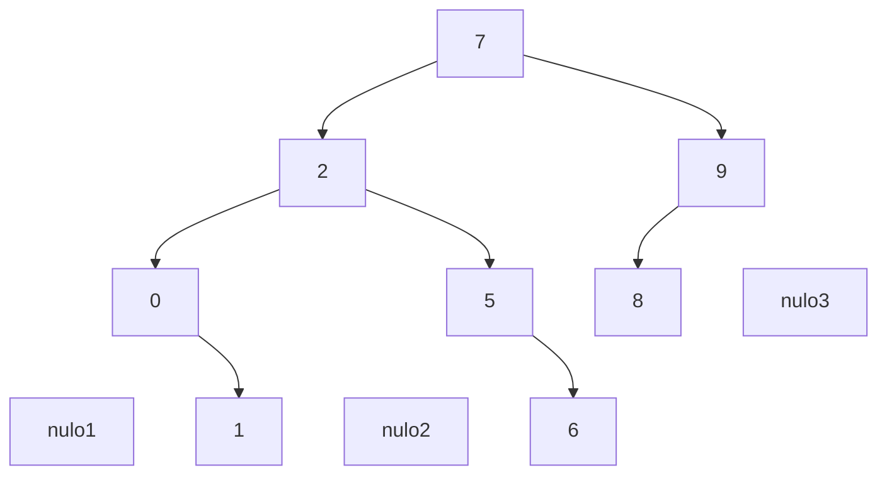

### 13. noseque de borrar el 7 (2)
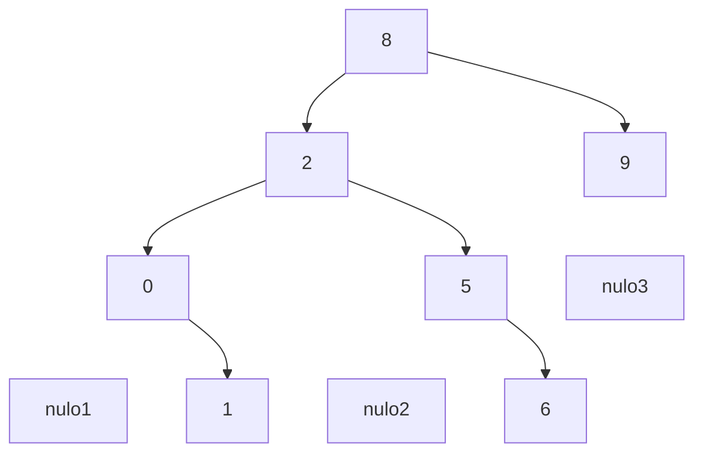
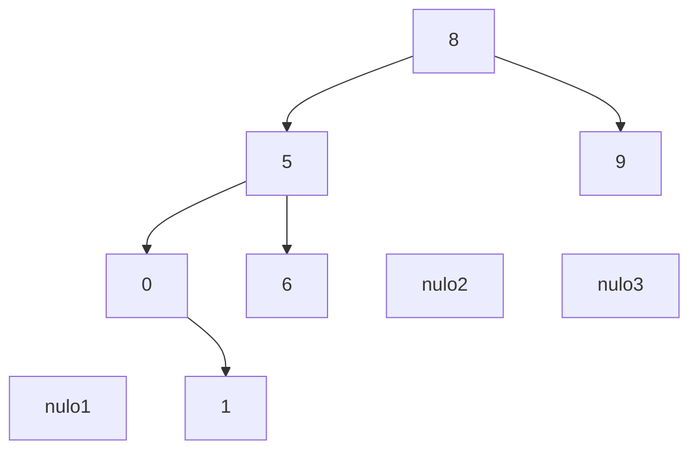


### 15. 
```
public boolean btree::isBalanced(n:^node)
    lh,nh: integer
    lh:=height(n^.leftchild)
    nh:=height(n^.rightchild)
    if abs(lh-nh) <= 1 and isBalanced(n^.leftchild) and isBalanced(n^.rightchild) then return true
    else return false
```


### 17. For the following trees decide whether they are balanced or not and specify balance factors for all nodes. If a tree is not balanced identify all roots of smallest unbalanced subtrees and balance them using rotations.
#### a) 
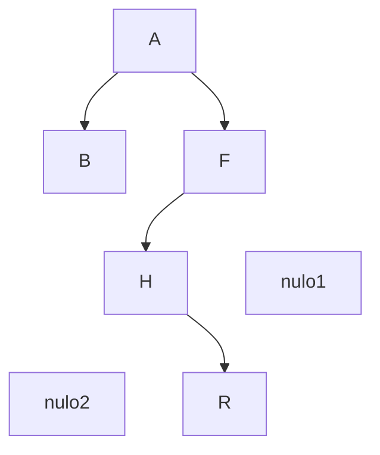
No, 


#### b)
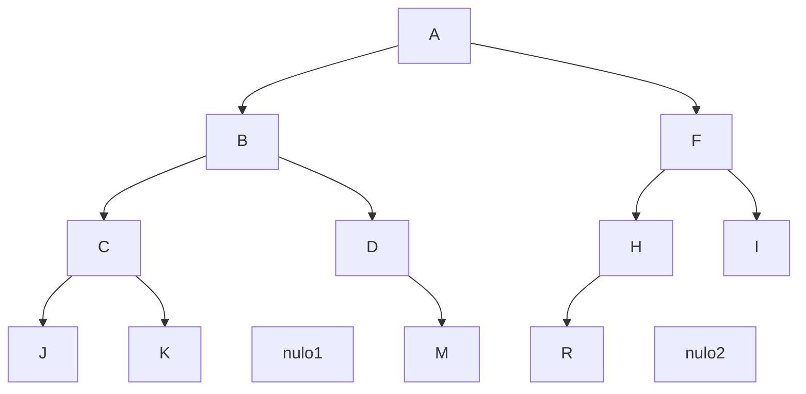

Yes, it's balanced

---

more exercises

---

### 2. Provide an algorithm for traversing an expression tree and producing a fully parenthesized infix expression. You can assume that the tree is a binary tree. Hint: note that operands are always on leaf nodes.
$(a+b)*c$
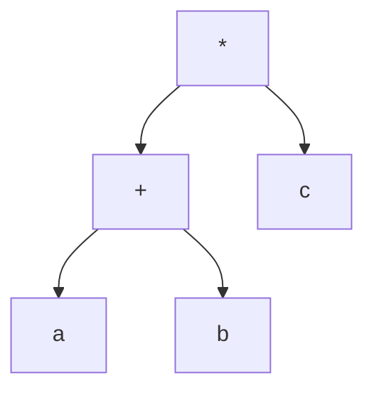
```
public void produceExp(n:^node)
    if n = null then return
    if isLeaf(n) then write (n^.element)
    else
        write("(")
        produceExp(n^.leftchild)
        write(n^.element)
        produceExp(n^.rightchild)
        write(")")
    endelse
endmethod
```
```
public int bt::addall(n:^node)
    if n = null then return 0
    return n^.element + addall(n^.leftchild) + addall(n^.rightchild)
endmethod
```


---

### 18. Insert the following nodes into an empty AVL tree. Show each step and what rotations are needed. Nodes to insert: 10, 40, 35, 25, 60, 30, 80, 50, 27, 28, 38

1. right-left
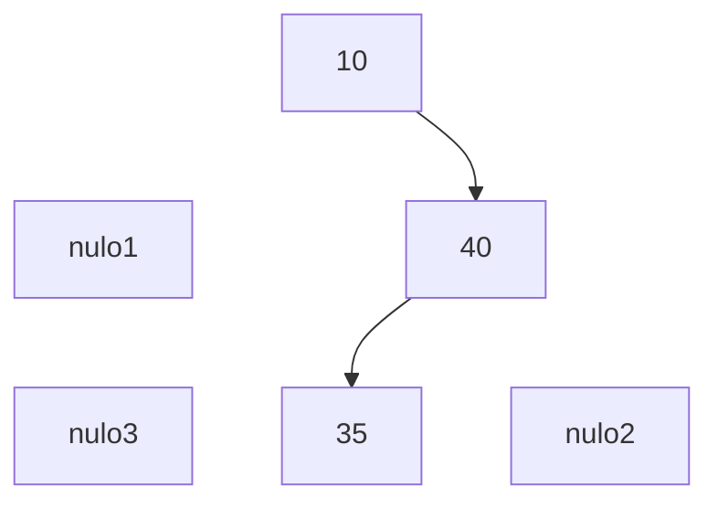
2. right-right
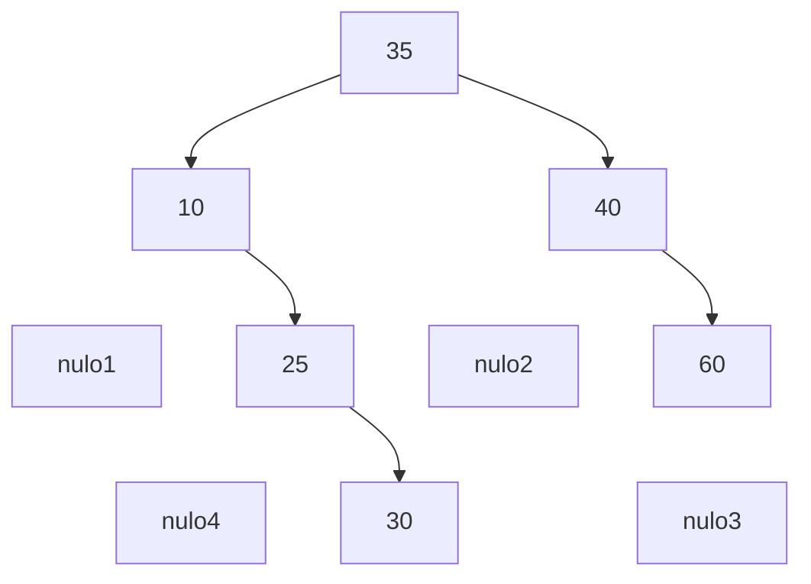
3. right-right
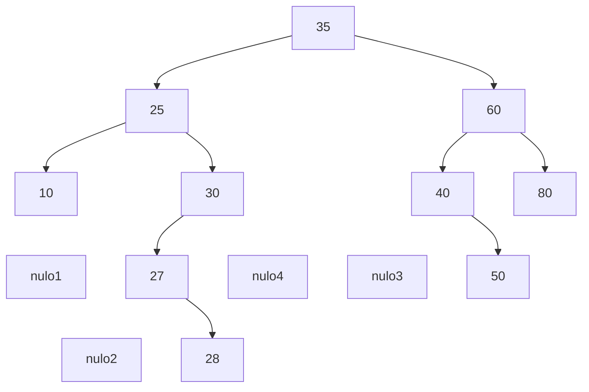
4. left-right
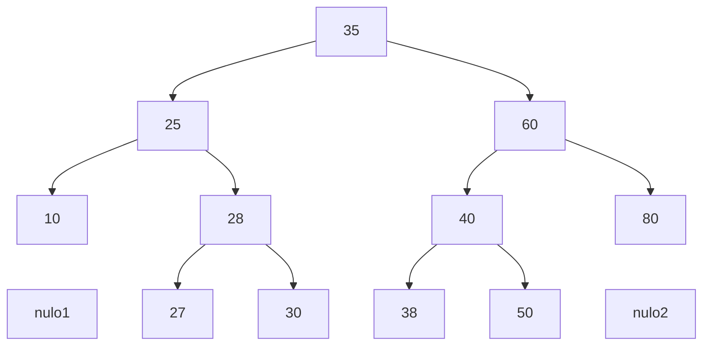

### 19. Delete the nodes 60, 55, 50 and 40 from the following AVL tree. Show each step and what rotations are needed, if any.
"The smart students will do it from the left"
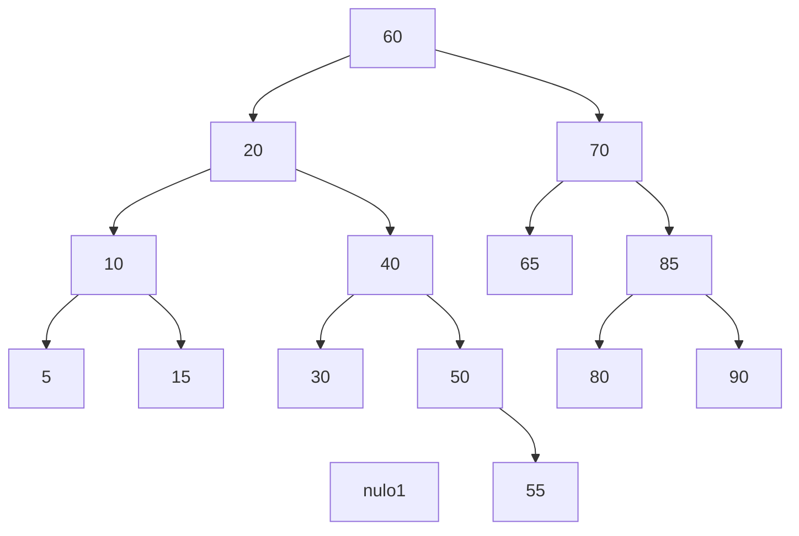
1. Delete 60


2. Delete 55
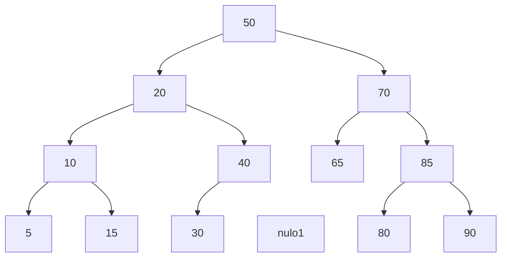

3. Delete 50
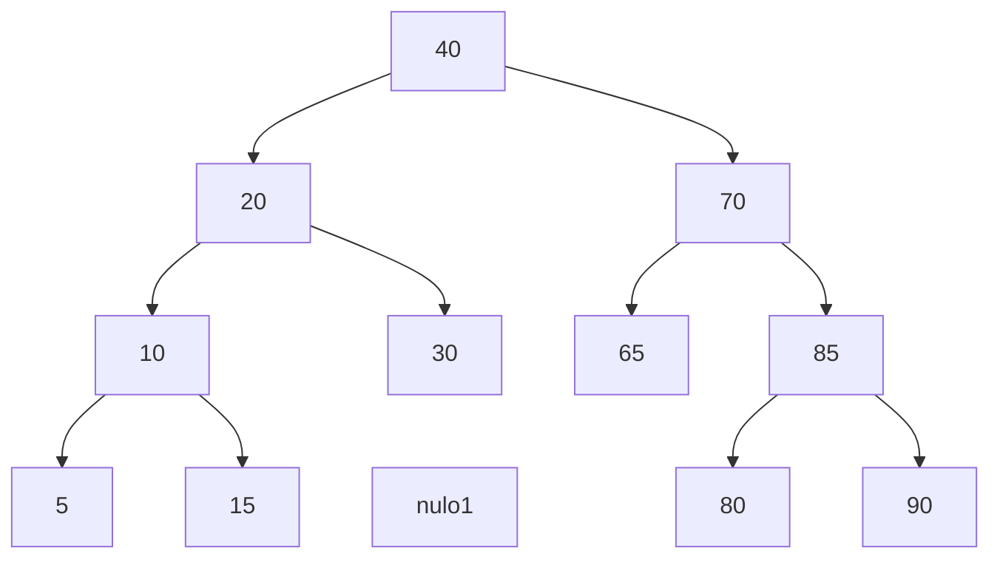

4. Delete 40 (left-left)
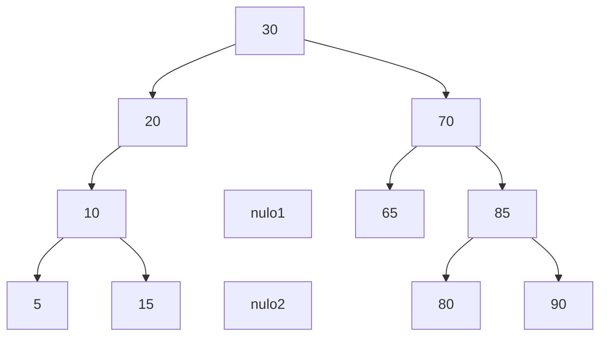

## 7.2. Hash Table Exercises
### 1. Extend the dictionary specification to support sets. Include the following:
- a) UNION(A, B, C), INTERSECTION(A, B, C) AND DIFFERENCE(A, B, C) take set-valued arguments A and B and store the result in C.
- b) Merge, or disjoint set union, that is no different from union, but that assumes its operands are disjoint (have no members in common). MERGE(A, B, C) assigns to the set variable C the value A U B, but is not defined if A ∩ B ≠ Ø, i.e., if A and B are not disjoint.
- c) MIN(A) returns the least element in set A. For example, MIN({2, 3, 1}) = 1 and MIN({'a','b','c'}) = 'a'.
- d) MAX(A) returns the greatest element in set A.
- e) EQUAL(A, B) returns true if and only if sets A and B consist of the same elements.
- f) FIND(x, cs[]) operates in an environment where there is a collection of disjoint sets cs (an array of sets). FIND(x, cs[]) returns the name of the (unique) set of which x is a member.

```
spec SET[ITEM]
    genres set, item
    operations
        member: set item -> boolean
        insert: set item -> set
        delete: set item -> set
        makenull: set -> set
        union: set set -> set
        intersection: set set -> set
        difference: set set -> set
        merge: set set -> set {b}
        min: set -> item {c}
        max: set -> item {d}
        equal: set set -> boolean {e}
        find: set[] item -> set {f}
endspec
```

Datatypes:
```
item: elementtype {could also be an integer, it's the element we're using}

celltype = record {node}
    element: elementtype
    next: ^celltype
endrecord

const B:=500 {number of buckets, we need to assign it a constant value, in this case we'll go with 500 but it usually depends on the hash function}

public class set
    private A:array[0..B-1] of ^celltype {array of pointers to cells}
    public boolean member(x:elementtype)
    public set insert(x:elementtype)
    public set delete(x:elementtype)
    public set makenull()
    public set union(s:set)
    public set intersection(s:set)
    public set difference(s:set)
    public set merge(s:set)
    public elementtype min()
    public elementtype max()
    public boolean equal(s:set)
    public set find(x:elementtype, cs:array[0..B-1] of set)
endclass
```

### 3. Write programs for the operations presented on Exercise 1 for an open hash table implementation

```
public set set::union(anotherSet: set)
    pos: ^celltype
    for i:=0 to B-1
        pos:=A[i]
        while pos != null
            anotherSet.insert(pos^.element) {O(n) in the worst case, O(1) on average}
            pos:=pos^.next
        endwhile
    endfor
    return anotherSet
endmethod
```
^ Running time: $O(n^2)$ in the worst case, $O(n)$ on average
Remember that we ignore loops which depend on a constant.

```
public set set::intersection(anotherSet: set)
    newSet: set
    pos: ^celltype
    for i:=0 to B-1
        pos:=A[i]
        while pos != null
            if anotherSet.member(pos^.element)
                newSet.insert(pos^.element)
            pos:=pos^.next
        endwhile
    endfor
    return newSet
endmethod
```
^ Running time: $O(n^2)$ in the worst case, $O(n)$ on average

Difference is the same as intersection, but we check if the element is not a member of the other set.

```
public set set::difference(anotherSet: set)
    newSet: set
    pos: ^celltype
    for i:=0 to B-1
        pos:=A[i]
        while pos != null
            if !anotherSet.member(pos^.element)
                newSet.insert(pos^.element)
            pos:=pos^.next
        endwhile
    endfor
    return newSet
endmethod
```
^ Running time: $O(n^2)$ in the worst case, $O(n)$ on average

```
public set set::merge(anotherSet: set)
    pos: ^celltype
    for i:=0 to B-1
        pos:=A[i]
        while pos != null
            anotherSet.insert(pos^.element)
            pos:=pos^.next
        endwhile
    endfor
    return anotherSet
endmethod
```
^ Need to review this one, hasn't been done in class

```
public item set::min()
    emin: elementtype
    pos: ^celltype
    emin:= ∞ {wtf}
    for i:=0 to B-1
        pos:=A[i]
        while pos != null
            if pos^.element < emin
                emin:=pos^.element
            pos:=pos^.next
        endwhile
    endfor
    return emin
endmethod
```
^ Running time: $O(n)$ for all cases

```
public item set::max()
    emax: elementtype
    pos: ^celltype
    emax:= -∞ {wtf}
    for i:=0 to B-1
        pos:=A[i]
        while pos != null
            if pos^.element > emax
                emax:=pos^.element
            pos:=pos^.next
        endwhile
    endfor
    return emax
```
^ Running time: $O(n)$ for all cases

```
public set set::find(sets: set[], x: elementtype)
    for i:= to length(sets)-1 do
        if sets[i].member(x)
            return sets[i]
    endfor
    return emptySet {if not found}
endmethod
```
^ Running time: $O(n^2)$ or $O(n*m)$ in the worst case where $n$ is the number of sets and $m$ is the average number of elements in each set, and $O(n)$ on average

## 7.3. Heap Exercises
## 5. Repeat the exercise assuming a binary max-heap and DELETEMAX operations
- a) Show the heap that results if the integers 5, 6, 4, 9, 3, 1, 7 are inserted into an initially empty heap.

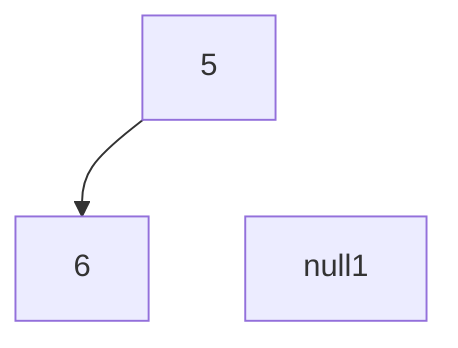

1 swap

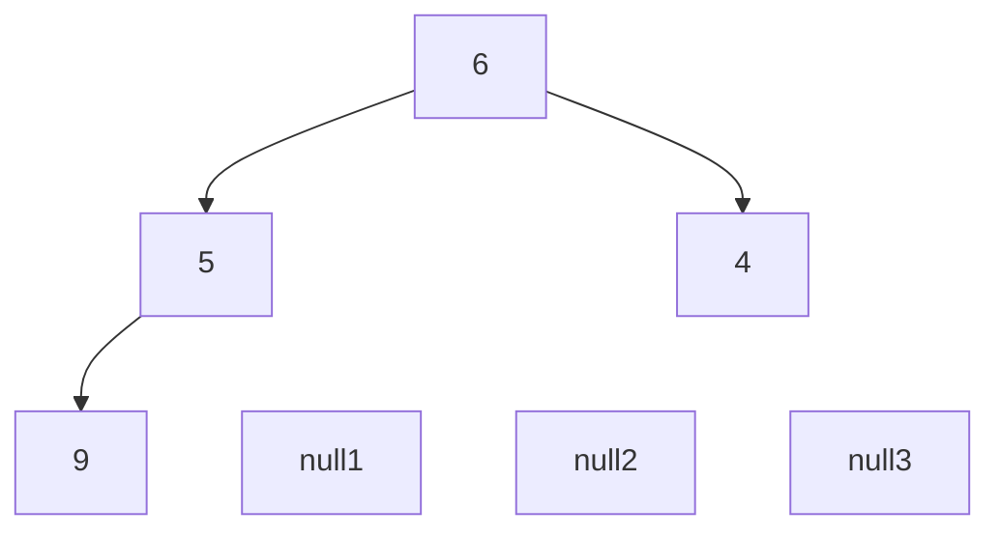

2 swaps

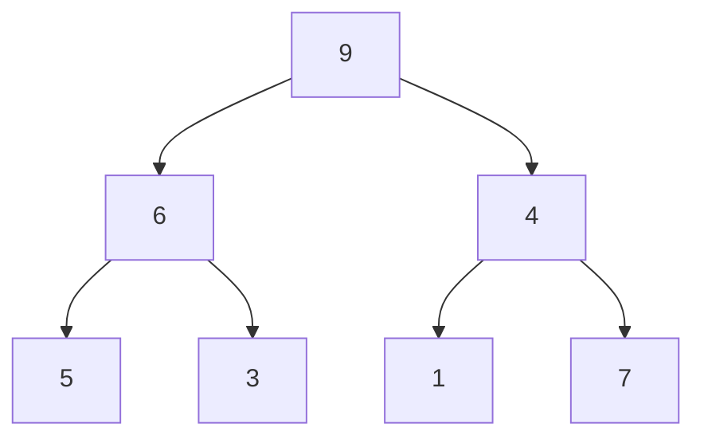

1 swap

```mermaid
graph TD
    9 --> 6
    9 --> 7
    6 --> 5
    6 --> 3
    7 --> 1
    7 --> 4
```

- b) Show the heap that results if the function create is called with the same set of integers.

1st, create the BT

```mermaid
graph TD
    5 --> 6
    5 --> 4
    6 --> 9
    6 --> 3
    4 --> 1
    4 --> 7
```

2nd, heapify down all nodes (not leaves)

```mermaid
graph TD
    5 --> 9
    5 --> 7
    9 --> 6
    9 --> 3
    7 --> 1
    7 --> 4
```

```mermaid
graph TD
    9 --> 5
    9 --> 7
    5 --> 6
    5 --> 3
    7 --> 1
    7 --> 4
```

```mermaid
graph TD
    9 --> 6
    9 --> 7
    6 --> 5
    6 --> 3
    7 --> 1
    7 --> 4
```

- c) What is the result of three successive DELETEMIN operations on the heap from a)?
    
```mermaid
graph TD
    9 --> 6
    9 --> 7
    6 --> 5
    6 --> 3
    7 --> 1
    7 --> 4
```

```mermaid
graph TD
    4 --> 6
    4 --> 7
    6 --> 5
    6 --> 3
    7 --> 1
    7 ~~~ null1:::hidden
```

1 swap

```mermaid
graph TD
    7 --> 6
    7 --> 4
    6 --> 5
    6 --> 3
    4 --> 1
    4 ~~~ null1:::hidden
```

```mermaid
graph TD
    1 --> 6
    1 --> 4
    6 --> 5
    6 --> 3
    4 ~~~ null1:::hidden
    4 ~~~ null2:::hidden
```

2 swaps

```mermaid
graph TD
    6 --> 5
    6 --> 4
    5 --> 1
    5 --> 3
    4 ~~~ null1:::hidden
    4 ~~~ null2:::hidden
```

```mermaid
graph TD
    3 --> 5
    3 --> 4
    5 --> 1
    5 ~~~ null1:::hidden
    4 ~~~ null2:::hidden
    4 ~~~ null3:::hidden
```

1 swap

```mermaid
graph TD
    5 --> 3
    5 --> 4
    3 --> 1
    3 ~~~ null1:::hidden
    4 ~~~ null2:::hidden
    4 ~~~ null3:::hidden
```


## 6. You are asked to implement a program to handle the processes that are executed on an `[FALTA]`
- a) Priority queue or heap
Justification:
1. The exercise is on a sheet that says HEAPS [not valid on the exam]
2. Minheap is optimal because:
    - a) INSERT efficiently. RT: $O(1)$ average, $O(log(n))$ worst case
    - b) get process lowest priority element efficiently. RT: $O(1)$
    - c) remove in $O(log(n))$ 
Minheap because lowest priority goes first

- b) Specification
```
spec HEAP[node]
    genres heap, node
    operations
        find_min: heap -> node
        delete_min: heap -> heap
        insert: node heap -> heap
        makenull: heap -> heap
        create: node[] -> heap
        empty: heap -> boolean
endspec
```

- c) Datatype
```
node = record
    id: integer
    name: string
    priority: 0..31 {or integer}
endrecord

const maxsize := 500

class heap
    private content: array[1..maxsize] of node
    private last: integer
    public node find_min()
    public void delete_min()
    public void insert(n: node)
    public void makenull()
    public void create(nodes: node[])
    public boolean empty()
    [private void min_heapify_down(i: integer)]
    [private void min_heapify_up(i: integer)]
endclass

public void heap::insert(n: node)
    var i, parent: integer
    content[last] := n
    i := last
    last := last + 1
    parent := floor(i/2)
    while i > 1 and content[i].priority < content[parent].priority
        swap(content[i], content[parent])
        i := parent
        parent := floor(i/2)
    endwhile
endmethod

{RT of O(log n) --> loop # iterations is proportional to the number of levels in the tree}

public node heap::find_min()
    return content[1]
endmethod

node: elementtype
```

## 7.4. Other exercises
### (2) Compute the running times of the following programs (hint: The rule of thumb given in the lecture does not work here):

1. 
```
    integer pA (arr:integer[])
        sum:integer
        sum:=0
        for i=1 to sqrt(length(arr)) do
            sum:=sum+1
        for i=1 to log(length(arr)) do
            sum:=sum+1
        return sum
    endfunc
```

`From innermost to outermost -> Start from the inner loops (fors)`  
$ for1 -> \sqrt(n) $  
$ for2 -> \log(n) $

$$ O(\sqrt(n)+\log(n)) -> O(\sqrt(n)) $$
`[WE PICK OUT THE WORST ONE]` $ -> O(\sqrt(n)) $


2. 
for1 -> 10 ~~^n~~
for2 -> n

O(10n) -> O(n)

3. 
for -> n^2
if -> 1

O(1n^2) -> O(n^2)

4. 
For this while, we consider different cases such as n=1000 or n=256, in which the loop is run 11 and 9 times. We can now see the proper notation would be log(n) in base 2.

### 3. Extend the specification of stack to include a function called searchstack that searches for a given element on a stack and returns its position in relation with the top. Write the function. Consider the case in which the element is not found. Provide the algorithm for the array implementation as well as for the pointer implementation. Provide also an implementation based on the standard operations of a stack. Estimate the running time of each version to determine the best option.

Extension:

```
spec STACK[ITEM]
    genres stack, item
    operations
        push: stack item->stack
        pop: stack->item
        top: stack->item
        makenull: stack->stack
        empty: stack->boolean

        searchStack: item stack -> integer
endspec
```

```
integer stack::searchStack(e:elementtype)
    pos:^celltype
    posint:integer
    pos:=top
    posint:=1

    while pos!=null
        if e=pos^.element then return posint
        else
            pos:=pos^.next
            posint:=posint+1
        endelse
    endwhile

    return -1 {not found}
endmethod
```
^ Running time of O(n)

Using standard operations:
[Destroying stack]
```
while not empty()
    pop()
    compare
    posint update
```
^ Running time of O(n)

Recursive implementation:
```
integer stack::searchstackrec(pos:^celltype, e:elementtype, posint:integer)
    if pos=null then return 0
    else if e=pos^.element then return posint
    else return searchstack(pos^.next,e,posint+1)
endmethod
```
^ Running time of O(n) {Provided that, in the worst case, it goes over all the elements in the stack}

### 5. Write a program that checks whether an input string is a palindrome or not using a stack

Palindrome example: `abccba`

```
bool checkpalindrome(word:string)
    reverse:stack
    for i:=1 to length(word) do
        reverse.push(word[i])
    endfor
    for j:=1 to length(word)
        if word[j] != reverse.pop() then return false
    endfor
    return true {palindrome or word = ""}
end
```
^ Running time of O(n) {Both loops are O(n)}


3. Extend the ADT queue to include the following operations:


```
spec QUEUE[ITEM]
    genres queue, item
    operations
        enqueue: queue item->queue
        dequeue: queue->item
        front: queue->item
        makenull: queue->queue
        empty: queue->boolean

        last: queue->item
        length: queue->integer
        enqueueN: queue item[] -> queue
        dequeueN: queue integer -> item[]
endspec
```


```
public elementtype queue::last()
    if not empty() then
        return rear^.element
endmethod
```
^ Running time of O(1)

```
public integer queue::length()
    l:integer
    pos:^celltype
    l:=0
    if empty() then return 0
    pos:=front
    while(pos!=null)
        pos:=pos^.next
        l:=l+1
    endwhile
    return l
endmethod
```
^ Running time of O(n)

```
public elementtype[] queue::dequeueN(n:integer)
    deqelem:elementtype[n]
    for i:=1 to n  do
        deqelem[i]:=dequeue()
    return deqelem
endmethod
```
^ Running time of O(n)

5. Extend the specification of queue to include a function called extractfromqueue that searches and returns an element e from a queue. ...

```
spec QUEUE[ITEM]
genres queue, item
    operations
        enqueue: queue item->queue
        dequeue: queue->item
        front: queue->item
        makenull: queue->queue
        empty: queue->boolean

        extractfromqueue: queue item->queue
endspec
```

The best way to do this is via an auxiliary queue
```
public void queue::extractfromqueue(e:elementtype)
    tempe:elementtype
    tempq:queue
    tempq.makenull()

    while not this.empty() do
        tempe:=this.dequeue()
        if tempe!= then tempq.enqueue(tempe)
    endwhile

    this.front:=tempq.front
    this.rear:=tempq.rear
endmethod
```

**5. list**
```
spec LIST[ITEM]
    genres list, item, position
    operations:
        insert: item, position, list -> list
        delete: position, list -> list
        locate: item -> position
        retrieve: position, list -> item
        next: position, list -> position
        previous: position, list -> position
        makenull: list -> list
        empty: list -> bool

        concatenateList: list, list -> list
        splitList: list, position -> list
```

```
public void list::concatenateList(l2:list)
    auxp:^celltype
    auxp:=this.last()
    auxp^.next:=l2.header
endmethod
```
^ Running-time of O(n) [As it includes last()]

```
public position list::last()
    auxp:^celltype
    auxp:=header
    if auxp=null then return null
    while auxp^.next!=null
        auxp:=auxp^.next
    return auxp
endmethod
```
^ Running-time of O(n)

```
public list list::splitList(p:position)
    l2:list
    l2.makenull()
    l2.header:=p^.next      {1. l2.header is now the first element of the second list}
    p^.next:=null           {2. this list's last element is now p. List is now split}
    return l2               {3. return the other split half}
```

## 6. Write a method to interchange the elements at positions p and next(p) in a singly-linked list (Using pointer operations). What is its running-time?

```mermaid
flowchart LR
    p1[1]-->p2[2]-->p3[3]-->p4[4]-->p5[5]
    pointerP[p]-->p2
```

Declare an auxiliary pointer --> p2

```mermaid
flowchart LR
    p1[1]-->p2[2]-->p3[3]-->p4[4]-->p5[5]
    pointerP[p]-->p2
    pointerP2[p2]-->p3
```

```
public void list::interchange(p:position)
    p2, auxp: position
    if p=null or p^.next=null then Error("nothing can be changed")
    p2:=p^.next             {1. p2 is now the next element}
    auxp:=previous(p)       {2. auxp is now the previous element}
    p^.next:=p^.next^.next
    p2^.next:=p
    auxp^.next:=p2
endmethod
```

```mermaid
flowchart LR
    subgraph elements
        direction LR
        p1[1] ~~~ p2[2] ~~~ p3[3] ~~~ p4[4]-->p5[5]
    end
    
    p1-->p3
    p2-->p4
    p3-->p2

    pointerP[p]-->p2
    pointerP2[p2]-->p3
```


## 12. A list of lists is a list of elements of the type list. Create a specification for this ADT that includes...

```
spec ListOfLists[List]
    uses list, integer
    genres listOfLists, positionl
    operations:
        insertlist: list, positionl, listOfLists -> listOfLists
        deletelist: positionl, listOfLists -> listOfLists
        locatelist: list, listOfLists -> positionl
        retrievelist: positionl, listOfLists -> list
        nextlist: positionl, listOfLists -> positionl
        previouslist: positionl, listOfLists -> positionl
        firstlist: listOfLists -> list
        concatenateNLists: integer, listOfLists -> listOfLists
endspec
```

```
DATATYPES

{cell basic linked list}

celltype = record
    element: elementtype
    next: ^celltype
endrecord

position = ^celltype

{cell list of lists}

celltypelist = record
    elementlist: list
    next: ^celltypelist
endrecord

positionl = ^celltypelist

{class}

class listOfList
    private headerl: ^celltypelist
    public void insertList(l:list, p:positionl)
    public void deleteList(p:positionl)
    public list retrieveList(p:positionl)
    public positionl nextList(p:positionl)
    public positionl previousList(p:positionl)
    public list firstList()
    public void concatenateNLists(n:integer)
endclass
```

```mermaid
flowchart LR
    subgraph list1
        direction TB
        p1[1]-->p2[2]-->p3[3]-->p4[4]-->p5[5]
    end
    subgraph list2
        direction TB
        p6[6]-->p7[7]
    end
    subgraph list3
        direction TB
        p8[8]-->p9[9]-->p10[10]
    end
    list1 --> list2 --> list3
```

```
public void listOfLists::concatenateNLists(n:integer)
    posl, auxl: positionl
    pos:position
    if n<1 then Error("nothing to concatenate")
    posl:=headerl                           {1. posl is now the first element of the list of lists}
    pos:=posl^.elementlist.last()           {2. pos is now the last element of the first list}

    for i:=1 to n do
        auxl:=posl^.next                    {3. auxl is now the second element of the list of lists}
        pos^.next:=auxl^.elementlist.header {4. the last element of the first list now points to the first element of the second list}
        posl^.next:=posl^.next^.next        {5. the first element of the second list is now the second element of the second list}
        dispose(auxl)                       {6. dispose of the second element of the list of lists}
        pos:=posl.elementlist.last()        {7. pos is now the last element of the second list}
    endfor
endmethod
```
^ Running-time of $O(n^2)$ **if n is the worst  case** (# list of lists) or **if n is the average # of elements in each list**. Otherwise, the running-time would be of $O(m*n)$ where n is the # of lists and m is the # of elements in each list.

## 11. Write a program to merge:
- a) Two sorted linked lists
- b) n sorted linked lists

# 8. Summaries
## 8.1. Lists

List as a class:
```
class list
    private header: ^celltype
    public void insert(e:elementtype, p:position)
    public void delete(p:position)
    public position locate(e:elementtype)
    public elementtype retrieve(p:position)
    public position next(p:position)
    public position previous(p:position)
    public void makenull()
    public void empty()
endclass
```

**`POSITION IS A POINTER TO CELLTYPE`**

```
position = ^celltype {REMEMBER, THESE ARE DATATYPES}
    insert:item position list->list
    delete:position list->list
    locate:item list->position
    retrieve:position list->item
    next:position list->item
    previous:position list->item
    makenull:list->list
    empty:list->bool
```

```
public void list::insert(e:elementtype, p:position)
    temp:position
    temp:=p^.next
    allocate(p^.next)
    p^.next^.element:=e
    p^.next^.next:=temp
endmethod
```
^ Running time of O(1) 
Has a problem, inserting p+1


---

Ordered lists are useful when you have an array implementation and you're running a **binary search**

```mermaid
flowchart LR
b1[0]-->b2[3]-->b3[10]-->b4[23]-->b5[32]-->b6[55]-->b7[99]

p4[binary_search] --> b4

```

**Binary search** for an ARRAY implementation of a list:

```
public position OrderedList::locate(e:elementtype)
    first, last_s, middle: integer
    first := 1
    last_s := this.last {cursor to last. attribute of class}
    while first <= last_s
        middle := (first + last_s) / 2
        if elements[middle] == e then return middle
        else if elements[middle] < e then first := middle + 1
        else if elements[middle] > e then last_s := middle - 1
    endwhile
    return -1
endmethod
```

## SINGLY LINKED LISTS

```
celltype = record
    element: elementtype
    next: ^celltype
endrecord

list: ^celltype

position = ^celltype
```


```
public void list::insert(e:elementtype,p:position)
    temp:position
    temp:=p^.next
    allocate(p^.next)
    p^.next^.element:=e
    p^.next^.next:=temp
endmethod
```


```
public void list::delete(p:position)
    temp:position
    temp:=p^.next
    p^.next:=p^.next^.next
    dispose(temp)
endmethod
```

Assumptions:
1. p!=null
2. deletes p+1
    - if need to delete p then `p^.element:=p^.next^.element`

```
public position list::locate(e:elementtype)
    temp:position
    temp:=header
    while temp!=null
        if temp^.element=e then return p
        else temp:=temp^.next
    endwhile
    return null
endmethod
```

Assumptions:
1. return position first instance of e


**Get the next element's position**
```
public position list::next(p:position)
    return p^.next
endmethod
```
^ Runtime of O(1)


**GETTER**:
```
public elementtype list::retrieve(p:position)
    return p^.element
endmethod
```
^ Runtime of O(1)


**Get the previous element's position**
```
public position list::previous
    temp:position
    temp:=header
    if header=p then return null {previous of header}
    while temp^.next!=null
        if temp^.next=p then return temp
        else temp:=temp^.next
    endwhile
    return null {not found}
endmethod
```
^ Runtime of O(n)


## DOUBLY LINKED LISTS

We must change the beginning record

```
celltype = record
    element: elementtype
    next, previous: ^celltype
endrecord
list: ^celltype
position = ^celltype
```


**DELETION:**

```
public void dllist::delete(p:position)
    {firstly, we'll have to delete any connection to the element we're deleting}
    if p^.previous!=null {not first}
        p^.previous^.next:=p^.next
    if p^.next!=null {not last}
        p^.next^.previous:=p^.previous
    {now we can safely dispose of p}
    dispose(p)
endmethod
```

*1. Initial situation*
```mermaid
flowchart LR
p1[a]-->p2[b]-->p3[c]
p3-->p2-->p1
```

*2. Unlinking b and relinking a and c*
```mermaid
flowchart LR
p1[a]
p2[b]
p3[c]
p1--xp2
p2-->p3
p3--xp2
p2-->p1
```
*3. Deletion of b*
```mermaid
flowchart LR
p1[a]
p3[c]

p1-->p3
p3-->p1
```

## 8.2. Queues
```
// DATATYPES
celltype: record
    element: elementtype
    next:^celltype
endclass
```

```
class queue
    private front, rear: ^celltype
    public void makenull()
    public bool empty()
    public void enqueue(e:elementtype)
    public elementtype dequeue()
    public elementtype front()
endclass
```
<br>

**ENQUEUE**:

```
public void queue::enqueue(e:elementtype)
    if empty()
        allocate(front)
        front^.element:=e
        rear:=front
        front^.next:=null
    else
        allocate(rear^.next)
        rear:=rear^.next
        rear^.element:=e
        rear^.next:=null
    endif
endmethod
```
<br>

**DEQUEUE**:

```
public elementtype queue::dequeue()
    if empty() then error("Nothing to dequeue")
    else if front=rear {only 1 element}
        auxe:elementtype
        auxe:front^.element
        dispose(front)
        front:=null
        rear:=null
        return auxe
    else
        auxc:^celltype
        auxe:elementtype
        auxc:=front
        auxe:=front^.element
        front:=front^.next
        dispose(auxc)
        return auxe
    endelse
endmethod
```


```
public bool queue::front()
    if not empty()
        return front^.element
endmethod
```

^ Has a running time of **`O(1)`**

```
public bool queue::empty()
    if front=null
        return true
    else
        return false
endmethod
```

^ Has a running time of **`O(1)`**

```
makenull
    - don't have garbage collection (c++)
        while not empty()
        dequeue
        {O(n)}

    - have garbage collection (java)
        front:=null
        rear:=null
        {O(1)}
```

## 8.3. Non-linear data structures summary
## Non Linear Data Structures Summary

| Data Structure | Average Case | Worst Case   |
| :------------- | :----------- | :----------- |
| **List**       | $O(\log{n})$ | $O(\log{n})$ |
| **BST**        | $O(\log{n})$ | $O(n)$       |
| **AVL**        | $O(\log{n})$ | $O(\log{n})$ |
| **Hash table** | $O(1)$       | $O(n)$       |
| **Heap**       | $O(1)$       | $O(\log{n})$ |


## TREES:
## Traversal
**Preorder**: Root -> Left from top to bottom -> Right from top to bottom
**Inorder**: Left from the very bottom LEFT, then root, then right ... One trick is to mention nodes the second time you visit them
**Postorder**: Left from the very bottom LEFT, then right, then root ... For this one we don't name nodes the second time we visit, but rather when we leave them (no more children)
All of those calls are RECURSIVE

```c++
void tree::PREORDER(node n){
    if (n == null){
        return;
    }
    std::cout << n.element << std::endl; // We print the node as soon as we reach it
    PREORDER(n.leftchild);
    PREORDER(n.rightchild);
}

void tree::POSTORDER(node n){
    if (n == null){
        return;
    }
    POSTORDER(n.leftchild);
    POSTORDER(n.rightchild);
    std::cout << n.element << std::endl; // We print the node after we have visited all its children
}

void tree::INORDER(node n){
    if (n == null){
        return;
    }
    INORDER(n.leftchild);
    std::cout << n.element << std::endl; // We print the node after we have visited all its LEFT children
    INORDER(n.rightchild);
}
```

--- 

## Tree ADT
```
spec TREE[NODE]
    genres tree, node, label
    operations
        parent: node tree -> node
        leftmost_child: node tree -> node
        right_sibling: node tree -> node
        label: node tree -> label
        create: label tree tree -> tree
        root: tree -> node
        makenull: tree -> tree
endspec
```

```
public void tree:create(t1,t2:tree, l:label)
    allocate(root)
    root^.element:=l
    root^.leftmost_child:=t1.root
    root^.leftmostchild^.rightsibling:=t2.root
endmethod
```

### BST ADT
```
spec BINARY_SEARCH_TREE[NODE]
    genres bst, node, label
    operations
        search: label BST -> boolean
        insert: label BST -> BST
        delete: label BST -> BST
endspec

node = record
    element: elementtype
    leftchild, rightchild: ^node
endrecord


class bst
    private root: ^node
    public boolean search(x:label, n:^node)
    public void insert(x:label, n:^node)
    public void delete(x:label, n:^node)
endclass


public boolean bst::search(x:label, n:^node)
    if n = null then return false
    else if n^.element = x then return true
    else if x < n^.element then return search(x, n^.leftchild)
    else return search(x, n^.rightchild)
endmethod


public void bst::insert(x:label, n:^node)
    if n= null
        allocate(n)
        n^.element:=x
        n^.leftchild:=null
        n^.rightchild:=null
    else if x<n^.element then insert(x, n^.leftchild)
    else if x>n^.element then insert(x, n^.rightchild)
    {if x=n^.element do nothing}
    endif
endmethod


private label bst::deletemin(n: ^node)
    {returns & removes the smallest  element from a bst}
    var aux:label
    if n^.leftchild = null {n points to smallest}
        aux:=n^.element
        n:=n^.rightchild
        return aux
    else
        return deletemin(n^.leftchild)
    endif
endmethod


public void bst::delete(x:label, n: ^node)
    if n != null then
        if x < n^.element then delete(x, n^.leftchild)
        else if x > n^.element then delete(x, n^.rightchild)
        else if n^.leftchild = null then n:=n^.rightchild {isnt this wrong}
        {if we reach here, x = n^.element}
        else if n^.leftchild = null and n^.rightchild = null then dispose(n)
        else if n^.leftchild = null then n:= n^.rightchild
        else if n^.rightchild = null then n:= n^.leftchild
        else n^.element:=deletemin(n^.rightchild) {both children}
    endif
endmethod
```


### AVL ADT
```
spec AVL[NODE]
    genres avl, node, label
    operations
        search: label AVL -> boolean
        insert: label AVL -> AVL
        delete: label AVL -> AVL
endspec

node = record
    element: elementtype
    leftchild, rightchild: ^node
    height: integer
endrecord

class avl
    private root: ^node
    public boolean search(x:label, n:^node)
    public void insert(x:label, n:^node)
    public void delete(x:label, n:^node)
endclass
```

--- 

## Dictionaries

**3 main operations**:
- Insert
- Delete
- Member

```
spec DICTIONARY[ITEM]
    genres dictionary, item
    operations
        member: dictionary, item -> boolean
        insert: dictionary, item -> dictionary
        delete: dictionary, item -> dictionary
        union: dictionary, dictionary -> dictionary
endspec
```

Can implement via linked list, bit vector, fixed length array with pointer to last entry of array. We're gonna consider the following: Hash Tables.

## Hash Tables
- **Hash function**: h(x) -> integer in [0, m-1]
Where h(x) is the hash value of x, x is the key, and m is the size of the table (also number of buckets)
- **Collision**: when h(x) = h(y) but x != y
- **Bucket table**: array of buckets, each bucket is a linked list of entries (key, value). Size of table is m, size of bucket is n. Load factor is n/m.
We'll mostly use the $h(x) = x mod m$ hash function. For example if we have a table of size 10, and we want to insert 23, we'll have $h(23) = 23 mod 10 = 3$.

### Open Hashing Data Structure
```
const B:= 10 {any suitable constant for number of buckets}

celltype = record
    element: elementtype
    next: ^celltype	
endrecord

class dictionary{// hashtable}
    private A: array [0..B-1] of ^celltype {must be in the class}
    public boolean member(x: elementtype)
    public void insert(x:elementtype)
    public void delete(x:elementtype)
    public void makenull()
endclass

item: elementtype


public boolean dictionary::member(x:elementtype)
    current: ^celltype
    current:= A[h(x)]
    while current != null
        if current^.element = x then return true
        else current := current^.next
    endwhile
    return false
endmethod


public void dictionary::insert(x:elementtype)
    bucket: integer
    oldheader: ^celltype
    if not member(x)
        bucket:= h(x)
        oldheader:= A[bucket]
        allocate(A[bucket])
        A[bucket]^.element:= x
        A[bucket]^.next:= oldheader
    endif
endmethod


public void dictionary::delete(x:elementtype)
    current, disposable
    bucket: integer
    bucket:= h(x)
    if A[bucket] != null
        if A[bucket]^.element=x
            {first element}
            disposable:= A[bucket]
            A[bucket]:= A[bucket]^.next
            dispose(disposable)
        else
            current:= A[bucket]
            while current^.next != null
                if current^.next^.element = x
                    disposable:= current^.next
                    current^.next:= current^.next^.next
                    dispose(disposable)
                else
                    current:= current^.next
                endif
            endwhile
        endif
    endif
endmethod
```

### Closed Hashing
We use a bucket table just as in open hashing, but we don't use a linked list for each bucket, we instead use an array of length m. We're basically keeping the members of the dictionary in the bucket table itself (1 bucket = 1 element)
We have to use a *rehash strategy* to deal with collisions. We try subsequent buckets until we find an empty one. We'll use the simplest, called linear rehashing: $h(x, i) = (h(x) + i) mod m$ where i is the number of times we've tried to insert x. We'll also use a *deletion strategy* to deal with deletions. We'll use the simplest, called lazy deletion: we'll mark the element as deleted, but we won't actually delete it. We'll use a special value for this, called DELETED. For membership, we'd have to check $h(x)$ but also all subsequent possibilities until we find an empty bucket.


### Closed Hashing ADT
```
const
    B:= {Suitable constant for number of buckets}
    empty:= '          ' {10 blanks}
    deleted:= '**********' {10 asterisks}
    
celltype = record
    element: elementtype
endrecord

class dictionary{// hashtable}
    private A: array [0..B-1] of elementtype {must be in the class}
    public boolean member(x: elementtype)
    public void insert(x:elementtype)
    public void delete(x:elementtype)
    public void makenull()
endclass

item: elementtype

public boolean dictionary::member(x:elementtype)
    i: integer
    i:= 0
    while A[h(x, i)] != empty and i < B
        if A[h(x, i)] = x then return true
        else i:= i+1
    endwhile
    return false
endmethod

public void dictionary::insert(x:elementtype)
    i: integer
    i:= 0
    while A[h(x, i)] != empty and A[h(x, i)] != deleted and i < B
        i:= i+1
    endwhile
    if i < B then A[h(x, i)]:= x
endmethod

public void dictionary::delete(x:elementtype)
    i: integer
    i:= 0
    while A[h(x, i)] != empty and i < B
        if A[h(x, i)] = x then A[h(x, i)]:= deleted
        else i:= i+1
    endwhile
endmethod

public void dictionary::makenull()
    for i:= 0 to B-1 do A[i]:= empty
endmethod
```

---

## Heaps
A heap is a **complete binary tree** with the following properties:
- **Shape property**: the tree is complete (all levels are full except possibly the last one, and the last one is filled from left to right)
- **Heap property**: Depending on the type of heap:
    - **Max heap**: the value of each node is greater than or equal to the value of its parent
    - **Min heap**: the value of each node is less than or equal to the value of its parent

## Heap ADT
```
spec HEAP[node]
    genres heap, node
    operations
        insert: node heap -> heap
        deletemax: heap -> heap
        {deletemin: heap -> heap}
        findmax: heap -> node
        {findmin: heap -> node}
        makenull: heap -> heap
        create: node[] -> heap
endspec

const MAX_SIZE:= 500 {or any suitable constant}

class maxHeap
    private content: array [0..MAX_SIZE-1] of node
    private last: integer
    public void insert(x:node)
    public void deletemax()
    public node findmax()
    public void makenull()
    public void create(x:node[])
    private heapify_up(i:integer)
    private heapify_down(i:integer)
endclass

node: elementtype


public void maxHeap::insert(x:node)
    if last < MAX_SIZE
        last:= last+1
        content[last]:= x
        heapify_up(last)
    endif
endmethod


public void maxHeap::deletemax()
    if last > 0
        content[0]:= content[last]
        last:= last-1
        heapify_down(0)
    endif
endmethod


public node maxHeap::findmax()
    if last > 0 then return content[0]
endmethod

public void maxHeap::makenull()
    last:= -1
endmethod

public void maxHeap::create(x:node[])
    last:= -1
    for i:= 0 to x.length-1 do insert(x[i])
endmethod

private void maxheap::max_heapify_up(i:integer)
    if i > 1 then
        if content[i].key > content[i/2].key then
            swap(content[i], content[i/2])
            max_heapify_up(i/2)
        endif
    endif
endmethod


private void maxheap::max_heapify_down(i:integer)
    if 2*i <= last then
        if 2*i+1 <= last then
            if content[2*i].key > content[2*i+1].key then
                if content[2*i].key > content[i].key then
                    swap(content[i], content[2*i])
                    max_heapify_down(2*i)
                endif
            else
                if content[2*i+1].key > content[i].key then
                    swap(content[i], content[2*i+1])
                    max_heapify_down(2*i+1)
                endif
            endif
        else
            if content[2*i].key > content[i].key then
                swap(content[i], content[2*i])
                max_heapify_down(2*i)
            endif
        endif
    endif
endmethod
```


### Heap Sort
Comparison based sorting algorithm. We use a max heap, and we insert all the elements into it. Then we delete the max element, and we put it in the last position of the array. We repeat this until the heap is empty. We can do this in place, by using the same array for the heap and the sorted array. We can also do this in reverse, by using a min heap.

```
public node[] heapsort(x:node[])
    h: maxheap
    h.create(x)
    for i:= x.length-1 downto 0 do
        x[i]:= h.findmax()
        h.deletemax()
    endfor
    return x
endmethod
```

### Priority Queues
Similar to regular queues or stacks, but elements have priorities.
To get better performance, done via heap. 

```
const MAX_SIZE:= 500 {or any suitable constant}

node = record
    element: elementtype
    priority: integer
endrecord

class priorityQueue
    private content: array [0..MAX_SIZE-1] of node
    private last: integer
    public void insert(x:node)
    public void deletemax()
    public node findmax()
    public void makenull()
    ...
endclass

node: elementtype
```


