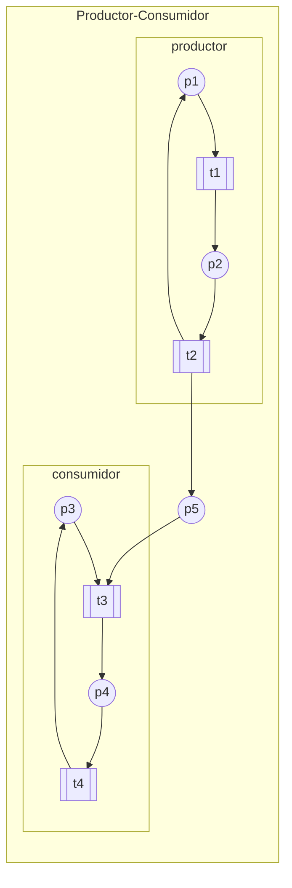
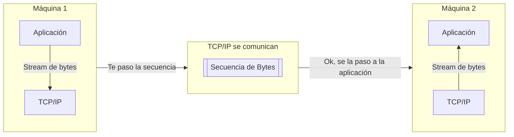
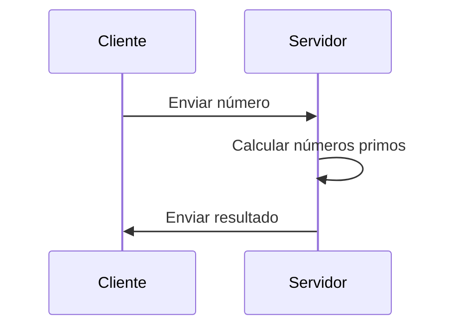
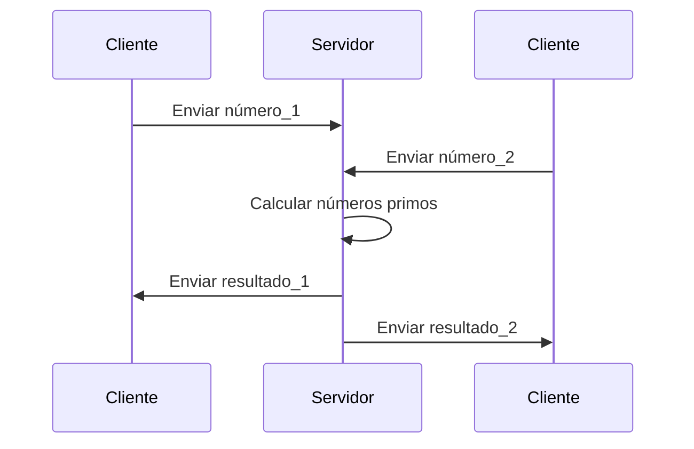

## 1.1. Concepto de Paradigma
Un paradigma de programación (PdP) es un conjunto de características comunes a varios lenguajes, o que diferencian un lenguaje de los demás.
### Utilidad:
- **Establecer clasificaciones**
- **Describir lenguajes**
- **Seleccionar el lenguaje a utilizar**
- **Establecer características de un nuevo lenguaje**

## 1.2. Niveles de Cumplimiento
- **Paradigma obligatorio**: Será imposible no seguir el paradigma porque no hay construcciones en el lenguaje que permitan salir de la norma que lo define.
- **Paradigma soportado**: Cuando no es obligatorio pero es la recomendación más común e incluso resulta complejo no cumplir el paradigma.
- **Paradigma permitido**: Es posible programar siguiendo el paradigma pero el lenguaje no lo favorece.
- **Paradigma no permitido**: Es imposible seguir el paradigma con el lenguaje porque las construcciones del mismo no lo permiten.

## 1.3. Características de los Paradigmas
Se pueden dividir en super-conjuntos:
- Según el tipo de **clasificación**:
  - 1ª clasificación: generales, complementarios y específicos
  - 2ª clasificación: de objetivo y de estructura
- Según la **evolución** de los lenguajes y aparición de nuevos paradigmas
- Según la **relación con el hardware** de los lenguajes de un cierto paradigma

### 1.3.1. Según clasificación: 1ª Clasificación
- **Paradigmas generales**: Establecen una partición sobre el total de los lenguajes de programación. No cumplir el paradigma tiene relevancia. [**estructurado** / **no estructurado**]
- **Paradigmas complementarios**: No cumplir uno implica cumplir el otro. [**imperativo** / **declarativo**]
- **Paradigmas específicos**: Establecen una partición que afecta a todos los lenguajes. Cada lenguaje cumple o no el paradigma, no cumplirlo no tiene relevancia. [**tiempo real**]

### 1.3.2. Según clasificación: 2ª Clasificación
- **Paradigmas de Objetivo**: Orientados a establecer la misión del lenguaje.
    Establecen el significado de las sentencias. [**Programación de Tiempo Real**]
- **Paradigmas de Estructura**: Orientados a establecer la forma que deberán tener los programas del lenguaje.
    Establecen recomendaciones de estructura de programas para evitar problemas u obtener ventajas. [**Programación Orientada a Objetos**]

### 1.3.3. Según la evolución de los lenguajes
- ***Primera línea evolutiva -** Control de memoria*
    Imperativo -> Declarativo
- ***Segunda línea evolutiva -** Estructura del código*
    Sin organización -> Estructurado -> Orientado a Objetos -> Orientado a Aspectos
- ***Tercera línea evolutiva -** Número de tareas simultáneas*
    Secuencial -> Concurrente -> Distribuida -> Cliente / Servidor

### 1.3.4. Según la relación con el Hardware
- **Imperativo vs Declarativo**
  - Imperativo: Como HW actual
  - Declarativo: Independiente de HW, cercano al estilo humano
- **Concurrente**
  - Según HW paralelo o no paralelo

## 1.4. Algunos Paradigmas
### 1.4.1. Programación Imperativa
Lenguajes **orientados a la acción**. Describen ***cómo*** usar la memoria con sentencias de:
- **Asignación**: Variables, expresiones, valores, funciones predefinidas, operadores
- **Control de flujo**: Saltos, bifurcaciones, iteraciones, subrutinas, tratamiento de excepciones
Control de flujo explícito.

### 1.4.2. Programación Declarativa
Lenguajes que describen ***qué** hacer con la memoria, no describen el manejo directo sobre ella. No hay control de flujo explícito.
- **Funcional**: Mediante funciones y expresiones, no hay variables ni procedimientos explícitos. Uso extensivo de recursividad. [LISP, ML, HASKELL, Scala...]
- **Lógico**: Hechos, predicados y relaciones para representar las tareas a realizar. Basado en lógica de predicados. [PROLOG...]

### 1.4.3. Programación Concurrente
Capaces de realizar **varias tareas simultáneamente**. Uso de técnicas, lenguajes, librerías y hardware específico para conseguir paralelismo.
- **Programación concurrente de memoria compartida**: Múltiples tareas simultáneas sobre una única máquina con una única memoria. Comportamiento independiente del número de procesadores.
- **Programación concurrente distribuida**: Se supera la barrera de máquina única - memoria única. Intercambio de información a través de una red. El más usado es el que implementa el modelo *Cliente-Servidor*.

### 1.4.4. Programación Orientada a Objetos
Evolución del Paradigma Estructurado. **Objeto** (estructura de datos) como entidad central. Permite encapsulación y abstracción (representación más directa del mundo real). Se adapta mejor a la informática distribuida. Permite desarrollos más flexibles. [Simula, Smalltalk, C++, Ada, Java...]

### 1.4.5. Programación de Tiempo Real
Permite controlar el funcionamiento de sistemas bajo restricciones de tiempo. Manejo de interrupciones, necesidad de acceder directamente al HW de entrada y salida. Reaccionan ante cambios de estado.

---

## 2.1. Definición
"Notaciones y técnicas usadas para expresas en programas la posibilidad potencial de ejecución simultánea de varios algoritmos y resolver los problemas de sincronización y comunicación derivados de realizar dicha implementación."
- **Notaciones**: Forma de representar los conceptos.
- **Técnicas**: Para descubrir la concurrencia potencial de los algoritmos.
- **Posibilidad potencial de ejecución**: Algoritmos con concurrencia latente, pero existente.

## 2.2. Historia
Aparece en el diseño de SSOO con tres objetivos principales:
- Optimizar el uso de recursos: E/S es mucho más lento
- Realizar un reparto de recursos más justo
- Simplificar el desarrollo: Dividir un programa en tareas que cooperan
Se crean librerías del SO para crear concurrencia, después se crean compiladores que convierten los programas en concurrentes analizando su comportamiento. Finalmente aparecen lenguajes que integran la concurrencia en su diseño.

### 2.2.1. Hilos
Hilos (Threads) = 'Procesos ligeros'
Son la unidad básica de ejecución concurrente. Se ejecutan de forma simultánea y asíncrona. Es necesario coordinar su acceso a datos y la disponibilidad de recursos

## 2.3. Beneficios / Riesgos
### A) Beneficios de los hilos
- Aprovecha múltiples CPUs
- Mejora rendimiento independientemente del número de CPUs
- Simplifica el modelado de programas
- Permite atender varias solicitudes simultáneas
- Facilita la gestión de elementos asíncronos

### B) Riesgos de los hilos
- Seguridad: Posibles **condiciones de carrera** -> Resultado depende del orden de ejecución
- **Interbloqueo**: Varios recursos y varios hilos. Cada hilo bloquea un recurso y se queda a la espera de la liberación de otro -> Posible ciclo infinito de bloqueo
- **Inanición**: Un hilo es incapaz de progresar y no es posible abandonar ese estado.
- **Bajo rendimiento** si el sistema está mal diseñado.

## 2.4. Niveles de Concurrencia
1. Nivel de operación (CPU)
    Procesamiento simultáneo de varios bits por operaciones aritméticas (actualmente 64 bits). Se consigue mediante duplicidad de componentes (ie sumadores paralelos). Nivel transparente para el programador.
2. Nivel de instrucción (CPU)
    Ejecución simultánea de varias instrucciones, ya sea con varios procesadores o con uno solo que use solapamiento. Transparente para nosotros.
3. **Nivel de programa (cooperación)**
    Realización simultánea de varias subtareas. Implica la existencia de un software adecuado para implementar concurrencia. Nivel sobre el que trabajamos.
4. Nivel de aplicaciones (competencia)
    Ejecución simultánea de varios programas. El SO debe soportarlo. No es relevante para nosotros.

## 2.5. Tipos de Concurrencia
### 2.5.1. Diseños
#### SISD: Single Instruction Single Data
`1 CU + 1 ALU`
Computador secuencial con un único procesador. Capaz de ejecutar una instrucción por vez, sobre un único dato. Por ejemplo, antiguos sobremesas.

#### SIMD: Single Instruction Multiple Data
`1 CU + n ALUs`
Ejecuta una instrucción sobre un gran número de datos (por ejemplo varias sumas). Por ejemplo ordenadores vectoriales, o GPUs actuales.

#### MISD: Multiple Instruction Single Data
`n CUs + 1 ALU`
Una secuencia se transmite a una línea de procesadores, cada uno con su propia CU. No son muy comunes, por ejemplo sistemas tolerantes a fallos (naves espaciales, criptografía...)

#### MIMD: Multiple Instruction Multiple Data
`n CUs + n ALUs`
HW realmente concurrente. Ejecución simultánea de varias instrucciones con varios datos diferentes. Varias categorías:
- **Multiprocesadores**
- **Multicomputadores**
- **Sistemas Distribuidos**

### 2.5.2. Concurrencia en distintos diseños
#### A. Concurrencia en monoprocesador
**Concurrencia simulada** que mejora el rendimiento del conjunto. Permite optimizar la utilización de recursos, servir a múltiples usuarios o conseguir un diseño más simple y comprensible.

#### B. Concurrencia en multiprocesador
Los procesos comparten una **memoria común**. Se ejecutan con **concurrencia física**. Es más eficiente.

#### C. Concurrencia en multicomputador
Cada procesador tiene una **memoria local**. Comparten controladores, discos... (clusters). Se ejecutan con **concurrencia física**. No puede haber hilos del mismo proceso en dos CPUs.

#### D. Concurrencia en sistemas distribuidos
Cada computador es **independiente** del resto. Se comunican a través de LAN o WAN e intercambian información a través de la red.

### 2.5.3. Simultaneidad
La simultaneidad puede ser:
- **Real** o **física**: La arquitectura dispone de hardware redundante (**más de un procesador**) y puede haber varias instrucciones ejecutándose simultáneamente.
- **Simulada** o **aparente**: Un **único procesador** que se reparte para simular el avance en paralelo de todas las tareas. No hay concurrencia física realmente.

### 2.5.4. Estados de un proceso
- **En ejecución**: El proceso está ocupando un procesador que ejecuta sus instrucciones.
- **Preparado/Listo/En espera**: El proceso está listo para que se le asigne un procesador en el que ejecutarse.
- **Bloqueado**: El proceso está a la espera de algún recurso y no puede pasar a ejecución.

## 2.6. Notación
### 2.6.1. Diferencia entre proceso e hilo
**Proceso**: Entidad independiente para el SO. Tienen su propia memoria, código, montículo...
**Hilo**: Comparten memoria, código, montículo... **todo excepto el puntero de instrucción.**
Para el SO es más sencillo trabajar con hilos.

### 2.6.2. Diagramas de precedencia
Grafos dirigidos donde:
- Los **nodos** representan secuencias de instrucciones.
- Las **flechas** indican el orden de ejecución.

### 2.6.3. Diagramas de estados
Similares, pero se vuelven complejos cuando se tratan sistemas concurrentes. Son poco flexibles, se requieren Redes de Petri.

### 2.6.4. Redes de Petri
Son una herramienta de modelado simple y efectiva para modelar procesos concurrentes.
Extensiones:
- Temporizadas
- Estocásticas
- Coloreadas

Una red de Petri es un grafo con dos clases de nodos: **lugares** (círculos) y **transiciones** (barras). Los **arcos** unen un lugar con una transición o viceversa.
Un **lugar** puede contener 0..n **marcas** (bolitas).
Las **marcas** se interpretan como recursos.
Las **transiciones** representan una acción a ejecutar:
- Necesitan **precondiciones**
- Generan **poscondiciones**

### 2.6.5. Ejemplo: Productor-Consumidor
*Dos procesos concurrentes utilizan una estructura de datos. Uno de los procesos produce datos y los deposita en la estructura. El otro proceso extrae los datos y los utiliza.


### 2.6.6. Caso Java
Todas las aplicaciones de Java usan hilos:
- main() se ejecuta en un hilo
- Hilos de AWT y Swing
- Hilo de recolección de basura

Java facilita el uso de los hilos:
- Timer: Programar una serie de hilos para que se ejecuten tras/cada cierto tiempo
- Servlets y JavaServer Pages: Para manejar peticiones remotas de clientes HTTP
- RMI: Llamadas a métodos que se ejecutan remotamente.


---

## 3.1. Concurrencia de Memoria Común
Cada proceso tiene su propio espacio de direcciones, asignado y protegido por el SO. No tienen acceso al de otros procesos.
El SO ofrece zonas de memoria compartida, utilizadas para compartir variables y coordinar (comunicación y sincronización)

## 3.2. Coordinación
Conjunto de secuencias ejecutadas simultáneamente que cooperan para un objetivo común.
Se consigue usando variables compartidas. Hay tres modelos:
### 3.2.1. Comunicación [PURO]
Intercambio de datos en variables compartidas **sin controles**.
Dos procesos intercambiando información **no crítica** usando una variable compartida: P1 toma temperatura y la escribe en la VC, P2 lee la VC y la muestra.

### 3.2.2. Sincronización [PURO]
Detención y reanudación de procesos, y su relación temporal.
P1 inicializa una impresora y envía la señal a otros procesos. P2, P3... preparan cada documento para imprimir.

### 3.2.3. Comunicación sincronizada [MIXTO]
Intercambio de información **con control** del momento en que se realiza para asegurar su integridad.
Un conjunto de cabinas de votación y un sistema central de recuento. Cada cabina es un proceso, el sistema central es otro. Cada cabina pone el valor de su voto en una VC con el sistema central, y además tendremos variables de control que informen si el voto es nuevo o ha sido contabilizado.


La coordinación mediante variables compartidas da paso a condiciones de carrera, por lo que es necesario garantizar la exclusión mutua entre procesos.
**Exclusión mutua**: Un único hilo puede acceder a la vez.
**Sección crítica**: Fragmento de código donde la corrección de un programa se ve comprometida por el uso de variables compartidas.
Es necesario asegurar la ejecución en exclusión mutua de toda sección crítica sobre la misma variable compartida.


## 3.3. Concurrencia en Java
Usamos objetos tipo hilo (clase `Thread` / interfaz `Runnable`), objetos con atributos para coordinación, como locks, semáforos... etc.


## 3.4. Algoritmos para la Exclusión Mutua
Problema del iglú: Dos esquimales (*procesos*) comparten un agujero para pescar (*recurso*) en el que solo cabe uno. El acceso debe ser exclusivo. 
1. Primera aproximación: Crear un iglú compartido y una pizarra en el iglú que indique el **turno**. Cuando el esquimal P0 quiera pescar, mirará la pizarra: si hay un 1, espera, si hay un 0, pesca. Cuando vuelva de pescar entra y pone un 1. El esquimal P1 lo hace igual pero a la inversa. (cambia 0 y 1) Problema: **Alternancia**. Si P0 tiene que pescar dos veces seguidas, no podrá.
2. Segunda aproximación: Crear dos iglús, uno para cada esquimal. Dentro de cada una pizarra con 0 (no pescando) o 1 (pescando). Si un esquimal quiere pescar, comprueba el iglú del otro para decidir y después indica si va a pescar en el suyo. Problema: **Falta de exclusión mutua**. Puede ocurrir que ambos comprueben el iglú del otro a la vez, creyendo ambos que el otro no está pescando y que tienen acceso.
3. Tercera aproximación: Cambiar el orden de la segunda. Primero indicar en tu pizarra, luego comprobar la del otro. Problema: **Interbloqueo**. Si ambos ponen que van a pescar y se encuentran en el otro un 1 (pescando) se quedarán en interbloqueo (espera infinita).
4. Cuarta aproximación: Introducir "cortesía". Cuando un proceso ve que el otro quiere utilizar el recurso, le cede el paso. Problema: **Espera indefinida**. Ambos procesos podrían quedar en estado de ceder indefinidamente. (**Inanición**).
5. Quinta aproximación (**Algoritmo de Dekker**): Mezclar 4ª con 1ª. Dos pizarras + Un turno. En caso de conflicto el turno decide a quién se le concede el acceso. Sigue quedando el problema de **espera activa**. Para evitarlo necesitamos al SO, es decir, semáforos, regiones críticas...


## 3.5. Soluciones no Algorítmicas
### 3.5.1. Locks
Permiten acceder a un recurso en exclusión mutua.
Hay dos tipos:
- Explícitos: `lock` y `unlock` se indican expresamente.  [Objeto `Lock` / `ReentrantLock`]
- Implícitos: Las operaciones son intrínsecas. [Cláusula `synchronized`]

`Lock lock = new ReentrantLock();` Crea un lock explícito. Se bloquea y se usa un bloque try durante la ejecución en exclusión mutua, liberamos el lock en un `finally`.

Para resolver problemas de sincronización usaremos **Condition**s

### 3.5.2. Condition
Un objeto `Condition` está ligado a un objeto `Lock`.

`Condition cond = lock.newCondition();`

El condition solo se puede usar por un hilo que haya tomado el lock.


## 3.6. Ejemplo Productor-Consumidor
4 clases:
- Main: Crea buffer, productor, consumidor y ejecuta.
- Buffer: **Objeto compartido** con operaciones de insertar y extraer.
- Productor: Genera elemento y lo inserta.
- Consumidor: Extrae elemento y consume.

Ejemplo locks y conditions.
**Clase Buffer**
```java
public class Buffer {
   private Object[] buf;
   private int in = 0, out = 0, numElem = 0, maximo = 0;
   
   private Lock control = new ReentrantLock();
   private Condition lleno = control.newCondition();
   private Condition vacio = control.newCondition();

   [constructor]

   public void insertar(Object obj) throws InterruptedException {
      control.lock();
      while (numElem==maximo) {
         lleno.await(); // Se suspende el proceso a la espera de que se señalice que hay hueco en el buffer
      }
      try {
         [insertar...]
         vacio.signal(); // Indicar que el buffer ya no está vacío
      }
      finally {
         control.unlock();
      }
   }

   public Object extraer() throws InterruptedException {
      control.lock();
      while (numElem==0) {
         vacio.await(); // Se suspende el proceso a la espera de que se señalice que hay algo en el buffer
      }
      try {
         [extraer...]
         lleno.signal(); // Indicar que el buffer ya no está lleno
         return obj;
      }
      finally {
         control.unlock();
      }
   }
}
```

---

## 4.1. Semáforos
Tipo Abstracto de Datos concebido por Djikstra para el control de la concurrencia. 

**Estructura**:
- **Contador**: entero no negativo.
- **Cola de procesos**: FIFO de procesos bloqueados.

### 4.1.1. Definición inicial
- **Declaración**: VAR s: SEMAPHORE;
- **`Initial(s, v)`**: Inicializa el contador de s
- **`Wait(s)`** (definida como P por Dijkstra): Si el contador es mayor que cero, lo decrementa en uno. Sino, suspende al proceso en la cola.
```pseudo
PROCEDURE wait(s:SEMAPHORE);
    BEGIN (* Operación Atómica *)
        IF (s.contador>0) THEN
            s.contador := s.contador - 1;
        ELSE
            suspende_en(s.cola);
    END;
```

- **`Signal(s)`** (definida como V por Dijkstra): Si hay procesos suspendidos en la cola, despierta a uno. Sino, incrementa el contador.
```pseudo
PROCEDURE signal(s:SEMAPHORE);
    BEGIN (* Operación Atómica *)
        IF vacia(s.cola) THEN
            s.contador := s.contador + 1;
        ELSE
            activar_desde(s.cola);
    END;
```

### 4.1.2. Características
- **Atomicidad**: Las operaciones `wait` y `signal` son atómicas.
- **Invariantes**:
  - $S \geq 0$
  - $S = S_0 + \sum{signal} - \sum{wait}$
- **Usos**:
  - **Comunicación**
  - **Sincronización**
  - **Comunicación sincronizada**

### 4.1.3. Tipos
- **Binario**: $S \in \{0, 1\}$
- **De Contador**: $S \in \{0, N\}$
### 4.1.4. Semáforos en Java
- **`public class Semaphore`**: Clase de Java que implementa semáforos.
  - Un semáforo contiene un número de permisos = contador.
    - *Binario*: 1.
    - *De Contador*: N. 
  - Un semáforo puede crearse como 'justo' incluyendo el parámetro boolean en el constructor inicializado a 1 (true). Los semáforos 'justos' liberan los procesos en el orden en el que se bloquearon (FIFO).
  - *Constructores*:
    - `Semaphore(int permits)`: Inicializa el semáforo con el número de permisos.
    - `Semaphore(int permits, boolean fair)`: Inicializa el semáforo con el número de permisos y si es justo o no.
  - **Operaciones principales**:
    - `void acquire()`: Decrementa el contador. Si es 0, se bloquea.
    - `void acquire(int permits)`: Decrementa el contador en la cantidad de permisos. Si es 0, se bloquea.
    - `void release()`: Incrementa el contador. Si hay procesos bloqueados, despierta a uno.
    - `void release(int permits)`: Incrementa el contador en la cantidad de permisos. Si hay procesos bloqueados, despierta a uno.
    - `boolean tryAcquire()`: Intenta decrementar el contador. Si es 0, devuelve false.
  - **Usos**:
    - *Controlar el número de hilos que acceden a un recurso (**COMUNICACIÓN**)*: Semáforo inicializado a 1 se comporta como un binario.
    - *Simular una cola de espera (**SINCRONIZACIÓN**)*: Semáforo inicializado a 0 simula un `await` de Condition.
  - **Diferencia entre Semáforo y Lock**:
    - **`Lock`**: Solo puede ser liberado por el hilo que lo adquirió.
    - **`Semaphore`**: Puede ser liberado por cualquier hilo, incluso si ese hilo no ha adquirido el semáforo previamente.
### 4.1.5. Ejemplos
**1.** Ejemplo de Secuencia.
- Clase `Secuencia` que devuelve un valor entero incrementado en 1.
```java
public class Secuencia {
    private int valor=0;
    private Semaphore sem = new Semaphore(1);

    public int getSiguiente() {
        try {
            sem.acquire();
            valor++;
        } catch (InterruptedException ie) { }
        finally {
            sem.release();
        } //Devuelve un único valor
        return valor;
    } 
}
```
- Clase `Main` que crea 100 hilos que acceden a la secuencia.
```java
public class Main {
    public static void main(String[] args) {
        Secuencia sec=new Secuencia();
        for(int i=0; i<100; i++) {
            Hilo hilo=new Hilo(i, sec);
            hilo.start();
        }
    }
}
```
- Clase `Hilo` que accede a la secuencia.
```java
public class Hilo extends Thread {
    private Secuencia sec;
    private int id;

    Hilo(int id, Secuencia sec) {
        this.id=id; this.sec=sec;
    }

    public void run() {
        System.out.println("Hilo "+id+": secuencia="+sec.getSiguiente());
    }
}
```

**2.** Ejemplo de Productor-Consumidor con Semáforos.
- Clase `Main` que crea un buffer y dos hilos productor y consumidor.
```java
public class Main
{
public static void main(String[] args)
{
Buffer buf = new Buffer(10);
Thread prod1 = new Productor(buf, "Prod1");
Thread prod2 = new Productor(buf, "Prod2");
Thread cons = new Consumidor(buf, "Cons");
prod1.start();
prod2.start();
cons.start();
}
}
```

- Clase `Productor` que produce mensajes y los inserta en el buffer.
```java
public class Productor extends Thread {
    Buffer buf;
    String id;

    public Productor(Buffer buf, String id) {
        this.buf = buf;
        this.id = id;
    }

    public void run() {
        Object msg;
        for (int i = 1; i <= 20; i++) {
            try {
                sleep(100 + (int) (200 * Math.random()));
                msg = (Object) (id + " - " + i);
                buf.insertar(msg);
                System.out.println("Produzco: " + msg);
            } catch (InterruptedException e) {}
        }
    }
}
```

- Clase `Consumidor` que extrae mensajes del buffer.
```java
public class Consumidor extends Thread {
    Buffer buf;
    String id;

    public Consumidor(Buffer buf, String id) {
        this.buf = buf;
        this.id = id;
    }

    public void run() {
        Object msg;
        for (int i = 1; i <= 20; i++) {
            try {
                sleep(100 + (int) (200 * Math.random()));
                msg = buf.extraer();
                System.out.println("Consumo: " + msg);
            } catch (InterruptedException e) {}
        }
    }
}
```

- Clase `Buffer` que contiene el buffer y los semáforos.
```java
public class Buffer {
    private Object[] buf;
    private int in = 0, out = 0, numElem = 0, maximo = 0;
    private Semaphore vacio = new Semaphore(0);
    private Semaphore lleno;
    private Semaphore em = new Semaphore(1); // Exclusión mutua

    public Buffer(int max) {
        this.maximo = max;
        buf = new Object[max];
        lleno = new Semaphore(max);
    }

    public void insertar(Object obj) throws InterruptedException {
        lleno.acquire();
        em.acquire(); // Bloqueo: Comienza SC
        buf[in] = obj;
        numElem++;
        in = (in + 1) % maximo;
        em.release(); // Desbloqueo: Finaliza SC
        vacio.release();
    }

    public Object extraer() throws InterruptedException {
        vacio.acquire();
        em.acquire(); // Bloqueo: Comienza SC
        Object obj;
        obj = buf[out];
        buf[out] = null;
        numElem = numElem - 1;
        out = (out + 1) % maximo;
        em.release(); // Desbloqueo: Finaliza SC
        lleno.release();
        return obj;
    }
}
```

## 4.2. Regiones Críticas y RCC
**Región Crítica**: Sección de código que accede a un recurso compartido y que no puede ser ejecutada por dos procesos simultáneamente.
### 4.2.1. Semántica de la RC
1. Los procesos (hilos) concurrentes sólo pueden acceder a las variables compartidas dentro de sus correspondientes RC.
2. Un proceso que quiera entrar a una RC lo hará en un tiempo finito.
3. En un instante t de tiempo, sólo un proceso puede estar dentro de una RC de una variable compartida determinada.
    - Esto no impide que, por ejemplo, un proceso P1 esté dentro de la RC asociada con la variable v y un proceso P2 dentro de la RC asociada con la variable w. Es decir, las RC que hacen referencia a variables distintas pueden ejecutarse concurrentemente.
4. Un proceso está **dentro** de una RC **un tiempo finito**, al cabo del cual la abandona.

La cláusula `synchronized` siempre está referida a un objeto:
- Todos los métodos/bloques `synchronized` definidos en un objeto están dentro de una única región crítica.
- Un objeto implementa una RC estricta si:
    - Todas sus variables son `private`.
    - Y todos sus métodos son `synchronized`.
### 4.2.2. RC en Java
**¿Cerrojo implícito o Región Crítica?**
- **Cerrojo implícito**: Se refiere a la instancia de la clase.
- **Región Crítica**: Se refiere a la sección de código que se ejecuta en exclusión mutua.

```java
public class VarComp {
    private int v=0;
    public void incrementar(int i) {
        v=v+i;
    }
    ...
}

public class Proceso extends Thread {
    VarComp var;
    …
    public void run() {
        …
        synchronized (var) {
            var.incrementar(12);
            …
        }
        …
    }
}
```

```java
public class VarComp {
    private int v=0;
    public synchronized void incrementar(int i) {
        v=v+i;
    }
    public class Proceso extends Thread {
        VarComp var;
        …
        public void run() {
            …
            var.incrementar(12);
            …
        }
    }
}
```
### 4.2.3. Regiones Críticas Condicionales
Si se usa una RC para *sincronización* puede darse **espera activa**. Para evitarla, necesitamos bloquear un hilo hasta que se cumpla una condición. 
Una Región Crítica Condicional (RCC) permite a un proceso abandonar temporalmente la RC, si una condición no se cumple, a la espera de que otro proceso modifique dicha condición.

Las RCC permiten abandonar temporalmente la RC:
- Si una condición no se cumple
- A la espera de que otro proceso entre en la RC y salga
- La condición puede haber sido modificada
- El proceso que salió temporalmente, vuelve a entrar a comprobar la condición

**No hay espera activa**

La sentencia `AWAIT` hace que el proceso dentro de la RCC la abandone temporalmente. 
Cuando un proceso completa la RCC, saca a todos los que esperan.

En Java no tiene implementación directa.

## 4.3. Monitores
### 4.3.1. Definición
Un monitor implementa una RCC especial:
- Un hilo dentro del monitor puede sacar de la cola de espera a uno o a todos los hilos esperando.
- Engloba datos compartidos, los métodos que los usan y una sección de inicialización que garantiza que el monitor parte de un estado coherente.
### 4.3.2. Semántica
Un proceso que llega al monitor tiene que esperar a que no haya nadie dentro.

- Comprueba si se satisface una condición:
    - Si cumple la condición, continúa ejecutando.
    - Si no se cumple, tiene que esperar (`wait`) en una cola `q` asociada.
- Si modifica la condición, puede notificar a los procesos que esperan en `q`, para que vuelvan a entrar (`notify`).
### 4.3.3. Monitores de Mesa en Java
Java dispone de tres sentencias para implementar un monitor:

- **`wait()`**: El proceso que la ejecuta (dentro de una RC) se queda bloqueado hasta que otro proceso lo saque de esa situación.
- **`notify()`**: Ejecutada por un proceso (dentro de una RC), saca a uno de los procesos en `wait` de su estado.
- **`notifyAll()`**: Igual que la anterior, pero saca a todos los procesos en `wait` dentro de esa RC.

**Ejemplo de los Igloos con Monitores**:
```java
public class Igloo // Monitor
{
    private boolean pescando = false;

    public synchronized void pescar() {
        while (pescando) { // El recurso está ocupado
            try {
                wait(); // Sale temporalmente de la SC
            } catch (InterruptedException e) {}
        }
        pescando = true; // El proceso adquiere el recurso
    }

    public synchronized void noPescar() {
        pescando = false; // El proceso libera el recurso
        notifyAll(); // Libera los procesos que estén
        // esperando el recurso
    }
}
```

### 4.3.4. Monitores de Hoare
**Propuesta original de Hoare y Hansen**:
- Proponen un monitor con varias colas
    - Tantas como se necesiten
    - Cada una implica una condición distinta
    - Todas las colas son justas (fair)
**Comportamiento**:
- **Thread A** espera una condición específica
    - Hace `wait()` de una cola para esa condición
- **Thread B** ejecuta un `signal()`
    - Abandona temporalmente el monitor
    - Espera hasta que el **Thread A** despertado salga del monitor o ejecute un nuevo `wait()`
### 4.3.5. Monitores de Mesa vs Monitores de Hoare
Un monitor de Hoare garantiza que:
- Si un proceso sale de su cola de condición, es porque dicha condición se cumple y no ha dejado de cumplirse.
    - No es necesario comprobar la condición.
- El proceso que detecta la condición y despierta a otro, sale del monitor en ese momento.

Un monitor simple (de Mesa) no garantiza:
- El cumplimiento de la condición de un proceso despertado.
    - Es necesario comprobar la condición.
- Porque:
    - El proceso que despierta a otro se sigue ejecutando.
    - Otros procesos pueden haber cambiado la condición.

## 4.4. Ejemplos
### 4.4.1. Productor-Consumidor con Monitores
```java
public class Buffer {
    private Object[] buf;
    private int in = 0, out = 0, numElem = 0, maximo = 0;

    public Buffer(int max) {
        this.maximo = max;
        buf = new Object[max];
    }

    public synchronized void insertar(Object obj) throws InterruptedException { // Añadimos 'synchronized'
        while (numElem == maximo) { // Buffer lleno
            wait(); // Esta línea es nueva
        }
        buf[in] = obj;
        numElem++;
        in = (in + 1) % maximo;
        notifyAll(); // Esta línea es nueva
    }

    public synchronized Object extraer() throws InterruptedException { // Añadimos 'synchronized'
        while (numElem == 0) { // Buffer vacío
            wait(); // Esta línea es nueva
        }
        Object obj;
        obj = buf[out];
        buf[out] = null;
        numElem = numElem - 1;
        out = (out + 1) % maximo;
        notifyAll(); // Esta línea es nueva
        return obj;
    }
}
```


### 4.4.2. Productor-Consumidor con Semáforos y Locks
```java
public class Buffer {
    private Object[] buf; // Lo hacemos privado
    private int in = 0, out = 0, numElem = 0, maximo = 0;
    private Semaphore vacio = new Semaphore(0); // Esta línea es nueva
    private Semaphore lleno;                    // Esta línea es nueva
    private Lock control = new ReentrantLock(); // Exclusión mutua // Esta línea es nueva

    public Buffer(int max) {
        this.maximo = max;
        buf = new Object[max];
        lleno = new Semaphore(max); // Esta línea es nueva
    }

    public void insertar(Object obj) throws InterruptedException {
        lleno.acquire();                            // Esta línea es nueva
        control.lock(); // Bloqueo: Comienza SC     // Esta línea es nueva
        try {
            buf[in] = obj;
            numElem++;
            in = (in + 1) % maximo;
            vacio.release();                        // Esta línea es nueva
        } finally {
            control.unlock(); // Desbloqueo: Finaliza SC    // Esta línea es nueva
        }
    }

    public Object extraer() throws InterruptedException {
        vacio.acquire();                            // Esta línea es nueva
        control.lock(); // Bloqueo: Comienza SC     // Esta línea es nueva
        Object obj;
        try {
            obj = buf[out];
            buf[out] = null;
            numElem = numElem - 1;
            out = (out + 1) % maximo;
            lleno.release();                        // Esta línea es nueva
        } finally {
            control.unlock(); // Desbloqueo: Finaliza SC    // Esta línea es nueva
        }
        return obj;
    }
}
```

## 4.5. Interbloqueo
### 4.5.1. Definición
Un interbloqueo (deadlock) impide que un programa progrese. Los hilos se quedan bloqueados esperándose unos a otros.

Para que ocurra un interbloqueo, deben cumplirse cuatro condiciones necesarias y suficientes. El propósito es evitar deadlocks diseñando sistemas en los que no puedan ocurrir interbloqueos.

### 4.5.2. Problema de los Filósofos

Cinco filósofos están sentados alrededor de una mesa circular. Cada uno de ellos alterna entre "pensar" y "comer". En medio de la mesa hay un gran plato de spaghetti, y cada filósofo necesita dos palillos para poder comer. Como los filósofos cobran menos que los informáticos, sólo tienen 5 palillos en total. Hay un palillo colocado a la izquierda y otro a la derecha de cada uno. 

Cuando un filósofo tiene hambre:
- Toma primero su palillo derecho y después el izquierdo.
- Con los dos palillos se puede poner a comer.

#### Modelado del problema
Cada palillo es un recurso compartido:
- Dos métodos, `get()` y `put()`, accedidos en exclusión mutua.

Cada filósofo es un hilo:
- En su método `run()`:
    - Simula la acción de pensar.
    - Coge el palillo derecho.
    - Coge el palillo izquierdo.
    - Simula la acción de comer.
    - Suelta el palillo derecho.
    - Suelta el palillo izquierdo.

Tal y como está planteado el problema, al cabo de un tiempo más o menos largo, ocurrirá que cada filósofo tiene un palillo en su mano derecha y ninguno puede continuar: Los procesos están interbloqueados.

### 4.5.3. Condiciones de Coffman
1. **Exclusión mutua**
    - Al menos existe un recurso compartido, al cual sólo puede acceder un proceso a la vez.
2. **Asignación parcial de recursos**
    - Cada proceso va adquiriendo (y bloqueando) los recursos a medida que los va necesitando.
3. **No expulsión de recursos**
    - Una vez adquirido un recurso, no se libera hasta no haber adquirido el resto.
4. **Espera circular**
    - Cada proceso espera la liberación de un recurso por otro proceso, que a su vez espera un tercero, y así sucesivamente hasta completar el círculo con el primer proceso.

### 4.5.4. Estrategias para evitar el interbloqueo
Para evitar el interbloqueo, es necesario **evitar alguna** de las condiciones de Coffman:

- **Eliminando la exclusión mutua**: 
    - Ningún proceso puede tener acceso exclusivo a un recurso.
    
- **Eliminando la asignación parcial de recursos**: 
    - Haciendo que todos los procesos pidan todos los recursos que van a necesitar antes de empezar.
    
- **Eliminando la condición de no expulsión de recursos**: 
    - A veces imposible de eliminar porque un proceso debe poder tener un recurso durante un cierto tiempo.
    
- **Eliminando la condición de espera circular**: 
    - Se le permite a un proceso poseer sólo un recurso en un determinado momento, o establecer una jerarquía para evitar ciclos.

http://www.youtube.com/watch?v=myomEBjnIDw

http://www.youtube.com/watch?v=1XbzdDE7yXI

---


## EJERCICIOS
### Ejercicio 1. Se pretende simular un sistema que representa un corral que contiene 28 pollos que siempre están dentro del corral. En el corral, los pollos están comiendo (tardan entre 2-6 segundos), bebiendo (1-3 segundos), paseando (5-9 segundos) o durmiendo (15-19 segundos). El ciclo de cada pollo empieza paseando y, cada vez que termina un acción, selecciona aleatoriamente la siguiente, que puede repetirse. Algunas de estas acciones requieren elementos con capacidad limitada: comedero (máximo 4 pollos), bebedero (máximo 8 pollos), cama (máximo 10 pollos). Los pollos no finalizan su ciclo de acciones nunca.
Se pide desarrollar el código completo del programa utilizando exclusivamente **monitores de mesa**. El único elemento static del programa será el método main. El programa deberá funcionar a excepción de posibles errores menores "de compilación". No se pide la ejecución del programa.

**Clase main**:
```java
public class Main {
    public static void main(String[] args) {
        Comedero com = new Comedero(4);
        Bebedero beb = new Bebedero(8);
        Cama cam = new Cama(10);
        for (int i = 0; i < 28; i++) {
            new Pollo(com, beb, cam, (i+1)).start();
        }
    }
}
```

**Clase Pollo**:
```java
public class Pollo extends Thread {
    private Comedero com;
    private Bebedero beb;
    private Cama cam;
    private int id;
    public Pollo(Comedero com, Bebedero beb, Cama cam, int id) {
        this.com = com;
        this.beb = beb;
        this.cam = cam;
        this.id = id;
    }
    public void run() {
        try {
            // Pasear (inicio de Pollo)
            sleep((int)(5000 + 4000*Math.random()));
        }
        catch (InterruptedException e) {
            e.printStackTrace();
        }
        while (true) {
            try{
                int accion = (int)(e*Math.random() + 1);
                switch (accion) {
                    case 1:
                        // Comer
                        com.empezarComer();
                        sleep((int)(2000 + 4000*Math.random()));
                        com.dejarComer();
                        break;
                    case 2:
                        // Beber
                        beb.empezarBeber();
                        sleep((int)(1000 + 2000*Math.random()));
                        beb.dejarBeber();
                        break;
                    case 3:
                        // Pasear
                        sleep((int)(5000 + 4000*Math.random()));
                        break;
                    case 4:
                        // Dormir
                        cam.empezarDormir();
                        sleep((int)(15000 + 4000*Math.random()));
                        cam.dejarDormir();
                        break;
                }
            }
            catch (InterruptedException ie) {}
        }
    }
}   
```

**Clase Comedero**:
```java
public class Comedero {
    private int capacidad;
    private int nPollosDentro = 0;
    public Comedero(int capacidad) {
        this.capacidad = capacidad;
    }
    public synchronized void empezarComer() throws InterruptedException {
        while (nPollosDentro == capacidad) {
            wait();
        }
        nPollosDentro++;
    }
    public synchronized void dejarComer() {
        nPollosDentro--;
        notifyAll();
    }
}
```

**Clase Bebedero**:
```java
public class Bebedero {
    private int capacidad;
    private int nPollosDentro = 0;
    public Bebedero(int capacidad) {
        this.capacidad = capacidad;
    }
    public synchronized void empezarBeber() throws InterruptedException {
        while (nPollosDentro == capacidad) {
            wait();
        }
        nPollosDentro++;
    }
    public synchronized void dejarBeber() {
        nPollosDentro--;
        notifyAll();
    }
}
```

**Clase Cama**:
```java
public class Cama {
    private int capacidad;
    private int nPollosDentro = 0;
    public Cama(int capacidad) {
        this.capacidad = capacidad;
    }
    public synchronized void empezarDormir() throws InterruptedException {
        while (nPollosDentro == capacidad) {
            wait();
        }
        nPollosDentro++;
    }
    public synchronized void dejarDormir() {
        nPollosDentro--;
        notifyAll();
    }
}
```

---

## 4b.1. Examen
Será de aprox. 1 hora 20 minutos. 
- Parte teórica (tipo test) - 20min
- Parte práctica (ejercicio clase) - 1h

Para la parte teórica tipo test de 10-20 preguntas, alguna puede ser de desarrollar.
Para la parte práctica será un ejercicio como en clase (probablemente productor-consumidor) con una de las siguientes:
- Locks y Conditions
- Semáforos
- Monitores

## 4b.2. Ejercicio Repaso
#### Se pide modelar el comportamiento de dos camareros que van dejando comandas (pedidos que han solicitado comensales) en una estantería para que posteriormente las recojan dos cocineros y vayan cocinando los distintos platos. Cada camarero deja una comanda cada 500 ms y cada cocinero tarda en coger una comanda y cocinarla 400 ms. En la estantería sólo caben hasta un máximo de 20 comandas. Si la estantería se llena, los camareros esperan a que los cocineros hagan hueco, y si la estantería se vacía entonces los cocineros esperan a que le lleguen más comandas.
#### Cuestiones a tener cuenta:
- Como el restaurante está repleto de gente, a priori, no se sabe cuántas comandas llevarán los camareros y, por consiguiente, tampoco se sabe cuántas comandas deben cocinar los cocineros.
- Para simplificar, las comandas pueden ser representadas mediante un objeto tipo String (con cualquier contenido).

#### Resolver este problema de la forma más eficientemente posible, utilizando exclusivamente Semáforos.
Se pide: desarrollar el código completo del programa utilizando exclusivamente semáforos. El único elemento static del programa será el método main. El programa deberá funcionar a excepción de posibles errores menores “de compilación”

**PASOS**
1. Leer enunciado e identificar los hilos (los que vayan a realizar acciones) -> *Cocinero*, *Camarero*
2. Identificar objetos compartidos -> *Estantería* [opcionalmente *Comandas* (se puede interpretar como dentro de estantería)]

---

##### [MAIN] Clase EjercicioRepasoPec1:
```java
package ejercicio_repaso_pec1;

public class EjercicioRepasoPec1() {
    public static void main(String[] args) {
        // 1. Creamos el objeto compartido
        Estanteria est = new Estanteria(20);

        // 2. Creamos los hilos
        Camarero cam1 = new Camarero(est, "Camarero 1");
        Camarero cam2 = new Camarero(est, "Camarero 2");
        Cocinero coc1 = new Cocinero(est, "Cocinero 1");
        Cocinero coc2 = new Cocinero(est, "Cocinero 2");

        // 3. Inicializamos los hilos
        cam1.start();
        cam2.start();
        coc1.start();
        coc2.start();
    }
}
```

##### [OBJETO COMPARTIDO] Clase Estanteria: 
```java
package ejercicio_repaso_pec1;

public class Estanteria {
    private List<String> est;
    private int max;
    private Semaphore vacio = new Semaphore(0); // Inicializado a 0 -> Condition
    private Semaphore lleno;
    private Semaphore em = new Semaphore(1); // Inicializado a 1 -> Binario Para asegurar Exclusión mutua

    public Estanteria(int max) {
        this.max = max;
        est = new ArrayList<String>();
        lleno = new Semaphore(max);
    }

    public void dejarComanda(String comanda) {
        try {
            lleno.acquire();
            em.acquire();
            est.add(comanda);
        }
        catch(InterruptedException ie) {}
        finally {
            em.release();
            vacio.release();
        }
    }

    public String cogerComanda() {
        try {
            vacio.acquire();
            em.acquire();
            String comanda = est.get(0);
            est.remove(0);
            return comanda;
        }
        catch(InterruptedException ie) {}
        finally {
            em.release();
            lleno.release();
        }
    }
}
```

##### [HILO] Clase Camarero:
```java
package ejercicio_repaso_pec1;

public class Camarero extends Thread {
    private Estanteria est;
    private String id;

    public Camarero(Estanteria est, String id) {
        this.est = est;
        this.id = id;
    }

    @Override
    public void run() {
        String comanda;
        int i=0;
        while(true) {
            try {
                comanda = id + " - " + i; // "Camarero x - 0"
                est.dejarComanda(comanda);
                i++;
                sleep(500);                
            }
            catch(InterruptedException ie) {
            }
        }
    }
} 
```

##### [HILO] Clase Cocinero:
```java
package ejercicio_repaso_pec1;

public class Cocinero extends Thread {
    private Estanteria est;
    private String id;

    public Cocinero(Estanteria est, String id) {
        this.est = est;
        this.id = id;
    }

    @Override
    public void run() {
        String comanda;
        while(true) {
            try {
                comanda = est.cogerComanda();
                System.out.println("El " + id + " cocina la comanda " + comanda);
                sleep(400);
            }
            catch (InterruptedException ie) {
            }
        }
    }
}
```

---

## 5.1. Computación y Sistemas Distribuidos
### 5.1.1. Computación Distribuida y Sistemas Distribuidos
Comunicación y sincronización entre procesos concurrentes **ejecutados en distintas máquinas**, se rompe la limitación de la memoria única.

> [!NOTE]
> **Sistemas Distribuidos**
> Un sistema distribuido es una solución **software** que consiste en dividir la funcionalidad entre distintas máquinas conectadas por una red. Cada máquina tiene su propio procesador, memoria y sistema operativo.
> Los sistemas deben ser **muy desacoplados**, es decir, deben intercambiar la menor cantidad de información.

Ventajas:
- Distribución de cálculo y datos
  - Hardware más económico
  - Mayor potencia de cálculo global
- Compartición de recursos
- Mayor fiabilidad ante caídas
- Posibilidad de escalabilidad
- Posibilidad de sistemas abiertos
- Facilidad en despliegue de nuevas versiones o aplicaciones

Desventajas:
- Complejidad adicional en la coordinación con HW y SO distintos
- Necesidad de una red fiable
- Menor seguridad (puerto abierto = vector de ataque)


### 5.1.2. Modelos de línea física
- **Directa**: Cable serie o infrarrojos.
    Lenta, poco fiable y sólo permite sistemas que se basen en la existencia de la conexión.
- **Directa de red P2P**: Con cable o inalámbrica, entre dos dispositivos (peer to peer).
    Más eficiente y segura, pero limitado a dos ordenadores y no se alcanzan todas las ventajas.
- **Red**: Intranet o Internet
    HW y SO aíslan del componente físico. Requiere de un sistema de nombrado lógico pero permite todas las ventajas en un escenario ideal.

## 5.2. Canales y Protocolos
Los canales y aplicaciones que hacemos con estos se basan en los niveles de red inferiores del modelo de red OSI.
### 5.2.1. IP - Internet Protocol
Nivel de Red.
Usado para mover datos en forma de paquetes entre aplicaciones.
Todo dispositivo conectado posee una dirección IP (IPv4 -> 4 bytes = 32 bits) que lo identifica unívocamente.
#### Direcciones IP y DNS
IPv4 -> 4 bytes = 4 cifras del 0 al 255
Difíciles de recordar, se crea el concepto de **domain name** (String asociada a dirección IP)

Surge **Domain Name System** para conversión entre dominios e IPs de forma automática.

### 5.2.2. TCP - Transfer Control Protocol
Nivel de Transporte.
Incorporado al protocolo IP (concepto de TCP/IP).
Proporciona fiabilidad a la comunicación validando que los paquetes llegan al destino en orden. **Puede pedir retransmisión**.

### 5.2.3. UDP - User Datagram Protocol
Nivel de Transporte.
Se utiliza junto a IP en comunicaciones donde no es importante que lleguen todos los paquetes, el orden de llegada es irrelevante, o es preferible la velocidad a la fiabilidad. **No verifica la llegada ni el orden**.

## 5.3. Comunicación Distribuida mediante Paso de Mensajes
### 5.3.1. Paso de Mensajes
**Canal**: "Conexión de red totalmente fiable y con un sistema de nombrado que permite crear un 'tubo' para comunicar 2 procesos en 2 máquinas distintas."

Los canales serán bidireccionales.

Pasos para implementar Paso de Mensajes:
1. Crear los programas necesarios en cada ordenador.
2. Establecer los canales de comunicación entre ellos.
3. Definir el protocolo de envío/recepción de datos.

Los programas se crean y compilan independientemente, la relación entre ellos se establece en tiempo de ejecución con la creación de los canales.

Cada canal tiene asociado un tipo de datos. Los canales pueden o no tener capacidad de almacenamiento, lo que da lugar a dos tipos de programación:
- **Comunicación síncrona**: los dos extremos de la comunicación tienen que estar dispuestos.
- **Comunicación asíncrona**: se pueden enviar datos sin necesidad de que el otro extremo esté esperando, pudiéndolos recibir más tarde. En este caso los datagramas pueden quedar almacenados en la red o en el propio receptor (en las capas inferiores).

| Comunicación síncrona                | Comunicación asíncrona              |
| ------------------------------------ | ----------------------------------- |
| Sin capacidad de almacenamiento      | Con capacidad de almacenamiento     |
| Comunicación orientada a la conexión | Comunicación orientada a datagramas |
| TCP                                  | UDP                                 |
| Fiable                               | No fiable                           |
| Sockets Stream                       | Sockets Datagrama                   |

Los programas deben:
- Definir el canal
  - Identificador
  - Dirección de destino
  - Tipo de canal (síncrono o asíncrono)
  - Tipo de datos a enviar
- Enviar datos
  - Identificador de canal de envío
  - Datos a enviar (coherentes con el tipo de canal)
- Recibir datos
  - Identificador de canal de envío
  - Variable donde guardar los datos recibidos
  

El comportamiento dependerá del tipo de canal y estado de ocupación del mismo:
- `Send`
  - En canales **síncronos** enviará el dato y continuará sólo si el receptor está preparado para recibir. En caso de no estarlo realiza espera no activa hasta que el receptor ejecute `receive`.
  - En canales **asíncronos** siempre enviará el dato y continuará con la siguiente instrucción.
- `Receive`
  - En canales **síncronos** sólo recibirá el dato y continuará si hay un envío bloqueado a la espera. En caso contrario se bloqueará (sin espera activa) hasta el envío.
  - En canales **asíncronos** recibirá el dato y continuará con la siguiente instrucción. Si no hubiera dato pendiente en el canal, quedará a la espera de un envío.

El protocolo TCP/IP transporta **bytes**. El protocolo de aplicaciñon proporciona la semántica.



### 5.3.2. Sockets
Para establecer la comunicación entre dos programas, se crea un socket en cada máquina. Son una abstracción del SO y las aplicaciones pueden crearlos, utilizarlos y cerrarlos.

Un socket tiene un identificador: IP + Puerto

La conexión entre sockets es **full-dúplex**.


### 5.3.3. Sockets en Java
!!!note Clase InetAddress
    **Clase `InetAddress`**: Permite manipulación y conocimiento de direcciones. Representa una dirección IP.
    - `byte[] getAddress()`: Devuelve la dirección IP del objeto InetAddress
    - `static InetAddress[] getByName(String host)`: Devuelve un objeto InetAddress representando el host.
    - `static InetAddress[] getAllByName(String host)`: Devuelve un array de objetos InetAddress correspondientes a las IP asignadas al host.
    - `static InetAddress getByAddress(byte[] addr)`: Devuelve un objeto InetAddress dada una dirección IP.
    - `static InetAddress getByAddress(String host, byte[] addr)`: Devuelve un objeto InetAddress a partir de host e IP.
    - `static InetAddress getLocalHost()`: Devuelve un objeto InetAddress representando el ordenador local donde se ejecuta la aplicación.
    
    Para representar una dirección IP: `byte[] dirIP = {127, 0, 0, 1};`

#### Sockets Stream (TCP)
Los datos son transmitidos en **bytes**.
Se utiliza el protocolo **TCP**.
La conexión empieza cuando **ambos sockets estén conectados**.
Se basa en:
- clase `Socket`
- clase `ServerSocket`

**Pasos**:
1. El servidor establece un puerto y espera a que el cliente establezca la conexión.
2. Cuando el cliente solicite conexión el servidor abrirá el socket con el método `accept()`.
3. El cliente establece una conexión con el host a través del puerto designado.
4. El cliente y servidor se comunican con **`InputStream`** y **`OutputStream`**.

**Clases**:
- `Socket`: Objeto básico de comunicación, proporciona métodos para entrada/salida a través de Streams.
  - `Socket s = new Socket(address, port);`: Crea y conecta un socket stream
  - `InputStream entrada = s.getInputStream();`
  - `OutputStream salida = s.getOutputStream();`
  - `s.close();`
- `ServerSocket`: Objeto utilizado **en el servidor** para escuchar las peticiones que realicen los clientes. Este objeto crea un objeto Socket en función del cliente para realizar la comunicación a través de este.
  - `ServerSocket ss = new ServerSocket(puerto);`
  - `Socket s;` -> `s = ss.accept();` -> `ss.close();`

**Operaciones**:
1. Apertura de Sockets en Cliente
    ```java
    Socket miCliente;
    try{
        miCliente = new Socket("maquina", puerto);
    }
    catch (IOException e) {
        e.printStackTrace();
    }
    ```
2. Apertura de Sockets en Servidor
    ```java
    ServerSocket miServicio;
    try {
        miServicio = new ServerSocket(puerto);
    }
    catch (IOException e) {
        e.printStackTrace();
    }

    Socket socketServicio = null;
    try {
        socketServicio = miServicio.accept(); //Se crea desde el ServerSocket
    } catch(IOException e) {
        e.printStackTrace();
    }
    ```
3. Creación de Streams de entrada y salida en Cliente
    ```java
    DataInputStream entrada;
    DataOutputStream salida;
    try {
        entrada = new DataInputStream(miCliente.getInputStream());
        salida = new DataOutputStream(miCliente.getOutputStream());
    } catch(IOException e) {
        e.printStackTrace();
    }
    ```
4. Creación de Streams de entrada y salida en Servidor
    ```java
    DataInputStream entrada;
    DataOutputStream salida;
    try {
        entrada = new DataInputStream(socketServicio.getInputStream());
        salida = new DataOutputStream(socketServicio.getOutputStream());
    } catch(IOException e) {
        e.printStackTrace();
    }
    ```
5. Recepción y envío con los métodos de los streams (ie `readDouble()`, `writeDouble(d)`...)
6. Cierre de streams y sockets: Primero cerrar los streams de un socket antes que el propio socket.
    ```java
    // En cliente
    salida.close();
    entrada.close();
    miCliente.close();

    // En servidor
    salida.close();
    entrada.close();
    socketServicio.close();
    miServicio.close();
    ```


#### Sockets Datagrama (UDP)
Los datos son transmitidos en **datagramas**.
Se utiliza el protocolo **UDP**.
**Más eficiente** pero **menos fiable**.
- clase `DatagramSocket`

**Clases**:
- `DatagramSocket`: No se pierde tiempo estableciendo una conexión.
- `DatagramPacket`: Representa un paquete datagrama para enviar y recibir información.


### Ejercicio 1
#### Se pretende crear una aplicación distribuida con sockets TCP, a la que se le envíe un número y nos devuelva como resultado cuantos números primos hay entre 1 y el número enviado. Para el cálculo de los primos deberán utilizarse al menos dos hilos.
**Adicional: Optimizar el servidor para que sea capaz de atender varias peticiones de clientes a la vez y mejorar el tiempo de ejecución.**



Con lo adicional:


#### Proyecto "Servidor"
**[MAIN] Clase Servidor**
```java
public class Servidor {
    
    public static void main(String[] args) {

        ServerSocket servidor;
        Socket conexion;
        DataInputStream entrada;
        DataOutputStream salida;

        try{
            servidor = new ServerSocket(5000);
            while (true) {
                conexion = servidor.accept();           // Esperamos una conexión
                entrada = new DataInputStream(conexion.getInputStream());
                salida = new DataOutputStream(conexion.getOutputStream());
                int numero = entrada.readInt();         // Recibimos el número, en este caso un int
                System.out.println("[SERVIDOR] Número recibido: " + numero);
                int numPrimos = 1;                      // Contador de números primos
                if (numero > 1) {
                    PrimosThread p1 = new PrimosThread(1, numero/2);
                    PrimosThread p2 = new PrimosThread(numero/2, numero);
                    p1.start();
                    p2.start();
                    p1.join();
                    p2.join();
                    numPrimos = p1.getNumPrimos() + p2.getNumPrimos();
                }
                salida.writeInt(numPrimos);             // Enviamos el número de primos
                entrada.close();
                salida.close();
                conexion.close();
            }
        } catch (Exception e) {}
    }
}
```
**[HILO] Clase PrimosThread**
```java
```

#### Proyecto "Cliente"
**[MAIN] Clase Cliente**
```java
public class Cliente {
    
    public static void main(String[] args) {

        Socket cliente;
        DataInputStream entrada;
        DataOutputStream salida;

        try {
            Scanner sc = new Scanner(System.in); // La profe lo hace con BufferReader [BufferedReader br = new BufferedReader(new InputStreamReader(System.in));]
            System.out.print("Introduce un número para calcular todos sus primos menores que él: ");
            int numero = sc.nextInt();
            cliente = new Socket("localhost", 5000); // Conexión al servidor, en otros casos pondríamos la IP en lugar de "localhost"
            entrada = new DataInputStream(cliente.getInputStream());
            salida = new DataOutputStream(cliente.getOutputStream());
            System.out.println("[CLIENTE] Enviando número: " + numero);
            salida.writeInt(numero); // Enviamos el número
            int numPrimos = entrada.readInt(); // Recibimos el número de primos
            System.out.println("[CLIENTE] Número de primos: " + numPrimos);
            entrada.close();
            salida.close();
            cliente.close();
        }
        catch (Exception e) {}

    }
}
```


#### Ahora vamos a optimizarlo:

**[MAIN] Clase Servidor**
```java
public class Servidor {

    public static void main(String args[]) {
        ServerSocket servidor;
        Socket conexion;
        try {
            servidor = new ServerSocket(5000);
            while (true) {
                conexion = servidor.accept();
                HiloConexion hilo = new HiloConexion(conexion);
                hilo.start();
            }
        }
        catch (Exception e) {}
    }
}
```

**[HILO] Clase HiloConexion**
```java
public class HiloConexion extends Thread {
    private Socket conexion;
    public HiloConexion(Socket conexion) {
        this.conexion = conexion;
    }

    public void run() {
        try {
            DataInputStream entrada;
            DataOutputStream salida;
            entrada = new DataInputStream(conexion.getInputStream());
            salida = new DataOutputStream(conexion.getOutputStream());
            int numero = entrada.readInt();
            System.out.println("[SERVIDOR] Número recibido: " + numero);
            int numPrimos = 1;
            if (numero > 1) {
                PrimosThread p1 = new PrimosThread(1, numero/2);
                PrimosThread p2 = new PrimosThread(numero/2, numero);
                p1.start();
                p2.start();
                p1.join();
                p2.join();
                numPrimos = p1.getNumPrimos() + p2.getNumPrimos();
            }
            salida.writeInt(numPrimos);
            entrada.close();
            salida.close();
            conexion.close();
        }
        catch (Exception e) {}
    }
}
```

---

## 6.1. RPC
### 6.1.1. Remote Procedure Calls
Comunicación a un nivel de abstracción mayor que el Paso de Mensajes. **No se manejan directamente los canales**. **Se hacen llamadas a procedimientos definidos en otros procesos**.

Los parámetros de la llamada a un procedimiento remoto serán los datos enviados/recibidos. Los canales siempre son **síncronos**.

**Proceso que llama**:
1. Ejecuta la llamada RPC
2. Se crean los canales automáticamente
3. Se envía la información al receptor
4. Se bloquea voluntariamente hasta que la información llegue, se procese y se responda.
5. Se recibe la respuesta y se carga en los parámetros de salida si los hay
6. Se pasa a la siguiente instrucción

**Proceso que se ofrece a ser llamado**:
1. Ejecuta la oferta RPC
2. Se crean los canales automáticamente
3. Se espera a recibir la información (bloqueo mientras)
4. Una vez recibida, se carga en los parámetros y se procesa
5. Se envía la respuesta como resultado de la ejecución
6. Se pasa a la siguiente instrucción

El modelo de RPC original no es práctico porque:
- El proceso que se ofrece queda bloqueado a la espera de llamadas
- El proceso que se ofrece usa una sentencia normal en mitad del código no RPC

Se crean nuevos modelos

### 6.1.2. Tipos de RPC
**ONC RPC**: RPC de Sun
**DCE/RPC**: RPC de Open Software Foundation
**DCOM**: Modelo de Objetos de Componentes Distribuidos de Microsoft
***RMI**: Invocación de Métodos Remotos de **Java***

No son compatibles entre sí, aunque coinciden en algunas cosas.
La mayoría usan un lenguaje de descripción de interfaz (IDL) que define los métodos exportados por el servidor. Actualmente se usa XML como lenguaje para definir el IDL, y HTTP como protocolo de red.

## 6.2. Arquitectura Cliente-Servidor
### 6.2.1. Modelo C-S
Se basa en el concepto de RPC:
- Existe una **oferta** para ejecutar un cierto código.
- Existe un **proceso que demanda** la ejecución de dicho código.

Sin embargo:
- Se independiza de la implementación concreta que se realice.
- No todos los procesos serán iguales:
  - Procesos **cliente**
  - Procesos **servidor**

### 6.2.2 Características
- Un servidor tendrá un bucle infinito denominado **"de servicio"**.
- Un servidor ofrecerá **uno o más** servicios disponibles **permanentemente** para cualquier cliente, no solo en momentos puntuales.
- El número y tipo de servicios puede cambiar con el tiempo.
- Un servidor no realiza otras tareas distintas a la de ofrecer servicios (además de las de inicialización).

Con este nuevo modelo los clientes no tendrán que esperar al servidor, y la espera de un servidor sin peticiones se considera no activa dado que la red se encarga de despertarla.
Es un modelo **totalmente desacoplado**. Un cliente solo necesita conocer el nombre de un servicio, los parámetros y el servidor donde reside.


## 6.3. RPC en Java - RMI
### 6.3.1. Remote Method Invocation 
Mecanismo de Java para invocar métodos remotos, exclusivo de Java.

**Objeto remoto**: Aquel cuyos métodos pueden ser invocados desde otra JVM (normalmente en un ordenador diferente)

#### Tipos de programas
- **Servidor**
  - Crea objetos remotos
  - Hace visibles las referencias a esos objetos
  - Espera a que los clientes invoquen esos métodos
  - Contiene:
    - Interfaz remota (compartida)
    - Clase que implementa la interfaz
    - Código principal que crea y registra el objeto remoto
- **Cliente**
  - Obtiene una referencia remota a un objeto remoto
  - Invoca métodos sobre esos objetos remotos
  - Contiene:
    - Interfaz remota (compartida)
    - Código principal que localiza el objeto remoto y llama a sus métodos

#### Funcionamiento
Un programa exporta parte de un objeto (algunos métodos) para que estén accesibles mediante un servidor de registro.
El programa permanece a la espera de peticiones en un puerto **TCP** gestionado por la librería de Java.
Una vez exportado el objeto, un cliente necesita localizarlo en una máquina y servidor concreto.

#### Pasos de la invocación
1. **Encapsulado** de los parámetros (serialización de Java)
2. **Invocación** del método (invocador espera respuesta)
3. Al terminar la ejecución, el servidor **serializa** el valor de retorno (si lo hay) y lo envía de vuelta al cliente.
4. El cliente **recibe** la respuesta y **continúa** su ejecución.

### 6.3.2. Arquitectura en 4 Capas
#### 1. Capa de Aplicación
Implementación de aplicaciones cliente-servidor.
LLamadas alto nivel para exportar objetos remotos y acceder a ellos.

#### 2. Capa proxy o 'stub-skeleton'
Capa que interactúa directamente con la capa aplicación.
Dota a clientes y servidores de una interfaz que les permite localizar objetos remotos.
En el lado del cliente: **Stub**
1. Inicia llamada al objeto remoto
2. Empaqueta (**marshalling**) los parámetros e informa a la capa inferior de que se debe invocar la llamada.
3. Espera resultado de invocación
4. Desempaqueta (**unmarshalling**) y devuelve el valor de retorno o la excepción.
5. Devuelve el valor a quien lo llamó e informa a la capa inferior de que se ha completado la llamada.

En el lado del servidor: **Skeleton**
1. Desempaqueta (**unmarshalling**) los parámetros necesarios para la ejecución del método remoto.
2. Invoca el método (implementación) del objeto remoto.
3. Empaqueta (**marshalling**) el valor de retorno de la llamada (o la excepción)
4. Avisa a la capa inferior de que lo envíe de vuelta al cliente.

#### 3. Capa de Referencias Remotas
Esta capa se encarga de la creación y gestión de las referencias a objetos remotos. Además, convierte las llamadas remotas en peticiones hacia la capa de transporte.

#### 4. Capa de Transporte
Responsable de realizar las conexiones.
El protocolo de transporte subyacente para RMI es **JRMP** *Java Remote Method Protocol*.
Se encuentra entre las capas de Aplicación y Transporte de TCP/IP.

### 6.3.3. Funcionamiento
#### Interfaz remota (compartido por servidor y cliente)
Contiene los métodos (solo la declaración) que pueden ser llamados del objeto remoto.

Restricciones:
- Debe heredar de la interfaz java.rmi.Remote
- Todo método debe lanzar, al menos, la excepción java.rmi.RemoteException

```java
public interface InterfazRemota extends Remote {
    public void metodo1() throws RemoteException {
        ...
    }
}
```

#### Objeto Remoto que implementa la interfaz remota (Servidor)
Contiene el código de los métodos (implementación)

Restricciones:
- Debe implementar la interfaz remota
- Debe declarar un constructor que lance RemoteException
- Debe extender de la clase UnicastRemoteObject

Puede contener sus propios métodos no remotos

```java
public class ObjetoRemoto implements InterfazRemota extends UnicastRemoteObject {
    public ObjetoRemoto() throws RemoteException {
        ...
    }
    public void metodo1() throws RemoteException {
        ...
    }

    private boolean metodo2() {
        ...
    }
}
```

#### Clase principal del Servidor (Servidor)
Donde se crea el objeto remoto y se hace visible (importante el try/catch, que tiene un throws)

```java
public class Servidor {
    public static void main(String[] args) {
        try {
            ObjetoRemoto obj = new ObjetoRemoto();
            Registry reg = LocateRegistry.createRegistry(1099);
            Naming.rebind("//127.0.0.1/ObjetoRemoto", obj);
        }
        catch (Exception e){
            e.printStackTrace();
        }
    }
}
```

#### Clase principal del cliente (Cliente)
Define la clase que obtiene los objetos remotos buscando en el registro RMI de la máquina remota. Aquí tampoco olvidar try/catch

```java
public class Cliente {
    public static void main(String[] args) {
        String respuesta = "";
        Scanner sc = new Scanner(System.in);
        try {
            String a = sc.nextLine();
            InterfazRemota obj = (InterfazRemota) Naming.lookup("//127.0.0.1/ObjetoRemoto");
            respuesta = obj.metodo1(a);
        }
    }
}
```


### Ejercicio 1
#### Se pretende crear una aplicación distribuida con RMI, a la que se le envíe un número y nos devuelva como resultado cuantos números primos hay entre 1 y el número enviado. Para el cálculo de los primos deberán utilizarse al menos dos hilos.
**Adicional: Optimizar el servidor para que sea capaz de atender varias peticiones de clientes a la vez y mejorar el tiempo de ejecución.**


#### Proyecto "Servidor"
**[MAIN] Clase Servidor**
```java
import java.rmi.Naming;
import java.rmi.registry.Registry;
import java.rmi.registry.LocateRegistry;

public class Servidor {
    
    public static void main(String[] args) {
        try {
            // Instanciamos el objeto remoto
            ObjetoRemoto obj = new ObjetoRemoto();

            // Arrancamos el registro rmiregistry en el puerto 1099
            Registry reg = LocateRegistry.createRegistry(1099);

            // Registramos el objeto remoto para que sea accesible a otras máquinas
            Naming.rebind("//127.0.0.1/ObjetoRMI", obj);
            
            System.out.println("Servidor listo");
        }
        catch (Exception e) {   // RemoteException
            e.printStackTrace();
        }
    }
}
```

**[INTERFAZ] Interfaz Primos (Servidor + Cliente)**
```java
import java.rmi.Remote;
import java.rmi.RemoteException;

interface InterfazRemota extends Remote {
    public int calcularPrimos(int n) throws RemoteException;
}
```

**[OBJETO REMOTO] Clase ObjetoRemoto**
```java
import java.rmi.server.UnicastRemoteObject;
import java.rmi.RemoteException;

public class ObjetoRemoto extends UnicastRemoteObject implements InterfazRemota {
    public ObjetoRemoto() throws RemoteException {}

    public int calcularPrimos(int numero) throws RemoteException {
        int numPrimos = 1;
        if (numero > 1) {
            PrimosThread p1 = new PrimosThread(1, numero/2);
            PrimosThread p2 = new PrimosThread(numero/2, numero);
            p1.start();
            p2.start();
            try {
                p1.join();
                p2.join();
            } catch (InterruptedException e) {
                e.printStackTrace();
            }
            numPrimos = p1.getNumPrimos() + p2.getNumPrimos();
        }
        return numPrimos;
    }
}
```


**[HILO] Clase PrimosThread**

> [!NOTE]
> El profe dice que en el examen esto será irrelevante, que lo importante será hacer bien la parte de RMI
```java
public class PrimosThread extends Thread {
    private int x,y,n=0;

    public PrimosThread(int x, int y){
        this.x=x;
        this.y=y;
    }

    private boolean esPrimo(int n){
        int raiz = (int) Math.sqrt((double) n);
        boolean primo = true;
        int i=2;
        while(primo && i<=raiz)
        {
            if (n % i == 0)
            primo=false;
            i++;
        }
        return primo;
    }
    public void run(){
        for (int i=x; i<=y; i++)
        {
            if(esPrimo(i))
            {
                n++;
            }
        }
    }
    public int cuantos(){
        return n;
    }
}
```

#### Proyecto "Cliente"
**[MAIN] Clase Cliente**
```java
import java.rmi.registry.LocateRegistry;
import java.rmi.registry.Registry;

public class Cliente {
    public static void main(String[] args) {
        try {
            // Leemos el número
            Scanner sc = new Scanner(System.in);
            System.out.print("Introduce un número: ");
            int numero = sc.nextInt();

            // Recogemos el objeto remoto (importante hacer casting)
            InterfazRemota obj = (InterfazRemota) Naming.lookup("//localhost/ObjetoRMI");
            int numPrimos = obj.calcularPrimos(numero);
            System.out.println("Número de primos: " + numPrimos);
        }
        catch (Exception ex) {
            ex.printStackTrace();
        }
    }
}
```

---

## 6b.1 Ejercicio RMI Reserva de billetes
#### Desarrollar un programa cliente-servidor, mediante RMI, para simular el proceso de reserva de billetes de un vagón de tren. El servidor debe mantener una matriz de 10 filas x 4 columnas que representa los asientos de un vagón. Los diferentes asientos se identifican por la fila y la columna en que se encuentra. La aplicación cliente debe permitir reservar y comprar billetes especificando el asiento concreto, identificado por un número de fila y un número de columna.
#### Cuando el cliente intenta realizar una compra de billete, el servidor le responde una de las siguientes opciones:
- **Reservado**: En este caso el cliente, al recibir la respuesta, muestra un mensaje por la salida estándar indicando que la compra se ha realizado correctamente y finaliza su ejecución.
- **Ocupado**: Junto con la lista de asientos que se encuentran libres actualmente. En este caso el cliente, al recibir la respuesta, solicita otro asiento hasta que logre comprar uno que esté libre.

#### Se pide implementar un sistema compuesto por una aplicación servidor y una aplicación cliente que permitan realizar el proceso de reserva. El cliente pedirá al usuario la ubicación de los asientos (fila y columna) y realizará el proceso de reserva, mostrando la respuesta correspondiente.
Se pide: desarrollar el código completo del programa utilizando exclusivamente semáforos. El único elemento static del programa será el método main. El programa deberá funcionar a excepción de posibles errores menores “de compilación”


**PASOS**:
1. Identificar los `main` (tiene que haber 2 mínimo)
   1. En `main` servidor dentro de un `try/catch`:
      1. Instanciar objeto remoto (`ObjetoRemoto obj = new ObjetoRemoto();`)
      2. Arrancar RMI (`Registry reg = LocateRegistry.createRegistry(<puerto>);`)
      3. Registrar el objeto remoto (`Naming.rebind(<dir>);`)
   2. En `main` cliente (puede hacerse al final) dentro de un `try/catch`:
      1. Crear variables locales y el scanner
      2. Pedir inputs al usuario
      3. Crear objeto de tipo `InterfazRemota` y castear (`InterfazRemota obj = (InterfazRemota) Naming.lookup(<dir>);`)
2. Crear la interfaz remota para el objeto con `extends Remote`
   1. Los métodos remotos tienen que incluir `throws RemoteException`
3. Crear el objeto remoto con `extends UnicastRemoteObject` e `implements InterfazRemota`
   1. Los métodos remotos tienen que incluir `throws RemoteException`
   2. En casos donde sea posible tener varios usuarios tener en cuenta concurrencia y aplicar algún mecanismo de control
4. Rezar y probarlo


---

##### [S - SERVIDOR] Clase Servidor:
```java
package ejercicio_repaso_pec2;

public class Servidor {
    public static void main(String[] args) {
        try {
            // 1. Instanciamos ObjetoRemoto
            ObjetoRemoto obj = new ObjetoRemoto();

            // 2. Ponemos en marcha el RMI en puerto 1099
            Registry reg = LocateRegistry.createRegistry(1099);

            // 3. Registramos el objeto remoto
            Naming.rebind("//localhost/vagon", obj);
        }
        catch (Exception e) {
            e.printStackTrace();
        }
    }
}
```

##### [SC - INTERFAZ REMOTA] Interfaz InterfazRemota:
```java
package ejercicio_repaso_pec2;

// IMPORTANTE extender Remote
public interface InterfazRemota extends Remote {
    // RECORDAR incluir throws RemoteException en los métodos que se invoquen remotamente
    String reservarBillete(int fila, int col) throws RemoteException;
}
```

##### [S - OBJETO REMOTO] Clase ObjetoRemoto
```java
package ejercicio_repaso_pec2;

public class ObjetoRemoto extends UnicastRemoteObject implements InterfazRemota {
    private boolean[][] asientosDisponibles = new boolean(); // Matriz de booleanos

    // Constructor (recorremos matriz e inicializamos a disponible todos)
    public ObjetoRemoto() throws RemoteException {
        for (int i=0; i<asientosDisponibles.length; i++) {
            for (int j=0; j<asientosDisponibles[i].length; j++) {
                asientosDisponibles[i][j] = true;
            }
        }
    }

    public synchronized String reservarBillete(int fila, int col) throws RemoteException {
        String respuesta = "";
        if (asientosDisponibles[fila][col]) { // Si el asiento solicitado está disponible
            asientosDisponibles[fila][col] = false; // Lo "reserva"
            respuesta = "Se ha reservado su billete correctamente.";
        }
        else {  // Asiento solicitado no disponible
            if (estaVagonCompleto()) { // Si el vagón está lleno
                respuesta = "Lo sentimos, el vagón está completo";
            }
            else {  // Si el asiento está ocupado
                respuesta = "Asiento ocupado, listado de asientos disponibles: " + getAsientosDisponibles();
            }
        }
        return respuesta;
    }

    private boolean estaVagonCompleto() {
        boolean vagonCompleto = true;
                
        while (i<asientosDisponibles.length && vagonCompleto) {
            while (j<asientosDisponibles[i].length && vagonCompleto) {
                if (asientosDisponibles[i][j]) {
                    vagonCompleto = false;
                }
                j++;
            }
            i++;
            j=0;
        }
        return vagonCompleto;
    }

    private String getAsientosDisponibles() {
        String asientosLibres = "";
        for (int i=0; i<asientosDisponibles.length; i++) {
            for (int j=0; j<asientosDisponibles[i].length; j++) {
                if (asientosDisponibles[i][j]){
                    asientosLibres = asientosLibres + "(" + i + ", " + j + ")";
                }
                asientosLibres = asientosLibres + "\n";
            }
        }
        return asientosLibres;
    }
}
```

##### [C - CLIENTE] Clase Cliente
```java
package ejercicio_repaso_pec2;

public class Cliente {
    public static void main(String[] args) {
        try {
            boolean reservadoOCompleto = false;
            Scanner sc = new Scanner(System.in);
            do {
                System.out.println("Introduce un número de fila: ");
                int fila = sc.nextInt();
                System.out.println("Introduce un número de columna: ");
                int columna = sc.nextInt();

                // NO OLVIDAR EL CASTING
                InterfazRemota obj = (InterfazRemota) Naming.lookup("//localhost/vagon");
                
                String respuesta = obj.reservarBillete(fila, columna);
                if (!respuesta.startsWith("Asiento ocupado")) {
                    reservadoOCompleto = true;
                }
                System.out.println(respuesta);
            }
            while (!reservadoOCompleto);
        }
        catch (Exception e) {
            e.printStackTrace();
        }
    }
}

```
---

# GUIA PROGRAMACION DISTRIBUIDA

## Sockets
### Sockets TCP
Los sockets TCP son una forma de comunicación entre dos nodos en una red. Se basan en la conexión entre ambos nodos, lo que garantiza la entrega de los mensajes en el orden correcto y sin pérdida de información. Para establecer una conexión, se debe crear un socket en el servidor y otro en el cliente, y luego se establece la conexión entre ambos. Una vez establecida la conexión, se pueden enviar y recibir mensajes entre ambos nodos.

Tendremos un **Servidor** y un **Cliente**.

#### Implementación
1. Clase Servidor
   1. `ServerSocket serverSocket = new ServerSocket(<puerto>);`
   2. `Socket socketServicio = serverSocket.accept();`
   3. `DataInputStream in = new DataInputStream(socketServicio.getInputStream());`
   4. `DataOutputStream out = new DataOutputStream(socketServicio.getOutputStream());`
2. Clase Cliente
   1. `Socket socket = new Socket(<ip>, <puerto>);`
   2. `DataInputStream in = new DataInputStream(socket.getInputStream());`
   3. `DataOutputStream out = new DataOutputStream(socket.getOutputStream());`

**Servidor**
```java
public class Servidor {
    public static void main(String args[]) {
        ServerSocket servidor;
        Socket conexion;
        DataOutputStream salida;
        DataInputStream entrada;
        int num = 0;
        try {
            servidor = new ServerSocket(5000); // Creamos un ServerSocket en el Puerto 5000
            System.out.println("Servidor Arrancado....");
            while (true) {
                conexion = servidor.accept(); // Esperamos una conexión
                num++;
                System.out.println("Conexión n." + num + " desde: " + conexion.getInetAddress().getHostName());
                entrada = new DataInputStream(conexion.getInputStream()); // Abrimos los canales de E/S
                salida = new DataOutputStream(conexion.getOutputStream());
                String mensaje = entrada.readUTF(); // Leemos el mensaje del cliente
                System.out.println("Conexión n." + num + " mensaje: " + mensaje);
                salida.writeUTF("Buenos días " + mensaje); // Le respondemos
                entrada.close(); // Cerramos los flujos de entrada y salida
                salida.close();
                conexion.close(); // Y cerramos la conexión
            }
        } catch (IOException e) {
            e.printStackTrace();
        }
    }
}
```

**Cliente**
```java
public class Cliente {
    public static void main(String[] args) {
        Socket cliente;
        DataInputStream entrada;
        DataOutputStream salida;
        String mensaje, respuesta;
        try {
            cliente = new Socket(InetAddress.getLocalHost(), 5000); // Creamos el socket para conectarnos al puerto 5000 del servidor
            entrada = new DataInputStream(cliente.getInputStream()); // Creamos los canales de E/S
            salida = new DataOutputStream(cliente.getOutputStream());
            mensaje = "Miguel Sánchez";
            salida.writeUTF(mensaje); // Enviamos un mensaje al servidor
            respuesta = entrada.readUTF(); // Leemos la respuesta
            System.out.println("Mi mensaje: " + mensaje);
            System.out.println("Respuesta del Servidor: " + respuesta);
            entrada.close(); // Cerramos los flujos de entrada y salida
            salida.close();
            cliente.close(); // Cerramos la conexión
        } catch (IOException e) {
            System.out.println("Error: " + e.getMessage());
        }
    }
}
```


### Sockets UDP
Los sockets UDP son una forma de comunicación entre dos nodos en una red. A diferencia de los sockets TCP, los sockets UDP no establecen una conexión entre ambos nodos, por lo que no garantizan la entrega de los mensajes en el orden correcto ni la integridad de la información. Sin embargo, son más rápidos y eficientes que los sockets TCP, por lo que son ideales para aplicaciones en las que la velocidad es más importante que la fiabilidad.

Tendremos un **Servidor** y un **Cliente**.

#### Implementación
1. Clase Servidor
   1. `DatagramSocket socket = new DatagramSocket(<puerto>);`
      1. `byte[] buffer = new byte[128];`
      2. `DatagramPacket paquete = new DatagramPacket(buffer, buffer.length);`
      3. `socket.receive(paquete);`
      4. `String recibido = new String(paquete.getData());`
      5. `buf = mensaje.getBytes(); //Para enviarlo necesitamos pasarlo a array de bytes`
      6. `paquete = new DatagramPacket(buf, buf.length, paquete.getAddress(), paquete.getPort());`
      7. `socket.send(paquete);`
   2. `socket.close();`

2. Clase Cliente
   1. `DatagramSocket socket = new DatagramSocket();`
   2. `Scanner sc = new Scanner(System.in);`
      1. `System.out.print("Introduce un mensaje: ");`
      2. `String mensaje = sc.nextLine();`
      3. `byte[] buf = mensaje.getBytes();`
      4. `socket.send(paquete);`
      5. `paquete = new DatagramPacket(buffer, buffer.length);`
      6. `socket.receive(paquete);`
      7. `String recibido = new String(paquete.getData());`
   3. `socket.close();`

**Servidor**
```java
public class Servidor {
    public static void main(String[] args) {
        try {
            DatagramSocket socket = new DatagramSocket(4445);
            byte[] buffer = new byte[128];
            DatagramPacket paquete = new DatagramPacket(buffer, buffer.length);
            socket.receive(paquete);
            String recibido = new String(paquete.getData());
            System.out.println("Mensaje recibido: " + recibido);
            byte[] buf = recibido.getBytes();
            paquete = new DatagramPacket(buf, buf.length, paquete.getAddress(), paquete.getPort());
            socket.send(paquete);
            socket.close();
        }
        catch (Exception e) {
            e.printStackTrace();
        }
    }
}
```

**Cliente**
```java
public class Cliente {
    public static void main(String[] args) {
        try {
            DatagramSocket socket = new DatagramSocket();
            Scanner sc = new Scanner(System.in);
            System.out.print("Introduce un mensaje: ");
            String mensaje = sc.nextLine();
            byte[] buf = mensaje.getBytes();
            DatagramPacket paquete = new DatagramPacket(buf, buf.length, destino, 4445);
            socket.send(paquete);
            buf = new byte[128];
            paquete = new DatagramPacket(buf, buf.length);
            socket.receive(paquete);
            String recibido = new String(paquete.getData());
            System.out.println("Mensaje recibido: " + recibido);
            socket.close();
        }
        catch (Exception e) {
            e.printStackTrace();
        }
    }
}
```

## RMI
El RMI (Remote Method Invocation) es un mecanismo que permite a un programa invocar métodos de objetos remotos como si fueran locales. Se basa en la serialización de objetos y la comunicación a través de sockets para enviar y recibir los mensajes entre el cliente y el servidor. Para utilizar RMI, se deben definir las interfaces y las clases que implementan dichas interfaces en ambos lados, y luego se debe registrar el objeto remoto en el registro RMI para que el cliente pueda acceder a él.

Tendremos un **Servidor**, un **Cliente**, una **Interfaz** y un **Objeto Remoto**.

#### Implementación
**Interfaz**
```java
public interface InterfazRemota extends Remote {
    public void metodo1() throws RemoteException {
        ...
    }
}
```

**Objeto Remoto**
```java
public class ObjetoRemoto implements InterfazRemota extends UnicastRemoteObject {
    // Constructor, puede estar vacío
    public ObjetoRemoto() throws RemoteException {
        ...
    }
    // Un método remoto, tiene que tener throws RemoteException
    public void metodo1() throws RemoteException {
        ...
    }

    // Podemos tener métodos privados que no sean remotos
    private boolean metodo2() {
        ...
    }
}
```

**Servidor**
```java
public class Servidor {
    public static void main(String[] args) {
        try {
            // Creamos el objeto remoto
            ObjetoRemoto obj = new ObjetoRemoto();
            // Creamos el registro RMI y registramos el objeto remoto
            Registry reg = LocateRegistry.createRegistry(1099);
            
            // Registramos el objeto remoto en el registro
            Naming.rebind("//127.0.0.1/ObjetoRemoto", obj);
        }
        catch (Exception e){
            e.printStackTrace();
        }
    }
}
```

**Cliente**
```java
public class Cliente {
    public static void main(String[] args) {
        String respuesta = "";
        Scanner sc = new Scanner(System.in);
        try {
            String a = sc.nextLine();
            // Buscamos el objeto remoto en el registro RMI, importante castearlo a la interfaz
            InterfazRemota obj = (InterfazRemota) Naming.lookup("//127.0.0.1/ObjetoRemoto");
            respuesta = obj.metodo1(a);
        }
    }
}
```

---

# Apuntes Laboratorio
#       L1. Concurrencia en Java

## 1. Hilos en Java
!!! note Hilo
    Un hilo es una secuencia de instrucciones que se ejecuta de forma independiente a otras secuencias de instrucciones.

Pueden ejecutarse concurrentemente en distintos procesadores/núcleos. No es necesario conocer la arquitectura.

En **Java**:
- Hilo principal: `main()`
- Hilos de AWT y Swing `listener()`
- Recolección de basura (Garbage Collector)...

## 2. Creación de hilos
### 2.1. Clase Thread
- `start()`: Crea un nuevo hilo e inicia la ejecución llamando a `run()`.
- `run()`: Define el comportamiento del hilo. Al terminar la ejecución el hilo muere.
- `join()` : Espera a que el hilo termine su ejecución.
- `sleep()`: Pausa la ejecución ("duerme") del hilo durante un tiempo determinado.

```java
public class Hilo extends Thread {
    public void run() {
        // Código del hilo
    }
}

public class Main {
    public static void main(String[] args) {
        Hilo t = new Hilo();
        t.start();
    }
}
```

### 2.2. Interfaz Runnable
```java
public class Hilo implements Runnable {
    public void run() {
        // Código del hilo
    }
}

public class Main {
    public static void main(String[] args) {
        Thread t = new Thread(new Hilo());
        t.start();
    }
}
```

### 2.3. Ejemplos
- **0. Programa Java que calcula cuántos numeros primos hay menores que 10.000.000**:
```java
// Calcula cuántos primos hay hasta 10.000.000 y muestra el tiempo que tarda en calcularlo
import java.util.*;

public class CuantosPrimos0 {
    public static void main(String[] x){
        long t0 = (new Date()).getTime(); //t0=instante de inicio de los cálculos
        Primos p = new Primos(1,10000000);
        p.calcular();
        int n = p.cuantos();
        long t1 = (new Date()).getTime(); //t1=instante de final de los cálculos
        System.out.println("Número de primos menores que 10.000.000: "+ n +" calculado en "+ (t1-t0) +" miliseg.");
    }
}
```

```java	
// Clase Primos que sirve para calcular cuántos primos hay entre dos enteros
public class Primos {
    private int x,y,n=0;

    public Primos(int x, int y){
        this.x=x;
        this.y=y;
    }

    private boolean esPrimo(int n){
        int raiz = (int) Math.sqrt((double) n);
        boolean primo = true;
        int i=2;
        while(primo && i<=raiz)
        {
            if (n % i == 0)
            primo=false;
            i++;
        }
        return primo;
    }

    public void calcular(){
        for (int i=x; i<=y; i++)
        {
            if(esPrimo(i))
            {
                n++;
            }
        }
    }

    public int cuantos(){
        return n;
    }
}
```
Tiempo de ejecución: 5 sec.

- **1. Programa Java que calcula cuántos numeros primos hay menores que 10.000.000. Hace el cálculo en 5 tramos de 2.000.000 enteros cada uno.**:
```java
// Calcula cuántos primos hay hasta 10.000.000 y muestra el tiempo que tarda en calcularlo
import java.util.*;

public class CuantosPrimos1 {
    public static void main(String[] x){
        long t0 = (new Date()).getTime(); //t0=instante de inicio de los cálculos
        Primos p1 = new Primos(1,2000000);
        Primos p2 = new Primos(2000001,4000000);
        Primos p3 = new Primos(4000001,6000000);
        Primos p4 = new Primos(6000001,8000000);
        Primos p5 = new Primos(8000001,10000000);
        p1.calcular();
        p2.calcular();
        p3.calcular();
        p4.calcular();
        p5.calcular();
        int n = p1.cuantos() + p2.cuantos() + p3.cuantos() + p4.cuantos() + p5.cuantos();
        long t1 = (new Date()).getTime(); //t1=instante de final de los cálculos
        System.out.println("Número de primos menores que 10.000.000: "+ n +" calculado en "+ (t1-t0) +"
        miliseg.");
    }
}
```

```java	
// Clase Primos que sirve para calcular cuántos primos hay entre dos enteros
public class Primos {
    private int x,y,n=0;

    public Primos(int x, int y){
        this.x=x;
        this.y=y;
    }

    private boolean esPrimo(int n){
        int raiz = (int) Math.sqrt((double) n);
        boolean primo = true;
        int i=2;
        while(primo && i<=raiz)
        {
            if (n % i == 0)
            primo=false;
            i++;
        }
        return primo;
        }

    public void calcular(){
        for (int i=x; i<=y; i++)
        {
            if(esPrimo(i))
            {
                n++;
            }
        }
    }
    public int cuantos(){
        return n;
    }
}
```
Tiempo de ejecución: 6 sec.

- **2. Conversión de los objetos de la clase Primos en hilos de la clase *Thread*. Comprobar el tiempo de ejecución**:
```java
// Calcula cuántos primos hay hasta 10.000.000 y muestra el tiempo que tarda en calcularlo
import java.util.*;

public class CuantosPrimos2 {
    public static void main(String[] x){
        long t0 = (new Date()).getTime(); //t0=instante de inicio de los cálculos
        PrimosThread p1 = new PrimosThread(1,2000000);
        PrimosThread p2 = new PrimosThread(2000001,4000000);
        PrimosThread p3 = new PrimosThread(4000001,6000000);
        PrimosThread p4 = new PrimosThread(6000001,8000000);
        PrimosThread p5 = new PrimosThread(8000001,10000000);
        p1.start();
        p2.start();
        p3.start();
        p4.start();
        p5.start();
        try{
            p1.join(); p2.join(); p3.join(); p4.join(); p5.join(); //esperamos a que terminen todos
        } catch (InterruptedException e){}
        int n = p1.cuantos() + p2.cuantos() + p3.cuantos() + p4.cuantos() + p5.cuantos();
        long t1 = (new Date()).getTime(); //t1=instante de final de los cálculos
        System.out.println("Número de primos menores que 10.000.000: "+ n +" calculado en "+ (t1-t0) +" miliseg.");
    }
}
```

```java	
// Clase PrimosThread sirve para calcular cuántos primos hay entre dos enteros
public class PrimosThread extends Thread {
    private int x,y,n=0;

    public PrimosThread(int x, int y){
        this.x=x;
        this.y=y;
    }

    private boolean esPrimo(int n){
        int raiz = (int) Math.sqrt((double) n);
        boolean primo = true;
        int i=2;
        while(primo && i<=raiz)
        {
            if (n % i == 0)
            primo=false;
            i++;
        }
        return primo;
    }
    public void run(){
        for (int i=x; i<=y; i++)
        {
            if(esPrimo(i))
            {
                n++;
            }
        }
    }
    public int cuantos(){
        return n;
    }
}
```
Tiempo de ejecución: 2 sec.

- **3. En este programa se muestra una ventana (*JFrame*) con cuatro botones. Los colores de fondo de los botones se pintan mediante cuatro Threads de la clase Pintor que, en un bucle infinito, pinta el botón de un color elegido al azar de entre 5 (negro, rojo, azul, verde y amarillo).**:
```java
import javax.swing.*;
public class Ventana extends JFrame {

    private JButton jButton1;
    private JButton jButton2;
    private JButton jButton3;
    private JButton jButton4;

    public Ventana() {
        initComponents();
        setVisible(true);
        new Pintor(jButton1).start();
        new Pintor(jButton2).start();
        new Pintor(jButton3).start();
        new Pintor(jButton4).start();
    }
    
    private void initComponents() {
        jButton1 = new JButton();
        jButton2 = new JButton();
        jButton3 = new JButton();
        jButton4 = new JButton();

        setDefaultCloseOperation(WindowConstants.EXIT_ON_CLOSE);
        setTitle("Colores");
        setBounds(new java.awt.Rectangle(0, 0, 0, 0));
        GroupLayout layout = new GroupLayout(getContentPane());
        getContentPane().setLayout(layout);
        layout.setHorizontalGroup(
            layout.createParallelGroup(GroupLayout.Alignment.LEADING)
            .addGroup(layout.createSequentialGroup()
                .addGap(116, 116, 116)
                .addComponent(jButton1, GroupLayout.PREFERRED_SIZE, 144, GroupLayout.PREFERRED_SIZE)
                .addGap(43, 43, 43)
                .addComponent(jButton2, GroupLayout.PREFERRED_SIZE, 150, GroupLayout.PREFERRED_SIZE)
                .addGap(42, 42, 42)
                .addComponent(jButton3, GroupLayout.PREFERRED_SIZE, 151, GroupLayout.PREFERRED_SIZE)
                .addGap(38, 38, 38)
                .addComponent(jButton4, GroupLayout.PREFERRED_SIZE, 145, GroupLayout.PREFERRED_SIZE)
                .addContainerGap(124, Short.MAX_VALUE))
        );
        layout.setVerticalGroup(
            layout.createParallelGroup(GroupLayout.Alignment.LEADING)
            .addGroup(layout.createSequentialGroup()
                .addGap(118, 118, 118)
                .addGroup(layout.createParallelGroup(GroupLayout.Alignment.TRAILING, false)
                .addComponent(jButton4,GroupLayout.Alignment.LEADING,GroupLayout.DEFAULT_SIZE,
                GroupLayout.DEFAULT_SIZE, Short.MAX_VALUE)
                .addComponent(jButton3, GroupLayout.Alignment.LEADING, GroupLayout.DEFAULT_SIZE,
                GroupLayout.DEFAULT_SIZE, Short.MAX_VALUE)
                .addComponent(jButton2, GroupLayout.Alignment.LEADING, GroupLayout.DEFAULT_SIZE,
                GroupLayout.DEFAULT_SIZE, Short.MAX_VALUE)
                .addComponent(jButton1, GroupLayout.Alignment.LEADING, GroupLayout.DEFAULT_SIZE, 147,
                Short.MAX_VALUE))
                .addContainerGap(130, Short.MAX_VALUE))
        );
        java.awt.Dimension screenSize = java.awt.Toolkit.getDefaultToolkit().getScreenSize();
        setBounds((screenSize.width-961)/2, (screenSize.height-422)/2, 961, 422);
    }// </editor-fold>

    public static void main(String args[]) {
        java.awt.EventQueue.invokeLater(new Runnable() {
            public void run() {
                new Ventana();
            }
        });
    }
}
```

```java	
// Pintor es un Thread que pinta un botón con colores al azar
import java.awt.Color;
import javax.swing.JButton;

public class Pintor extends Thread {
    JButton b;
    Color paleta[] = new Color[5];
    public Pintor(JButton b){
        this.b=b;
        paleta[0]=Color.BLACK;
        paleta[1]=Color.RED;
        paleta[2]=Color.GREEN;
        paleta[3]=Color.BLUE;
        paleta[4]=Color.YELLOW;
    }
    public void run(){
        while (true){
            int i = (int)(5. * Math.random());
            b.setBackground(paleta[i]);
        }
    }
}
```

### 2.4. Ejercicios
- **1. Modificar el Ejemplo 1 para que, además de calcular el tiempo necesario para calcular cuántos primos hay en total, se imprima el tiempo que ha tardado el cálculo de cada uno de los tramos. Verificar que el tiempo total es mayor o igual que la suma de los tiempos de los cinco tramos.**:
```java
// Calcula cuántos primos hay hasta 10.000.000 y muestra el tiempo que tarda en calcularlo, incluyendo también el tiempo por tramo. Verifica que el total sea mayor o igual que la suma del tiempo por tramo
import java.util.*;

public class CuantosPrimos1 {
    public static void main(String[] x){
        long t0 = (new Date()).getTime(); //t0=instante de inicio de los cálculos
        Primos p1 = new Primos(1,2000000);
        Primos p2 = new Primos(2000001,4000000);
        Primos p3 = new Primos(4000001,6000000);
        Primos p4 = new Primos(6000001,8000000);
        Primos p5 = new Primos(8000001,10000000);
        long tp1 = (new Date()).getTime();
        p1.calcular();
        long tp1f = (new Date()).getTime();
        long tp2 = (new Date()).getTime();
        p2.calcular();
        long tp2f = (new Date()).getTime();
        long tp3 = (new Date()).getTime();
        p3.calcular();
        long tp3f = (new Date()).getTime();
        long tp4 = (new Date()).getTime();
        p4.calcular();
        long tp4f = (new Date()).getTime();
        long tp5 = (new Date()).getTime();
        p5.calcular();
        long tp5f = (new Date()).getTime();
        int n = p1.cuantos() + p2.cuantos() + p3.cuantos() + p4.cuantos() + p5.cuantos();
        long t1 = (new Date()).getTime(); //t1=instante de final de los cálculos
        long tTotal = t1-t0;
        long tSumaTramos = (tp1f-tp1)+(tp2f-tp2)+(tp3f-tp3)+(tp4f-tp4)+(tp5f-tp5);
        System.out.println("Número de primos menores que 10.000.000: "+ n +" calculado en "+ tTotal +" miliseg.");
        System.out.println("Tiempo tramo 1: "+ (tp1f-tp1) +" miliseg.\nTiempo tramo 2: "+ (tp2f-tp2) +"miliseg.\nTiempo tramo 3: "+ (tp3f-tp3) +" miliseg.\nTiempo tramo 4: "+ (tp4f-tp4) +" miliseg.\nTiempo tramo 5: "+ (tp5f-tp5) +" miliseg.");
        boolean totalMayor = (tTotal >= tSumaTramos);
        System.out.println("Tiempo total mayor que sumas por tramo?: "+ totalMayor);
        System.out.println("Suma de tiempos por cada tramo: " + tSumaTramos);
    }
}
```
Seguramente hay una alternativa mejor, pero esta implementación es bastante simple y rápida de verificar.

- **2. Modificar el Ejemplo 2 en la misma forma que en el ejercicio anterior. Comprobar que, si el ordenador tiene 2 o más procesadores o núcleos, ahora la suma de los tiempos parciales es mucho mayor que el tiempo total. Cuantos más procesadores tenga el ordenador, mayor será la diferencia. Estudiar la relación entre la ganancia de tiempo de ejecución y el número de procesadores o núcleos.**:
```java
// Calcula cuántos primos hay hasta 10.000.000 y muestra el tiempo que tarda en calcularlo, incluyendo también el tiempo por tramo. Verifica que el total sea mayor o igual que la suma del tiempo por tramo
import java.util.*;

public class CuantosPrimos2 {
    public static void main(String[] x){
        long t0 = (new Date()).getTime(); //t0=instante de inicio de los cálculos
        PrimosThread p1 = new PrimosThread(1,2000000);
        PrimosThread p2 = new PrimosThread(2000001,4000000);
        PrimosThread p3 = new PrimosThread(4000001,6000000);
        PrimosThread p4 = new PrimosThread(6000001,8000000);
        PrimosThread p5 = new PrimosThread(8000001,10000000);
        p1.start();
        p2.start();
        p3.start();
        p4.start();
        p5.start();
        try{
            p1.join(); p2.join(); p3.join(); p4.join(); p5.join(); //esperamos a que terminen todos
        } catch (InterruptedException e){}
        int n = p1.cuantos() + p2.cuantos() + p3.cuantos() + p4.cuantos() + p5.cuantos();
        long t1 = (new Date()).getTime(); //t1=instante de final de los cálculos
        long tTotal = t1-t0;
        long tp1 = p1.tiempo();
        long tp2 = p2.tiempo();
        long tp3 = p3.tiempo();
        long tp4 = p4.tiempo();
        long tp5 = p5.tiempo();

        long tSumaTramos = tp1+tp2+tp3+tp4+tp5;
        System.out.println("Número de primos menores que 10.000.000: "+ n +" calculado en "+ tTotal +" miliseg.");
        System.out.println("Tiempo tramo 1: "+ tp1 +" miliseg.\nTiempo tramo 2: "+ tp2 +" miliseg.\nTiempo tramo 3: "+ tp3 +" miliseg.\nTiempo tramo 4: "+ tp4 +" miliseg.\nTiempo tramo 5: "+ tp5 +" miliseg.");
        boolean totalMayor = (tTotal >= tSumaTramos);
        System.out.println("Tiempo total mayor que sumas por tramo?: "+ totalMayor);
        System.out.println("Suma de tiempos por cada tramo: " + tSumaTramos);
    }
}
```
Para este ejercicio cambiamos la implementación del anterior, esta vez nos lo curramos un poco más y tomamos los tiempos en cada hilo en lugar de en el principal (que es bastante cutre). Esto es necesario dado que la implementación previa habría devuelto el tiempo de finalización en el mismo instante que se llama al hilo (pues ya no es secuencial y por lo tanto se ejecutará directamente después de llamarlo, que no es lo que queremos medir). Implementamos el método `tiempo()` en la clase `PrimosThread` para devolver el tiempo que ha tardado en ejecutarse el hilo, que se mide en su propio `run()`. También vamos a modificar nuestra implementación de `CuantosPrimos2` para dejar de medir los tiempos en main, pero esto es obvio.
```java	
import java.util.Date;

// Clase PrimosThread sirve para calcular cuántos primos hay entre dos enteros
public class PrimosThread extends Thread {
    private int x,y,n=0;
    private long t0,t1;

    public PrimosThread(int x, int y){
        this.x=x;
        this.y=y;
    }

    private boolean esPrimo(int n){
        int raiz = (int) Math.sqrt((double) n);
        boolean primo = true;
        int i=2;
        while(primo && i<=raiz)
        {
            if (n % i == 0)
                primo=false;
            i++;
        }
        return primo;
    }
    public void run(){
        t0 = (new Date()).getTime();
        for (int i=x; i<=y; i++)
        {
            if(esPrimo(i))
            {
                n++;
            }
        }
        t1 = (new Date()).getTime();

    }
    public int cuantos(){
        return n;
    }
    public long tiempo(){
        return t1-t0;
    }
}
```
Los resultados tras la ejecución son los siguientes: 
```
Número de primos menores que 10.000.000: 664580 calculado en 1195 miliseg.
Tiempo tramo 1: 573 miliseg.
Tiempo tramo 2: 785 miliseg.
Tiempo tramo 3: 974 miliseg.
Tiempo tramo 4: 1125 miliseg.
Tiempo tramo 5: 1193 miliseg.
Tiempo total mayor que sumas por tramo?: false
Suma de tiempos por cada tramo: 4650
```
Como podemos ver, el tiempo total es menor que la suma de los tiempos de los tramos. Esto se debe a que los hilos se ejecutan de forma concurrente, por lo que el tiempo total es el tiempo del hilo que más tarde en ejecutarse, mientras que la suma de los tiempos por tramo va a ser siempre mayor (pues es el tiempo del hilo que más tarda sumado a todos los demás tiempos, no es el tiempo real debido a la ejecución concurrente).

- **3. Hacer un programa que realice concurrentemente los siguientes cálculos**:
    a) Suma de los múltiplos de 7 entre el 1 y el 10000;
    b) Suma de los números terminados en 3 o en 5 entre el 1 y el 10000;
    c) Suma de los números primos entre el 1 y el 10000.
    **Cada cálculo debe imprimir el resultado y el tiempo que ha tardado. El programa principal debe imprimir la suma de los tres resultados a, b y c y el tiempo total que ha tardado.**:
```java
```

- **4. En el Ejemplo 2, modificar la clase PrimosThread (y el programa principal), para que en vez de heredar de la clase Thread, implemente la interfaz Runnable.**:
```java
```

- **5. Ampliar la paleta del ejemplo 3 para que en lugar de 5 tenga muchos colores diferentes.**:
Cambiamos la clase `Pintor`. Implementamos la función `Math.random()` para obtener colores aleatorios en base a números double casteados a float y usando el constructor Color(float a, float b, float c).
```java
import java.awt.Color;
import javax.swing.JButton;

public class Pintor extends Thread {
    JButton b;
    Color paleta[] = new Color[100];
    public Pintor(JButton b){
        this.b=b;
        for (int i=0; i<100; i++){
            paleta[i]=new Color(Math.random(),Math.random(),Math.random());
        }
    }
    public void run(){
        while (true){
            int i = (int)(100. * Math.random());
            b.setBackground(paleta[i]);
        }
    }
}
```

- **6. En el Ejemplo 3, hacer que los botones cambien de color siguiendo la secuencia: se pintan de negro durante un tiempo aleatorio que varía entre un mínimo de 2 y un máximo de 4 segundos. A continuación, obtienen un color al azar entre rojo, verde, azul y amarillo y se pintan con ese color durante un tiempo aleatorio entre 3 y 5 segundos, y vuelven a empezar el ciclo. (Para ello el thread tiene que detenerse (sleep()) durante los tiempos requeridos).**:
```java
```

- **7. Escribir una clase Bicho que herede de Thread y que trate de representar un organismo vivo. Su funcionamiento es el siguiente: cuando se crea un nuevo bicho, se le pasan dos parámetros: la generación a la que pertenece y un nombre formado por cuatro letras al azar. Cada bicho**:
a) escribe un mensaje en la pantalla, indicando “NACE: “, su nombre y generación a la que pertenece;
b) espera un tiempo aleatorio entre 0,5 y 1 segundos;
c) crea un nuevo bicho hijo (de la siguiente generación) y le pone nombre;
d) espera a que su hijo termine (muera) y
e) escribe en la pantalla un mensaje indicando “MUERE: “, su nombre, generación y tiempo en milisegundos que ha durado su vida.
**Los bichos de la quinta generación son estériles y no pueden tener hijos. Escribir un programa que cree un primer bicho de la primera generación, de nombre ADAN y lo lance al mundo.**: 
```java
```

- **8. Tras realizar y ejecutar el Ejemplo 2, modificar las llamadas a los métodos “start()” por “run()” y observar la diferencia en el tiempo empleado. ¿Qué ocurre?**

- **9. Escribir un programa que cree 1000 hilos. Cada hilo tendrá un identificador que se generará secuencialmente y deberá imprimir por pantalla dicho identificador. ¿Se ejecutan los hilos secuencialmente, en el mismo orden en el que se crearon?**:
```java
```

---

## 3.1. Cerrojos con Condition

### 3.1.1. Concepto
Mecanismo que permite controlar el acceso de varios hilos a una sección crítica y realizar acciones de espera y reanudación mediante una condición.

### 3.1.2. Creación
```java
public class Clase {
    private Lock cerrojo = new ReentrantLock();
    private Condition parar = cerrojo.newCondition();
    ...
}
```
A partir del cerrojo se crea una condición que se asocia a él. Podemos tener varias condiciones asociadas a un mismo cerrojo.

### 3.1.3. Métodos de sincronización
Usados sobre la condición, una vez se ha obtenido el cerrojo (`cerrojo.lock()`):

- `await()`
    - Ejecuta de forma atómica lo siguiente:
        1. El hilo llamante es suspendido y bloqueado.
        2. Se libera la exclusión mutua sobre el objeto.
        3. El hilo se coloca en una única cola de espera.
- `signal()`
    - Uno de los hilos de la cola pasa a listo.
- `signalAll()`
    - Todos los hilos de la cola son desbloqueados y pasan a listos.

### 3.1.4. Consideraciones
Dado que `signalAll()` despierta a todos los hilos, es posible que se active un hilo que no cumple la condición de espera:

- Tenemos que comprobarla después de despertar.
- Y volver al bloqueo, si aún no se cumple.

### 3.1.5. Ejemplo
```java
public void receptor() {
    try {
        cerrojo.lock();
        while (!condicion) {
            try {
                micondicion.await(); // espera a que le manden una señal
            } catch (Exception e) {}
        }
        // código accedido en exclusión mutua (al recurso compartido)
    } finally {
        cerrojo.unlock();
    }
}
```
El hilo receptor se bloquea si no se cumple la condición, esperando que le manden una señal.

```java
public void emisor() {
    try {
        cerrojo.lock();
        // código en exclusión mutua que cambia condición de estado
        micondicion.signalAll(); // o también micondicion.signal();
    } finally {
        cerrojo.unlock();
    }
}
```

El hilo ejecutor cambia la condición de estado y lanza una señal a todos los hilos bloqueados. Los hilos que estaban bloqueados vuelven a comprobar su condición (con el bucle while).

---

## 4.1. Interbloqueo (Deadlock)
### 4.1.1. Concepto
Bloqueo permanente de un conjunto de procesos o hilos en un sistema concurrente que compiten por recursos del sistema

### 4.1.2. Condiciones de Coffman
Condiciones que generan interbloqueo:
1. Exclusión mutua: Al menos existe un recurso compartido al cual solo puede acceder un proceso a la vez.
2. Asignación parcial de recursos: Cada proceso va adquiriendo y bloqueando los recursos a medida que los va necesitando.
3. No expulsión de recursos: Una vez adquirido un recurso, no se libera hasta no haber adquirido el resto.
4. Espera circular: Cada proceso espera la liberación de un recurso por otro proceso, y así sucesivamente.

```java
public class Interbloqueo {
    public static void main(String[] args) {
        //Hay 2 objetos (recursos) para los
        //que intentaremos obtener el lock
        final Object recurso1 = "recurso1";
        final Object recurso2 = "recurso2";

        Hilo h1 = new Hilo(1, recurso1, recurso2);
        Hilo h2 = new Hilo(2, recurso1, recurso2);
        //Se lanzan los dos hilos.
        //El interbloqueo sucede, y el programa nunca finaliza
        h1.start();
        h2.start();
    }
}
```

```java
[FALTA]
```

### 4.1.3. Solución al interbloqueo
En el caso anterior el bloqueo lo podemos solucionar evitando **una** de las condiciones de Coffman.

### 4.2. Ejemplo Interbloqueo
```java
```

```java
```

```java
```


### 4.2.1. Soluciones al ejemplo
#### A. Quitar la Exclusión Mutua
Podemos evitar la exclusión mutua quitando la cláusula `synchronized`. Si bien esto resuelve el problema tendríamos condiciones de carrera, por lo que sería necesario editar el código para permitir que dos pintores usen el mismo color. Esto, sin embargo, sería modificar el enunciado por lo que no podemos considerarlo una solución viable.
```java
public Color tomaColor(int n)
{
return colores[n%4];
}

public void dejaColor(int i)
{
}
```

#### B. Evitar la Asignación Parcial de Recursos
Podemos hacer que el pintor solicite simultáneamente el color de su índice junto al siguiente, evitando así que los pintores bloqueen un recurso y se queden a la espera de que otro libere el siguiente. Lo podemos hacer modificando `tomaColor()` a `tomaColores()` que use un array de dos colores en lugar de un único color.
**Clase Paleta**:
```java
public synchronized Color[] tomaColores(int n)
{
    int i = n % 4; // para evitar errores de índice, si n > 3 se sustituye por su resto
    while (ocupado[i] || ocupado[(i + 1) % 4])
    {
        System.out.println("Pintor" + i + " color1=" + ocupado[i] + " color2=" + ocupado[(i + 1) % 4]);
        try
        {
            wait(); // mientras el color esté ocupado, espero
        } catch (InterruptedException e) {}
    }
    ocupado[i] = true;
    ocupado[(i + 1) % n] = true;
    Color[] doscolores = {colores[i], colores[(i + 1) % 4]};
    return doscolores;
}

public synchronized void dejaColores(int n)
{
    int i = n % 4; // para evitar errores de índice, si n > 3 se sustituye por su resto
    ocupado[i] = false;
    ocupado[(i + 1) % 4] = false;
    notifyAll();
}
```

**Clase Pintor**
```java
public void run()
{
    while (true)
    {
        b.setBackground(negro); // Pinta el botón de negro
        try
        {
            sleep((int)(200 * Math.random()));
        } catch (InterruptedException e) { }
        
        Color[] doscolores = p.tomaColores(numPintor); // Toma de la paleta los dos colores
        Color uno = doscolores[0];
        Color dos = doscolores[1];
        
        b.setBackground(uno); // y pinta el botón con el primer color
        try
        {
            sleep((int)(50 * Math.random()));
        } catch (InterruptedException e) { }
        
        Color mezcla = p.mezclaColores(uno, dos); // los mezcla
        b.setBackground(mezcla); // y pinta el botón con la mezcla
        try
        {
            sleep((int)(100 * Math.random()));
        } catch (InterruptedException e) { }
        
        p.dejaColores(numPintor);
    }
}
```
Esto, sin embargo, causa otro problema: **Inanición**. Dos pintores pintarán indefinidamente mientras que los otros dos se quedan bloqueados a la espera del recurso que no pueden bloquear. No es una solución viable.

#### C. Asegurar la Expulsión de Recursos
Podemos hacer que un pintor libere su primer bloqueo si a la hora de bloquear el segundo color no le es posible. Modificamos `tomaColor()` a `tomaColor1()` y `tomaColor2()`. El 1 es idéntico al original, pero el dos comprueba si puede bloquear el recurso y, si no puede, libera el primero.
**Clase Paleta**:
```java
public synchronized Color tomaColor1(int n) {
    int i = n % 4; // para evitar errores de índice, si n > 3 se sustituye por su resto
    while (ocupado[i]) {
        try {
            wait(); // mientras el color esté ocupado, espero
        } catch (InterruptedException e) { }
    }
    ocupado[i] = true;
    return colores[n % 4];
}

public synchronized Color tomaColor2(int n) {
    int i = n % 4; // para evitar errores de índice, si n > 3 se sustituye por su resto
    Color colorDevuelto;
    if (ocupado[i]) {
        colorDevuelto = Color.black;
    } else {
        ocupado[i] = true;
        colorDevuelto = colores[i];
    }
    return colorDevuelto;
}
```

**Clase Pintor**:
```java
public void run() {
    while (true) {
        b.setBackground(negro); // Pinta el botón de negro
        try {
            sleep((int)(200 * Math.random()));
        } catch (InterruptedException e) { }
        
        Color uno = p.tomaColor1(numPintor); // Toma de la paleta el primer color
        b.setBackground(uno); // y pinta el botón
        try {
            sleep((int)(50 * Math.random()));
        } catch (InterruptedException e) { }
        
        Color dos = p.tomaColor2(numPintor + 1); // Toma de la paleta el segundo color
        if (dos.equals(Color.black)) {
            p.dejaColor(numPintor);
        } else {
            Color mezcla = p.mezclaColores(uno, dos); // los mezcla
            b.setBackground(mezcla); // y pinta el botón
            try {
                sleep((int)(100 * Math.random()));
            } catch (InterruptedException e) { }
            p.dejaColor(numPintor);
            p.dejaColor(numPintor + 1);
        }
    }
}
```
Perdemos algo de eficiencia, pero el sistema ahora es robusto. **Solución viable**

#### D. Romper la Espera Circular
Todos los hilos se comportan igual, bloqueando primero el primer recurso y luego el segundo, lo que posibilita la espera circular. La forma más simple es como en el ejemplo de los filósofos. Si hacemos que un hilo se comporte de forma distinta, bloqueando primero el segundo recurso y luego el primero, podemos romper la espera circular.
**Clase Pintor**:
```java
public void run() {
    while (true) {
        b.setBackground(negro); // Pinta el botón de negro
        try {
            sleep((int)(200 * Math.random())); // Espera entre 0 y 0.2 seg.
        } catch (InterruptedException e) { }
        
        Color uno;
        if (numPintor == 0) { // El pintor n.0 es "zurdo" y coge los colores al revés que los demás
            uno = p.tomaColor(numPintor + 1);
            b.setBackground(uno);
        } else {
            uno = p.tomaColor(numPintor); // Toma de la paleta el primer color
            b.setBackground(uno); // y pinta el botón
        }
        
        try {
            sleep((int)(50 * Math.random())); // Espera entre 0 y 0.05 seg.
        } catch (InterruptedException e) { }
        
        Color dos;
        if (numPintor == 0) { // El pintor n.0 es "zurdo" y coge los colores al revés que los demás
            dos = p.tomaColor(numPintor);
        } else {
            dos = p.tomaColor(numPintor + 1); // Toma de la paleta el segundo color
        }
        
        Color mezcla = p.mezclaColores(uno, dos); // los mezcla
        b.setBackground(mezcla); // y pinta el botón
        
        try {
            sleep((int)(100 * Math.random())); // Espera entre 0 y 0.1 seg.
        } catch (InterruptedException e) { }
        
        p.dejaColor(numPintor);
        p.dejaColor(numPintor + 1);
    }
}
```
